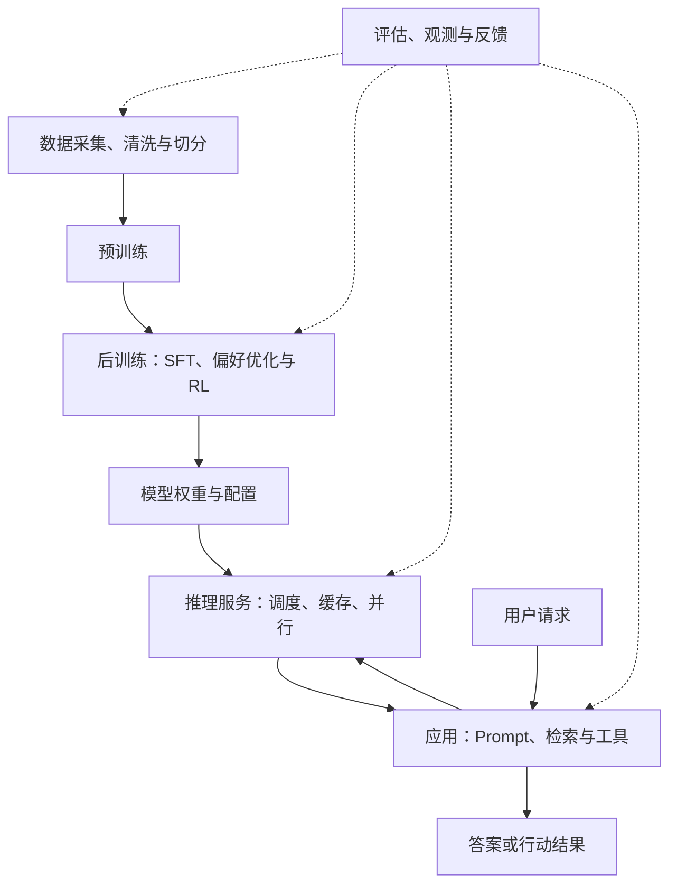

# 大模型架构知识地图

从「输入一句话」到「训练一个模型、部署一个服务、构建一个应用」，建立完整的理解框架。

本仓库以大模型为主线，按知识依赖组织：AI 与机器学习的位置 → 数学与表示 → 模型结构 → 训练 → 推理与服务 → 应用与评估。各章节从直觉讲到机制、公式和实践，形成统一的系统学习路径。详见[知识体系与学习路线](docs/00-learning-roadmap.md)。

## 你将学会什么

- 解释 Token、Embedding、Attention、Transformer、MoE 各自解决什么问题。
- 跟踪一句话如何变成张量，再变成下一个 Token 的概率。
- 区分预训练、SFT、偏好优化、强化学习，以及 Prompt、RAG、微调的作用。
- 估算参数、训练状态、KV Cache 的显存，理解长上下文和高并发为什么昂贵。
- 从质量、延迟、吞吐、成本出发，设计推理服务和知识库助手。
- 通过自测和小实验检查理解，而不只记住术语。

## 先建立全景



模型架构决定一次前向计算怎样发生；训练架构决定参数怎样被学到；推理架构决定计算怎样被高效执行；应用架构决定模型怎样连接数据、权限和业务。这四层相互约束，但不能混为一谈。

## 文档导航

建议按顺序读；已有基础时可用最后一列跳转。

| 章节 | 核心问题 | 阅读目的 |
| --- | --- | --- |
| [00 知识体系与学习路线](docs/00-learning-roadmap.md) | 知识之间有什么依赖关系？ | 建立完整学习顺序与验收标准 |
| [01 架构全景](docs/01-system-map.md) | 「大模型架构」包含哪些层？ | 建立边界和整体地图 |
| [02 数学与张量基础](docs/02-math-and-tensors.md) | 公式中的矩阵在做什么？ | 补齐必要数学 |
| [03 Token 与表示](docs/03-tokenization-and-embeddings.md) | 文字如何进入模型？ | 理解表示与上下文 |
| [04 Transformer](docs/04-transformer.md) | 模型内部怎样流动？ | 掌握核心计算 |
| [05 Attention 数值例子](docs/05-attention-walkthrough.md) | Q、K、V 和 Mask 到底是什么？ | 手算一次注意力 |
| [06 现代架构变体](docs/06-modern-architectures.md) | RoPE、GQA、MoE、SSM 改了什么？ | 理解设计取舍 |
| [07 数据与预训练](docs/07-pretraining.md) | 模型怎样从语料中学习？ | 理解训练流程 |
| [08 后训练与适配](docs/08-post-training.md) | 模型怎样变得会回答、符合偏好？ | 比较 SFT、DPO、RL、LoRA |
| [09 推理与显存](docs/09-inference-and-memory.md) | 为什么首字慢、长对话贵？ | 估算资源和性能 |
| [10 服务与分布式](docs/10-serving-and-distributed.md) | 怎样服务多人并发？ | 理解调度与并行 |
| [11 RAG 与 Agent](docs/11-rag-and-agents.md) | 怎样连接私有知识和工具？ | 构建业务应用 |
| [12 评估与可靠性](docs/12-evaluation.md) | 怎样知道系统真的有用？ | 设计评估与排错 |
| [13 多模态与推理模型](docs/13-multimodal-and-reasoning.md) | 图像、语音和推理如何进入架构？ | 扩展知识边界 |
| [14 贯穿案例](docs/14-end-to-end-case.md) | 怎样设计一个企业知识助手？ | 串联全部知识 |
| [15 动手实验](docs/15-experiments.md) | 怎样以低成本验证理解？ | 从知识走向实践 |
| [术语表](docs/glossary.md) | 缩写和概念怎么对应？ | 随时查阅 |
| [常见误区与自测答案](docs/misconceptions-and-answers.md) | 哪些概念最容易混淆？ | 检查理解 |
| [原始资料与延伸阅读](docs/references.md) | 依据是什么？下一步读什么？ | 阅读论文和官方文档 |
| [云端 Codex 与 GitHub 连接](docs/github-connection.md) | 授权、Token、远程仓库与 Pages 怎么区分？ | 配置仓库访问与发布链路 |

## 怎么读

**只有 30 分钟：**读 01 的全景、04 的计算流程、09 的资源例子、11 的方法选择表。

**希望系统入门：**按照 00 的四周计划学习。每章先读直觉，再看机制，最后做自测。第一次可以跳过公式推导，但不要跳过概念边界。

**希望做工程：**完成 14 的设计笔记和 15 的实验，再用 12 的评估表检查结果。

本仓库侧重稳定原理，不提供实时模型排行榜，也不推测未公开模型的内部结构。数字均标明假设；同名技术在不同实现中的细节可能不同。资料入口见[参考资料](docs/references.md)。

## 仓库结构与维护

```text
llm-architecture-guide/
├── README.md
├── docs/                 # 中文教程、图解、练习和资料
├── templates/            # 学习检查清单、架构决策与评估记录
├── CONTRIBUTING.md       # 文档修改约定
├── CHANGELOG.md
└── .gitignore
```

全部正文使用 Markdown，公式使用 GitHub 支持的数学语法，结构图使用 Mermaid。不需要安装依赖。可直接在 GitHub 中阅读。

后续可将这些 Markdown 接入 GitHub Pages 文档主题。选定主题后再配置站点导航、数学公式、Mermaid 和部署流程；当前交付尚未包含网站主题或 Pages 部署。

远程仓库：[miauyle/llm-architecture-guide](https://github.com/miauyle/llm-architecture-guide)，文档分支为 `main`。仓库提交与 GitHub Pages 网站部署是两个状态，当前尚未配置 Pages。后续发布方式参见[GitHub 发布说明](docs/publishing.md)。
