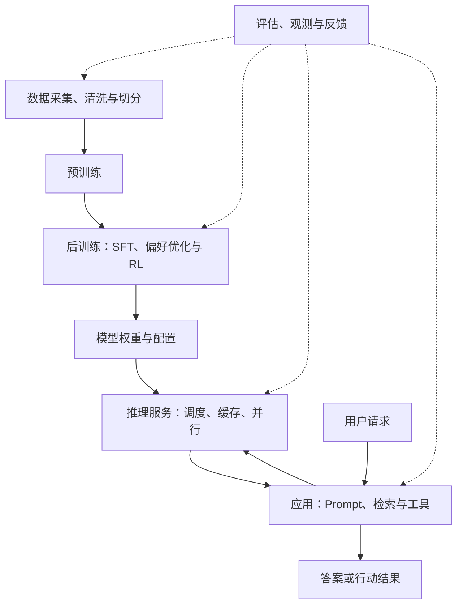

# AI 系统架构知识库

**大模型、推理服务、RAG 与 Agent**

从模型内部计算到训练、部署，再到检索、工具和行动系统，理解各个组件如何组成可验证的 AI 应用。

本知识库以大模型驱动的 AI 系统为主线。学习从一个可以手算的预测任务开始，逐步加入参数、梯度、上下文、完整 Decoder 与推理服务，再连接检索、工具和 Agent。正文使用 Markdown；首页的连续课程是系统学习入口，后面的专题用于查阅与深入。

## 从这里开始：连续课程

同样以 `问` 结尾，为什么有的输入要回答甲、有的要回答乙？只看最后一个 Token 的模型缺少哪些信息？注意力怎样把开头的信息送到末尾，梯度又如何学出这条路径？前四课用同一个人工任务逐步回答这些问题。

后四课围绕同一个差旅制度助手：从生成回答，到检索有效制度，再到提交操作、恢复超时和验收。每课都有计算或状态轨迹、具体算例、练习与解析。

| 顺序 | 课程 | 完成时应能做出的事 |
| --- | --- | --- |
| 1 | [从计数到预测](course/01-prediction.md) | 算条件概率、交叉熵，解释输入信息缺失造成的准确率上限 |
| 2 | [从概率到可学习参数](course/02-tensors-and-gradients.md) | 手算 softmax、p−y 梯度、矩阵梯度与一次参数更新 |
| 3 | [从上下文到注意力](course/03-context-and-attention.md) | 推导 Q/K/V，训练模型，并用未见前缀和输入干预检查结果 |
| 4 | [从注意力到完整语言模型](course/04-decoder-and-training.md) | 追踪残差、Norm、FFN、多头、标签移位与损失掩码 |
| 5 | [从语言模型到推理服务](course/05-generation-and-serving.md) | 解释生成和缓存等价性，算 KV 容量、读带宽与并发预算 |
| 6 | [从回答到有证据的回答](course/06-retrieval.md) | 手算 BM25，执行版本/组织过滤，核验引用支持的声明 |
| 7 | [从回答到可恢复的行动](course/07-agent.md) | 跟踪工具契约、结果未知、幂等、对账和终止状态 |
| 8 | [从演示到系统验收](course/08-evaluation.md) | 定义分层指标，逐题比较版本，设计故障注入与验收记录 |

阅读方式、前置知识和五个实验的递进关系见[课程目录](course/README.md)。无需先读完整本术语表，矩阵和导数会在实际需要时展开。

## 你将学会什么

- 解释 Token、Embedding、Attention、Transformer、MoE 各自解决什么问题。
- 跟踪一句话如何变成张量，再变成下一个 Token 的概率。
- 区分预训练、SFT、偏好优化、强化学习，以及 Prompt、RAG、微调的作用。
- 估算参数、训练状态、KV Cache 的显存，理解长上下文和高并发为什么昂贵。
- 从质量、延迟、吞吐、成本出发，设计推理服务和知识库助手。
- 通过自测和小实验检查理解，而不只记住术语。
- 跟踪可运行 Transformer 的前向与缓存实现，手算训练梯度，设计 Agent 的执行与恢复状态机。

## 当前覆盖范围

| 系统组成 | 当前内容 |
| --- | --- |
| 模型与训练 | 数学、Token、Transformer、架构变体、预训练与后训练 |
| 推理与服务 | KV Cache、显存、量化、调度、缓存与分布式 |
| 知识与工具 | RAG、检索、引用、工具调用与权限 |
| Agent 与工作流 | 执行状态机、规划依赖、记忆、协作、幂等性、恢复、终止与预算 |
| 评估与扩展 | 质量和性能评估、多模态、推理模型与系统案例 |

Agent 属于应用系统层：模型提供理解与决策能力，工具负责外部执行，状态和控制流组织多步任务。入门见[第 11 章](docs/11-rag-and-agents.md)，执行机制见[第 20 章](docs/20-agent-runtime.md)，规划、记忆与多 Agent 协作见[第 21 章](docs/21-agent-planning-and-memory.md)。

传统机器学习、视觉、推荐与机器人等方向可在后续扩展，当前章节聚焦大模型驱动的系统。

## 先建立全景



模型架构决定一次前向计算怎样发生；训练架构决定参数怎样被学到；推理架构决定计算怎样被高效执行；应用架构决定模型怎样连接数据、权限和业务。这四层相互约束，但不能混为一谈。

## 专题导航

先完成对应课程，再沿课末链接深入；以下专题不要求按编号重新读完一轮。

| 章节 | 核心问题 | 阅读目的 |
| --- | --- | --- |
| [00 知识体系与学习路线](docs/00-learning-roadmap.md) | 知识之间有什么依赖关系？ | 建立完整学习顺序与验收标准 |
| [01 AI 系统架构全景](docs/01-system-map.md) | 模型、训练、推理与应用怎样组成系统？ | 建立边界和整体地图 |
| [02 数学与张量基础](docs/02-math-and-tensors.md) | 公式中的矩阵在做什么？ | 补齐必要数学 |
| [03 Token 与表示](docs/03-tokenization-and-embeddings.md) | 文字如何进入模型？ | 理解表示与上下文 |
| [04 Transformer](docs/04-transformer.md) | 模型内部怎样流动？ | 掌握核心计算 |
| [05 Attention 数值例子](docs/05-attention-walkthrough.md) | Q、K、V 和 Mask 到底是什么？ | 手算一次注意力 |
| [06 现代架构变体](docs/06-modern-architectures.md) | RoPE、GQA、MoE、SSM 改了什么？ | 理解设计取舍 |
| [07 数据与预训练](docs/07-pretraining.md) | 模型怎样从语料中学习？ | 理解训练流程 |
| [08 后训练与适配](docs/08-post-training.md) | 模型怎样变得会回答、符合偏好？ | 比较 SFT、DPO、RL、LoRA |
| [09 推理与显存](docs/09-inference-and-memory.md) | 为什么首字慢、长对话贵？ | 估算资源和性能 |
| [10 服务与分布式](docs/10-serving-and-distributed.md) | 怎样服务多人并发？ | 理解调度与并行 |
| [11 RAG 与 Agent](docs/11-rag-and-agents.md) | 怎样连接私有知识和工具？ | 构建业务应用 |
| [12 评估与可靠性](docs/12-evaluation.md) | 怎样知道系统真的有用？ | 设计评估与排错 |
| [13 多模态与推理模型](docs/13-multimodal-and-reasoning.md) | 图像、语音和推理如何进入架构？ | 扩展知识边界 |
| [14 贯穿案例](docs/14-end-to-end-case.md) | 怎样设计一个企业知识助手？ | 串联全部知识 |
| [15 动手实验](docs/15-experiments.md) | 怎样以低成本验证理解？ | 从知识走向实践 |
| [16 Transformer 可运行实现](docs/16-transformer-implementation.md) | 公式如何变成程序，缓存怎样保持等价？ | 张量、Mask、位置与数值验证 |
| [17 训练系统详解](docs/17-training-engineering.md) | 梯度、批次、优化器和分布式如何协同？ | 手写训练、AdamW、分片、DPO 与排错 |
| [18 推理引擎详解](docs/18-inference-engineering.md) | 缓存、带宽、调度和量化实际怎么工作？ | 容量、计算、通信与性能实验 |
| [19 检索系统详解](docs/19-retrieval-engineering.md) | 怎样从原文找到完整且可引用的证据？ | 分块、BM25、向量、RRF、ANN 与重排 |
| [20 Agent 运行时](docs/20-agent-runtime.md) | 决策如何变成可靠的业务执行？ | 状态机、工具校验、预算、对账与幂等性 |
| [21 Agent 规划与记忆](docs/21-agent-planning-and-memory.md) | 怎样规划、保留状态和组织角色协作？ | 依赖图、重规划、记忆、MCP 与协作 |
| [22 评估与生产验收](docs/22-evaluation-and-production.md) | 怎样证明改动有效且能稳定交付？ | 指标定义、统计、故障注入与验收 |
| [可运行教学示例](examples/README.md) | 怎样执行并检查具体机制？ | 参数训练、上下文注意力、Decoder、检索与 Agent |
| [术语表](docs/glossary.md) | 缩写和概念怎么对应？ | 随时查阅 |
| [常见误区与自测答案](docs/misconceptions-and-answers.md) | 哪些概念最容易混淆？ | 检查理解 |
| [原始资料与延伸阅读](docs/references.md) | 依据是什么？下一步读什么？ | 阅读论文和官方文档 |
| [云端 Codex 与 GitHub 连接](docs/github-connection.md) | 授权、Token、远程仓库与 Pages 怎么区分？ | 配置仓库访问与发布链路 |

## 怎么读

**只有 30 分钟：**读 01 的全景、04 的计算流程、09 的资源例子、11 的方法选择表。

**希望系统学习：**从课程 01 开始，每课先复算例子，再运行对应实验，最后完成练习并核对解析。不要把阅读完成当作验收；以能说明计算、状态和实验边界为准。

**希望做工程：**完成课程 05–08，再进入 18–22 的引擎、检索、Agent 和生产验收专题，使用 14 的案例与模板记录实际设计。

**希望深入具体机制：**先读相应基础章，再进入 16–22。重点练习完整与缓存计算对照、训练梯度、检索错误定位，以及 Agent 的超时恢复。运行示例时请注意各程序明确标注的教学简化。

本仓库侧重稳定原理，不提供实时模型排行榜，也不推测未公开模型的内部结构。数字均标明假设；同名技术在不同实现中的细节可能不同。资料入口见[参考资料](docs/references.md)。

## 仓库结构与维护

```text
ai-systems-notes/
├── README.md
├── course/               # 八课连续主线：推导、算例、实现、验证和解析
├── docs/                 # 编号专题、图解、术语和原始资料
├── templates/            # 学习检查清单、架构决策与评估记录
├── examples/             # 五个可运行教学示例
├── tools/                # 文档与公式源代码检查
├── AGENTS.md             # AI 助手协作与验证规则
├── CONTRIBUTING.md       # 文档修改约定
├── CHANGELOG.md
└── .gitignore
```

全部正文使用 Markdown，独立公式使用 GitHub 支持的 `math` 代码块，结构图使用 Mermaid；表格中的张量形状和算式使用代码或普通文本。不需要安装依赖，可直接在 GitHub 中阅读。

文档源检查可运行 `python tools/check_docs.py`。公式修改还需实际浏览器排版检查，Markdown 接口识别出数学节点不等于公式已经排版成功。

后续可将这些 Markdown 接入 GitHub Pages 文档主题。选定主题后再配置站点导航、数学公式、Mermaid 和部署流程；当前交付尚未包含网站主题或 Pages 部署。

远程仓库：[miauyle/ai-systems-notes](https://github.com/miauyle/ai-systems-notes)，唯一长期主线为 `master`。修改通过临时分支提 PR，验证后合并并删除临时分支，不再维护重复的 `main`。协作规则见 [AGENTS.md](AGENTS.md) 与 [CONTRIBUTING.md](CONTRIBUTING.md)。

仓库提交与 GitHub Pages 网站部署是两个状态，当前尚未配置 Pages。后续发布方式参见[GitHub 发布说明](docs/publishing.md)。
