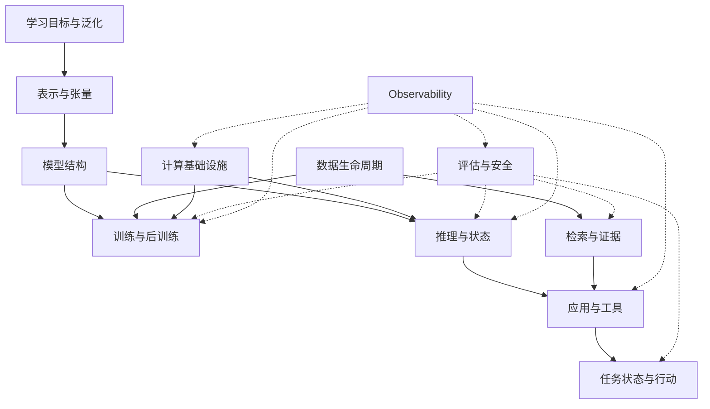

# 00 · AI 知识关系地图

[首页](../README.md) · [完整专题目录](README.md)

## 用关系组织知识

AI 的概念来自不同层次：任务定义要解决什么，学习方法规定数据如何提供信号，模型规定表示与计算，执行系统管理资源，应用组织证据和动作，评估判断结果。

一条技术链可以使用多种方法：图文编码器采用对比目标，语言模型采用自回归目标，应用用 RAG 提供资料，用工具做确定性操作。它们不是互斥的产品选项，而是不同位置上的组件。

## 知识依赖

评估并非最后才开始：训练需要知道目标是否有效，检索需要知道证据是否覆盖，推理需要知道质量和性能，行动需要知道真实业务效果。Performance、Observability 和 Security 都横切各层；图中虚线表示观测关联，不是请求数据流。[可观测性](31-ai-systems-observability-and-debugging.md)连接训练、Serving、基础设施、应用和生产。

## 三条连续脉络

**能力脉络：**从机器学习的目标、表示和泛化进入 Token 与 Transformer，再理解预训练、后训练、多模态及生成家族。它解释能力从哪里来，以及为什么概率预测不等于事实保证。

**执行脉络：**Model Architecture → Tensor / Graph → Compiler / Runtime → Kernel → GPU / Network → Distributed Runtime → Training / Serving。模型规定逻辑计算，执行栈将图变成设备工作，分布式运行时管理跨 GPU 状态与通信，集群调度提供资源与拓扑，性能模型判断是否满足容量、延迟与成本目标。

**应用脉络：**从外部知识、检索与工具进入任务状态、规划、记忆和恢复，再连接评估、安全与发布。它解释语言输出怎样成为可追溯的答案或可靠的业务动作。

三条脉络相互约束：证据组织改变输入负载，模型行为改变工具次数，执行资源限制上下文，数据版本决定正确事实。

## 执行中间层怎样连接上下游

| 关系 | 需要追踪的对象 | 章节入口 |
| --- | --- | --- |
| Model → Tensor / Graph | 参数、张量布局、操作依赖与动态输入 | [模型结构](04-transformer.md)、[计算布局](16-transformer-implementation.md) |
| Graph → Compiler / Runtime → Kernel | 捕获图、guard、IR、编译产物、缓冲与工作提交 | [编译与运行时](28-ai-compiler-and-runtime.md) |
| Kernel → GPU / Network | HBM/片上访问、stream 依赖与通信完成 | [计算基础设施](27-compute-infrastructure.md) |
| Distributed Runtime → Training | Device Mesh、张量 placement、CP 与分片恢复 | [训练系统](17-training-engineering.md) |
| Distributed Runtime → Serving | 请求执行所有权、KV transfer、路由与池协调 | [服务架构](10-serving-and-distributed.md)、[推理引擎](18-inference-engineering.md) |
| Workload → Cluster placement | Job/Deployment、GPU/NIC/存储约束、组级就绪 | [平台与集群调度](29-ai-platform-and-cluster-scheduling.md) |
| Resource budget → Production | 关键路径、SLO、有效吞吐、容量与成本 | [性能模型](30-ai-systems-performance.md)、[生产评估](22-evaluation-and-production.md) |

Compiler、Platform 与 Performance 仍归入“推理与基础设施”，同时服务训练和生产章节；不新增第七个分组。它们描述通用执行关系，深入 KV 存储层级与 RDMA/GDS 等路径由[AI Storage Notes](https://miauyle.github.io/ai-storage-notes/)承接。

## 基础与深入的分工

| 基础专题 | 深入专题 | 增加的系统关系 |
| --- | --- | --- |
| [Transformer](04-transformer.md) | [计算布局](16-transformer-implementation.md) | 结构如何映射到布局、内核和缓存语义 |
| [预训练](07-pretraining.md)、[后训练](08-post-training.md) | [训练系统](17-training-engineering.md) | 目标如何落到梯度聚合、状态分片与恢复 |
| [推理与显存](09-inference-and-memory.md)、[服务](10-serving-and-distributed.md) | [推理引擎](18-inference-engineering.md) | 状态如何组织、复用、抢占并参与调度 |
| [RAG 与工具](11-rag-and-agents.md) | [检索工程](19-retrieval-engineering.md) | 相关候选如何成为完整授权证据 |
| [RAG 与工具](11-rag-and-agents.md) | [运行时](20-agent-runtime.md)、[规划与记忆](21-agent-planning-and-memory.md) | 动态决策如何保持持久状态与真实结果 |
| [评估](12-evaluation.md) | [生产评估](22-evaluation-and-production.md) | 质量判断如何连接故障、负载与发布 |
| [计算布局](16-transformer-implementation.md)、[硬件](27-compute-infrastructure.md) | [Compiler / Runtime](28-ai-compiler-and-runtime.md) | 张量图如何变成 Kernel 和设备执行 |
| [训练](17-training-engineering.md)、[Serving](10-serving-and-distributed.md) | [集群平台](29-ai-platform-and-cluster-scheduling.md)、[性能](30-ai-systems-performance.md) | 分布式状态如何落到资源 placement 与 SLO 容量 |

## 主解释章节：一个机制一个入口

| 主负责章节 | 机制边界 |
| --- | --- |
| [15 · 数据](15-data-lifecycle.md) | manifest/version、mixture、sampling/packing、loader 消费恢复与污染 |
| [08 · 后训练](08-post-training.md)、[17 · 训练工程](17-training-engineering.md) | 08 负责 RL 轨迹/策略陈旧的语义；17 负责 GPU 分池、权重发布、并行与 checkpoint |
| [10 · Serving](10-serving-and-distributed.md) | 请求生命周期、Gateway/Router、P/D transfer、KV ownership、fleet |
| [18 · 引擎](18-inference-engineering.md) | KV block/page、prefix、迭代批处理/局部容量、remote/offload 接口、量化/推测 |
| [27 · 硬件路径](27-compute-infrastructure.md) | GPU/HBM/CPU、互联、NCCL primitive 与物理传输边界 |
| [28 · 执行栈](28-ai-compiler-and-runtime.md) | graph/IR、compiler/runtime、Kernel、Triton/CUDA、CUDA Graph |
| [29 · 平台](29-ai-platform-and-cluster-scheduling.md) | allocation/placement、topology、gang、租户、cold start、autoscaling/组级恢复 |
| [30 · 性能](30-ai-systems-performance.md) | TTFT/TPOT/ITL、吞吐/容量/成本、queueing、Roofline/Amdahl/Little、SLO |
| [31 · 观测与排障](31-ai-systems-observability-and-debugging.md) | trace 关联、timeline/profile、GPU utilization、hang/OOM 与根因证据 |

其他章节只从自己的对象解释连接和约束，并链接主入口；checkpoint、集群失败恢复与请求恢复分别属于训练一致点、workload 组生命周期和流式请求状态，不能混成一个万能恢复机制。

## 跨章共同对象与血缘

参数由训练改变，激活是一次计算的表示，KV 是可复用的请求状态，索引是派生知识产物，业务状态是真实外部事实。每种对象有自己的更新、共享和失效规则。

这些对象的生命周期见[数据](15-data-lifecycle.md)与[模型资产](26-model-lifecycle.md)。权限和信任边界见[安全](25-ai-security.md)。系统全景见[第 01 章](01-system-map.md)，组件整合见[第 14 章](14-end-to-end-case.md)。

## 范围与维护

当前主线深入大模型驱动的系统，另外建立通用学习基础、生成家族与硬件关系。体系收口后不再主动横向扩张；维护重点是跨章一致性、缺失机制与技术演进，不以覆盖全部 AI 学科为目标。

文件编号是稳定标识；分组目录表达当前体系，未来站点侧栏使用同一关系。原始依据集中在[参考资料](references.md)。
