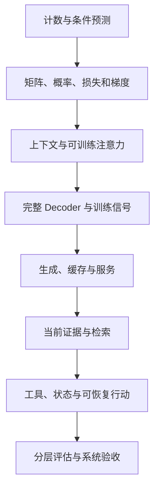

# 00 · 知识体系与学习路线

[返回首页](../README.md) · [开始连续课程](../course/01-prediction.md)

## 当前范围

人工智能是较宽的研究与应用领域；机器学习研究从数据中学习规律；深度学习使用多层神经网络进行表示学习。大语言模型通常是其中一类大规模语言模型。

本仓库围绕大模型驱动的 AI 系统，覆盖模型、训练、推理服务以及 RAG、Agent、评估。生成式 AI 还包括图像和音频；强化学习也有许多超出模型后训练的用途。传统机器学习、完整视觉/机器人/强化学习理论不在当前主线内，不能把仓库称为全部 AI 学科百科。

## 主线按问题依赖推进

每课用上一课已经建立的对象解释下一层，避免先读许多概念简介、最后再重新找实现。评估实际上贯穿所有环节，最后一课将前面的检查统一成验收方法。

## 课程、专题与验收对应

| 连续课程 | 可继续深入的专题 | 验收产物 |
| --- | --- | --- |
| [01 预测](../course/01-prediction.md) | [03 Token 与表示](03-tokenization-and-embeddings.md) | 一张条件计数表、理论基线与移位标签 |
| [02 参数与梯度](../course/02-tensors-and-gradients.md) | [02 数学](02-math-and-tensors.md)、[17 训练](17-training-engineering.md) | 一次完整的概率、损失、梯度与更新手算 |
| [03 上下文与注意力](../course/03-context-and-attention.md) | [05 Attention 算例](05-attention-walkthrough.md)、[16 实现](16-transformer-implementation.md) | 未见前缀结果、梯度检查与输入干预记录 |
| [04 Decoder 与训练](../course/04-decoder-and-training.md) | [04 结构](04-transformer.md)、[06 变体](06-modern-architectures.md)、[07 预训练](07-pretraining.md)、[08 后训练](08-post-training.md) | 一条前向计算链和一份对话标签/掩码表 |
| [05 生成与服务](../course/05-generation-and-serving.md) | [09 显存](09-inference-and-memory.md)、[10 分布式](10-serving-and-distributed.md)、[18 引擎](18-inference-engineering.md) | KV 容量估算、缓存等价验证与时间线 |
| [06 检索](../course/06-retrieval.md) | [19 检索工程](19-retrieval-engineering.md) | 过滤前后候选、BM25 算例与证据包 |
| [07 Agent](../course/07-agent.md) | [20 运行时](20-agent-runtime.md)、[21 规划与记忆](21-agent-planning-and-memory.md) | 结果未知的恢复轨迹与幂等不变量 |
| [08 验收](../course/08-evaluation.md) | [12 评估](12-evaluation.md)、[22 生产验收](22-evaluation-and-production.md) | 测试项、逐题结果、分层失败归因 |

建议每次完成一段推导或一个实验，不按页数或固定周数判断进度。遇到矩阵维度问题回到第二课，遇到工具状态问题回到第七课；无需为理解一个计算先读完全部专题。

## 自己检查是否真正掌握

能回答每个组件的输入、输出、参数、状态和代价，并且能指出失败时查看哪个中间产物。例如 KV 是推理状态，不是训练参数；证据引用需要有效原文支持；模型说完成不等于事务完成。

使用[学习检查清单](../templates/learning-checklist.md)记录复算结果；使用[评估模板](../templates/evaluation-record.md)记录实验配置、观测和结论边界。每课已提供练习解析，先独立作答再核对。

## 完成主线后的扩展

模型算法深入 RoPE、GQA、MoE、优化和后训练；推理工程深入算子、分页缓存、并行与调度；应用系统深入检索、计划、长期记忆、协作与任务评估。多模态与推理模型从[第 13 专题](13-multimodal-and-reasoning.md)进入，系统整合从[第 14 案例](14-end-to-end-case.md)进入。

这些是继续学习的分支，不是让主线再变成一张必须背完的术语清单。参考依据与原始资料见[参考资料](references.md)。
