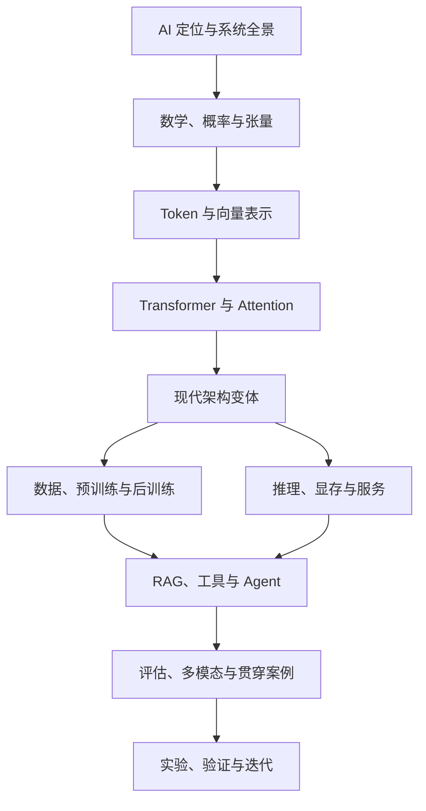

# 00 · 知识体系与学习路线

[返回目录](../README.md) · [下一章：架构全景](01-system-map.md)

## 先定位：大模型在 AI 中的位置

人工智能是较宽的研究与应用领域；机器学习研究从数据中学习规律；深度学习使用多层神经网络进行表示学习。大语言模型通常是深度学习中的一类大规模语言模型。

生成式 AI 按任务性质分类，涉及文本、图像、音频等生成，并不与「大语言模型」完全等同。强化学习是一种通过交互和奖励学习的范式，可用于大模型后训练，也有大量其他用途。

「AI 系统架构知识库」当前围绕大模型驱动的系统展开，覆盖其必要数学、模型结构、训练、推理、服务、RAG、Agent 和评估。传统机器学习算法、计算机视觉、推荐系统、机器人与强化学习完整理论可作为后续扩展专题；当前教程不等于全部 AI 学科的百科。

## 按依赖构建知识体系

图表达主要学习依赖，不是严格的实现调用顺序。例如评估贯穿所有环节；多模态也有自身的编码器与训练机制。

## 统一主线与阶段验收

| 阶段 | 章节 | 关键知识 | 完成标志 |
| --- | --- | --- | --- |
| 1：建立全景 | 00–01 | AI 定位、模型/训练/推理/应用边界 | 能画出一次请求与一次训练的总体流程 |
| 2：掌握表示 | 02–03 | 张量、矩阵、概率、Token、Embedding、位置 | 能跟踪文本到隐藏状态的形状变化 |
| 3：理解结构 | 04–06 | Attention、FFN、残差、RoPE、GQA、MoE | 能复算注意力并说明变体的目标与代价 |
| 4：理解学习 | 07–08 | 数据、目标、优化、SFT、偏好、RL、LoRA | 能区分训练目标与参数适配方法 |
| 5：理解执行 | 09–10 | Prefill、Decode、KV、显存、调度、并行 | 能估算资源并解释延迟与吞吐的取舍 |
| 6：构建系统 | 11–14 | 检索、工具、控制流、评估、多模态 | 能设计可验证、有来源与权限边界的应用 |
| 7：验证理解 | 15 | 数值实验、检索实验、质量与性能对照 | 能先提出假设，再用观测说明结论 |

所有阶段都属于主线。专题选读只是复习或深入的方式，不替代系统学习，也不删除其他章节。

## 每个概念都讲到四个层次

1. **直觉：**它解决什么问题？
2. **机制：**输入、处理和输出是什么？
3. **形式：**公式、形状、复杂度或资源账怎样写？
4. **验证：**有什么代价、边界和可以检验的例子？

例如 GQA：让多个查询头共享较少的 K/V 头；减少缓存规模和相关带宽；资源随 K/V 头数变化；需要与训练设计、任务质量和实际性能一起验证。

类比帮助建立直觉，公式和实验负责检查类比的适用边界。

## 四周学习安排

建议每周 3 次，每次 45–60 分钟。这是阅读与入门练习的节奏建议，深入算法或部署实践可能需要更多时间。

| 周次 | 内容 | 当周产物 | 验收方式 |
| --- | --- | --- | --- |
| 第 1 周 | 00–05：全景、数学、表示、Transformer | 前向计算图与一次 Attention 手算 | 不看资料解释 Q/K/V、Mask 和输出概率 |
| 第 2 周 | 06–08：架构、预训练、后训练 | 一页模型学习流程笔记 | 区分架构变化、参数更新和上下文变化 |
| 第 3 周 | 09–10：推理、显存、服务 | 显存估算和部署决策表 | 解释缓存、并发、吞吐和 TTFT |
| 第 4 周 | 11–15：应用、评估、案例、实验 | 知识助手设计与小型评估集 | 按错误环节定位改动并验证效果 |

## 完成主线后的专题深入

| 专题 | 复习入口 | 进一步学习 |
| --- | --- | --- |
| 模型算法 | 02、04–08、13 | 优化理论、架构论文、训练实验 |
| 推理工程 | 04、06、09–10、12 | GPU 计算、算子、分布式与服务调优 |
| 应用系统 | 01、08、11–12、14–15 | 检索、数据治理、工作流与任务评估 |

## 学习检查方法

每学一个概念，回答：输入是什么、输出是什么、解决什么问题、付出什么代价。只能背缩写时，回到流程图和数值例子。

使用[学习检查清单](../templates/learning-checklist.md)记录自己的解释、练习和待解决问题。记录依据是知识点掌握情况。
