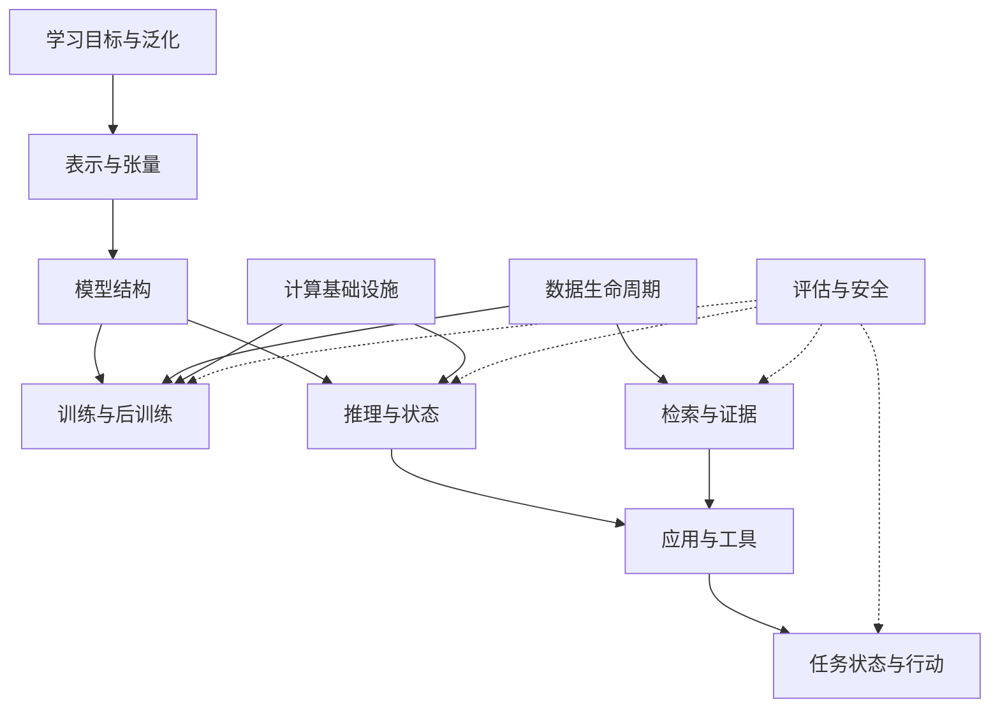

# 00 · AI 知识关系地图

[首页](../README.md) · [完整专题目录](README.md)

## 用关系组织知识

AI 的概念来自不同层次：任务定义要解决什么，学习方法规定数据如何提供信号，模型规定表示与计算，执行系统管理资源，应用组织证据和动作，评估判断结果。

一条技术链可以使用多种方法：图文编码器采用对比目标，语言模型采用自回归目标，应用用 RAG 提供资料，用工具做确定性操作。它们不是互斥的产品选项，而是不同位置上的组件。

## 知识依赖

评估并非最后才开始：训练需要知道目标是否有效，检索需要知道证据是否覆盖，推理需要知道质量和性能，行动需要知道真实业务效果。安全同样贯穿数据与执行。

## 三条连续脉络

**能力脉络：**从机器学习的目标、表示和泛化进入 Token 与 Transformer，再理解预训练、后训练、多模态及生成家族。它解释能力从哪里来，以及为什么概率预测不等于事实保证。

**执行脉络：**从模型计算进入张量布局、算子和数值精度，再理解 Prefill / Decode、KV、调度、并行与硬件。它解释同一个模型怎样形成不同容量、延迟与成本。

**应用脉络：**从外部知识、检索与工具进入任务状态、规划、记忆和恢复，再连接评估、安全与发布。它解释语言输出怎样成为可追溯的答案或可靠的业务动作。

三条脉络相互约束：证据组织改变输入负载，模型行为改变工具次数，执行资源限制上下文，数据版本决定正确事实。

## 基础与深入的分工

| 基础专题 | 深入专题 | 增加的系统关系 |
| --- | --- | --- |
| [Transformer](04-transformer.md) | [计算布局](16-transformer-implementation.md) | 结构如何映射到布局、内核和缓存语义 |
| [预训练](07-pretraining.md)、[后训练](08-post-training.md) | [训练系统](17-training-engineering.md) | 目标如何落到梯度聚合、状态分片与恢复 |
| [推理与显存](09-inference-and-memory.md)、[服务](10-serving-and-distributed.md) | [推理引擎](18-inference-engineering.md) | 状态如何组织、复用、抢占并参与调度 |
| [RAG 与工具](11-rag-and-agents.md) | [检索工程](19-retrieval-engineering.md) | 相关候选如何成为完整授权证据 |
| [RAG 与工具](11-rag-and-agents.md) | [运行时](20-agent-runtime.md)、[规划与记忆](21-agent-planning-and-memory.md) | 动态决策如何保持持久状态与真实结果 |
| [评估](12-evaluation.md) | [生产评估](22-evaluation-and-production.md) | 质量判断如何连接故障、负载与发布 |

## 跨章共同对象

参数由训练改变，激活是一次计算的表示，KV 是可复用的请求状态，索引是派生知识产物，业务状态是真实外部事实。每种对象有自己的更新、共享和失效规则。

这些对象的生命周期见[数据](15-data-lifecycle.md)与[模型资产](26-model-lifecycle.md)。权限和信任边界见[安全](25-ai-security.md)。系统全景见[第 01 章](01-system-map.md)，组件整合见[第 14 章](14-end-to-end-case.md)。

## 范围与扩展

当前主线深入大模型驱动的系统，另外建立通用学习基础、生成家族与硬件关系。它尚未覆盖全部 AI 学科。后续传统学习、视觉、推荐、控制和机器人专题应在各自任务与表示层扩展，保持与现有系统脉络的连接。

文件编号是稳定标识；分组目录表达当前体系，未来站点侧栏使用同一关系。原始依据集中在[参考资料](references.md)。
