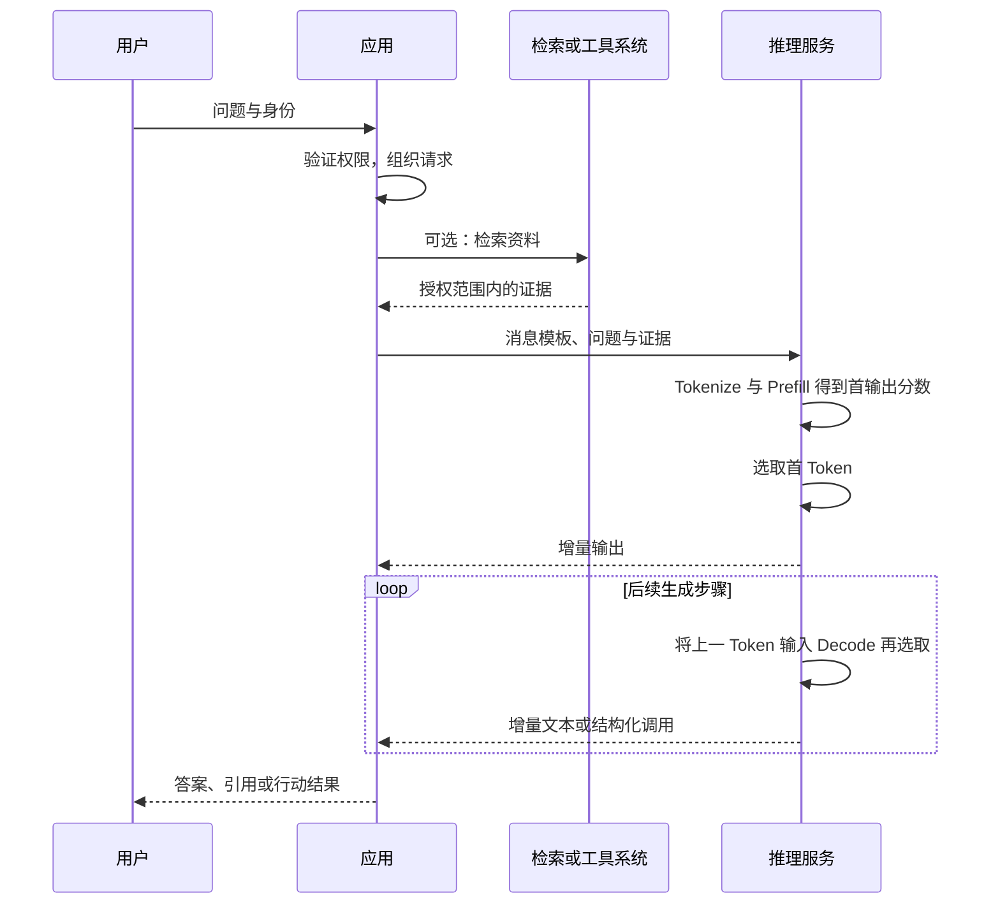

# 01 · AI 系统架构全景

[返回目录](../README.md) · [下一章](02-math-and-tensors.md)

## 从模型到系统

本知识库围绕大模型驱动的 AI 系统展开：模型是核心能力组件，训练赋予和调整其能力，推理服务执行计算，应用系统连接知识、工具、权限与业务。

Agent 是应用系统的一种组织方式，通过模型、工具、状态和控制循环完成多步任务。理解模型内部结构与理解 Agent 控制流，分别回答「能力如何计算」和「任务如何推进」，需要在同一系统地图中衔接。

## 先回答：大模型是什么？

语言模型学习的是文本序列的概率规律。常见自回归语言模型根据前面的 Token 预测下一个 Token：

```math
p(x_1,\ldots,x_T)=\prod_{t=1}^{T}p(x_t\mid x_1,\ldots,x_{t-1})
```


「大」没有统一的参数门槛。参数量、训练数据、训练计算量、上下文长度和系统能力是不同维度。一个参数更多的模型不一定在你的具体任务上更好。

这里的条件表示「第 t 个 Token 之前已经出现的所有 Token」；当 t = 1 时，历史为空。写成历史序列并不表示模型只看最后一个 Token，Transformer 会通过注意力处理允许访问的整个前缀。

以「请总结这份合同」为例，基础模型处理的是数字化的 Token 序列。文件解析、合同检索、访问权限、引用定位和页面展示通常由外围系统完成。

## 四层架构与交付物

| 层 | 负责的问题 | 常见组件 | 交付物 |
| --- | --- | --- | --- |
| 模型计算 | 输入如何经过神经网络得到概率？ | Tokenizer、Embedding、Attention、FFN、输出头 | 架构代码、配置 |
| 训练 | 参数如何从数据中学出来？ | 数据管线、损失、优化器、分布式训练、后训练 | 权重、Tokenizer、训练与评估记录 |
| 推理服务 | 怎样在预算内响应请求？ | 权重加载、KV 管理、调度、并行、量化 | 模型服务端点、指标 |
| 应用 | 怎样完成业务任务？ | Prompt、RAG、工具、工作流、权限、交互 | 可用的产品和验收数据 |

Tokenizer、模型配置和权重必须匹配。只有一份权重文件，不代表拥有完整可复现的模型。

## 模型和服务之间的执行中间层

四层架构表达责任，真正运行还要穿过执行栈：Model Architecture → Tensor / Graph → Compiler / Runtime → Kernel → GPU / Network → Distributed Runtime → Training / Serving。这不是另加一类应用，而是模型计算怎样成为资源上的真实工作。

| 中间层 | 产生什么、谁消费 | 关键状态与约束 |
| --- | --- | --- |
| Tensor / Graph | 框架表达张量操作与依赖，Compiler 分析 | shape、stride、dtype、别名、动态分支 |
| Compiler / Runtime | 图转换为代码/库调用，Runtime 准备并提交 | guard、IR、编译缓存、临时缓冲、stream 与图实例 |
| Kernel / Hardware | Kernel 访问权重/激活/KV，设备与网络完成工作 | HBM/片上资源、启动、通信依赖与拓扑 |
| Distributed Runtime | rank 按布局交换参数、梯度、激活或 KV | Mesh、placement、通信组、执行所有权与恢复点 |
| Platform / Performance | 平台提供设备与副本，指标验证交付 | 配额、组级就绪、locality、SLO 与有效容量 |

Eager 可以直接分派已有 Kernel，编译也可以调用现有库，不能把上述关系误读为所有工作必经代码生成。编译产物不是模型权重，CUDA Graph 不是模型计算图，训练 K/V 激活也不是 Serving 的持久请求缓存。

入口：[执行栈](28-ai-compiler-and-runtime.md)、[现代并行](17-training-engineering.md)、[集群 Serving](10-serving-and-distributed.md)、[平台调度](29-ai-platform-and-cluster-scheduling.md)、[性能模型](30-ai-systems-performance.md)。Production 的质量验收与故障评估见[第 22 章](22-evaluation-and-production.md)。

## 完整主线与横切能力

Data → Model → Training / Post-training → Tensor / Graph → Compiler / Runtime → Kernel → GPU / Network / Storage Interface → Distributed Runtime → Cluster Platform → Inference Serving → RAG / Agent → Evaluation / Lifecycle。这是知识与资产的依赖主线，不是每个在线请求的串行执行步骤；RL rollout 还把生成和验证反馈到训练。

数据 manifest/mixture 与消费进度见[第 15 章](15-data-lifecycle.md)，策略版本/轨迹与训练更新的闭环见[第 08 章](08-post-training.md)、[第 17 章](17-training-engineering.md)。[Performance](30-ai-systems-performance.md)定义有效工作与 SLO，[Observability](31-ai-systems-observability-and-debugging.md)连接请求/step、执行与版本证据，[Security](25-ai-security.md)规定信任、权限与隔离；三者贯穿各层，不建立第七个分组。

## 一次请求的生命周期与应用边界



如果模型提出工具调用，应用要解析和验证调用，再执行工具并将结果放回上下文。模型输出的调用建议与工具的实际执行是两个环节。

Prefill 的末端分数通常选择首输出；被选出的 Token 要在下一轮经过网络才形成它自己的各层 K/V。请求的入队、迭代、流式输出与释放细节见[推理服务](10-serving-and-distributed.md)。

## 三种容易混淆的「记忆」

| 名称 | 存在哪里 | 如何改变 | 主要限制 |
| --- | --- | --- | --- |
| 参数中的知识 | 模型权重 | 训练或微调 | 难更新，难追溯，可能记错 |
| 上下文中的信息 | 当前输入序列与相关计算状态 | 增删 Prompt、历史和检索证据 | 长度和资源有限 |
| 外部记忆 | 数据库、文档库、用户状态 | 应用读写和索引更新 | 需要检索、权限和一致性设计 |

对话中的「记住这个」通常不等于服务立即更新了模型权重。产品也可能把信息存入外部记忆，具体以产品实现为准。

## 常见结构家族

- **Encoder-only**：典型例子 BERT，侧重双向上下文表示，适用于分类、抽取等。
- **Encoder–Decoder**：典型例子原始 Transformer、T5，编码输入后由解码器生成输出。
- **Decoder-only**：GPT 类模型的常见结构，用因果注意力自回归生成，是后续章节的主线。

这是一种结构分类，不是能力的绝对排名。不同训练目标、数据和后训练策略也会影响实际能力。

## 把系统放进更大的 AI 地图

AI 系统可以做分类、预测、排序、生成、感知和行动，大模型驱动的产品只是其中一部分。监督学习、表示学习与泛化决定“能力如何从数据来”；模型结构与生成机制决定“怎样计算输出”；系统架构决定“怎样把能力交付给用户”。

这些轴不是同一棵简单分类树。Transformer 可以服务于语言或视觉，可以用不同训练目标；强化学习可以训练机器人策略，也可以用于语言模型后训练；RAG 与 Agent 则是应用如何组织知识和行动。应沿任务、表示、训练、执行和应用分别定位技术。

基础脉络见[机器学习](23-machine-learning-foundations.md)，生成家族见[生成模型](24-generative-models.md)。当前主线深入大模型系统，传统学习、视觉控制与机器人尚未展开为完整分支。

## 离线构建与在线执行怎样连接

离线侧产出权重、配置、Tokenizer、索引、工具描述与评估记录；在线侧读取这些版本化产物，接收请求并产生结果。两侧通过资产而非抽象概念连接。

权重升级影响计算与缓存兼容；Tokenizer 或模板升级影响输入；索引升级影响证据；工具升级影响实际动作。同一个最终错误可能来自不同产物，因此系统观测要保留这些版本关系。

“模型没变但答案变了”完全可能：资料、Prompt、工具数据或采样发生变化，输出就会变化。模型评估与整个应用评估需要分别记录。

## 数据、计算与控制三条流

数据流包含文本、图像、张量、证据和工具结果；计算流包含前向、反向、采样与验证；控制流决定权限、调度、分支、重试和终止。把三条流画在一起时，需要明确哪个箭头传内容，哪个箭头启动动作。

例如模型提出查询并不等于查询已经执行，工具返回数据也不等于最终答案验证通过。运行时控制真实状态，模型计算产生建议或内容，应用验证把它们连接为任务结果。

## 能力边界需要由系统共同承担

参数提供可泛化模式，但事实可能过时；上下文提供当前信息，但不保证有效利用；工具提供外部能力，但需要正确参数与权限；验证降低部分错误，却受覆盖范围限制。

可靠应用让这些组件互相补充：动态事实来自明确来源，精确运算来自确定性工具，执行状态来自真实回执，开放式解释由模型组织。安全与可靠性是这些关系的结果，而不是额外给模型贴一个标签。
