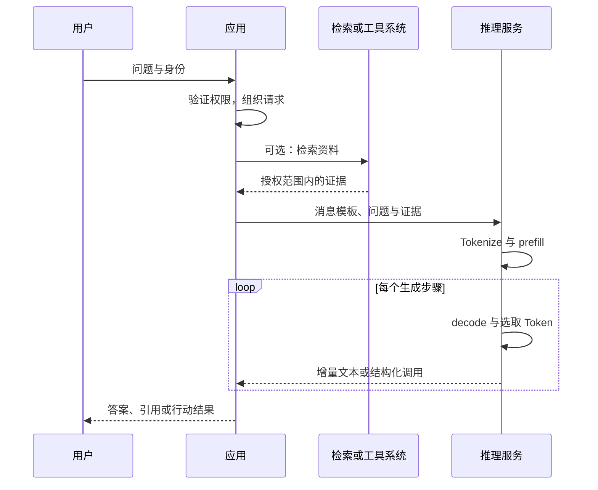

# 01 · AI 系统架构全景

[返回目录](../README.md) · [下一章](02-math-and-tensors.md)

## 从模型到系统

本知识库围绕大模型驱动的 AI 系统展开：模型是核心能力组件，训练赋予和调整其能力，推理服务执行计算，应用系统连接知识、工具、权限与业务。

Agent 是应用系统的一种组织方式，通过模型、工具、状态和控制循环完成多步任务。理解模型内部结构与理解 Agent 控制流，分别回答「能力如何计算」和「任务如何推进」，需要在同一系统地图中衔接。

## 先回答：大模型是什么？

语言模型学习的是文本序列的概率规律。常见自回归语言模型根据前面的 Token 预测下一个 Token：

$$
p(x_1,\ldots,x_T)=\prod_{t=1}^{T}p(x_t\mid x_{<t})
$$

「大」没有统一的参数门槛。参数量、训练数据、训练计算量、上下文长度和系统能力是不同维度。一个参数更多的模型不一定在你的具体任务上更好。

以「请总结这份合同」为例，基础模型处理的是数字化的 Token 序列。文件解析、合同检索、访问权限、引用定位和页面展示通常由外围系统完成。

## 四层架构与交付物

| 层 | 负责的问题 | 常见组件 | 交付物 |
| --- | --- | --- | --- |
| 模型计算 | 输入如何经过神经网络得到概率？ | Tokenizer、Embedding、Attention、FFN、输出头 | 架构代码、配置 |
| 训练 | 参数如何从数据中学出来？ | 数据管线、损失、优化器、分布式训练、后训练 | 权重、Tokenizer、训练与评估记录 |
| 推理服务 | 怎样在预算内响应请求？ | 权重加载、KV 管理、调度、并行、量化 | 模型服务端点、指标 |
| 应用 | 怎样完成业务任务？ | Prompt、RAG、工具、工作流、权限、交互 | 可用的产品和验收数据 |

Tokenizer、模型配置和权重必须匹配。只有一份权重文件，不代表拥有完整可复现的模型。

## 一次请求的生命周期

如果模型提出工具调用，应用要解析和验证调用，再执行工具并将结果放回上下文。模型输出的调用建议与工具的实际执行是两个环节。

## 三种容易混淆的「记忆」

| 名称 | 存在哪里 | 如何改变 | 主要限制 |
| --- | --- | --- | --- |
| 参数中的知识 | 模型权重 | 训练或微调 | 难更新，难追溯，可能记错 |
| 上下文中的信息 | 当前输入序列与相关计算状态 | 增删 Prompt、历史和检索证据 | 长度和资源有限 |
| 外部记忆 | 数据库、文档库、用户状态 | 应用读写和索引更新 | 需要检索、权限和一致性设计 |

对话中的「记住这个」通常不等于服务立即更新了模型权重。产品也可能把信息存入外部记忆，具体以产品实现为准。

## 常见结构家族

- **Encoder-only**：典型例子 BERT，侧重双向上下文表示，适用于分类、抽取等。
- **Encoder–Decoder**：典型例子原始 Transformer、T5，编码输入后由解码器生成输出。
- **Decoder-only**：GPT 类模型的常见结构，用因果注意力自回归生成，是后续章节的主线。

这是一种结构分类，不是能力的绝对排名。不同训练目标、数据和后训练策略也会影响实际能力。

## 自测

1. RAG 更新知识时，一定需要重新训练模型吗？
2. 参数规模、上下文长度和服务并发分别属于什么概念？
3. 为什么模型权重无法单独解决私有文档的访问权限问题？

[答案](misconceptions-and-answers.md)
