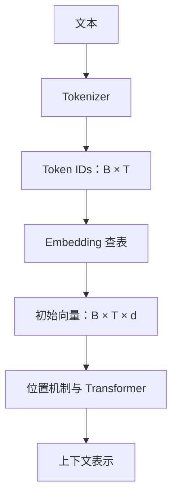

# 03 · 从文字到模型表示

[返回目录](../README.md) · [下一章](04-transformer.md)

## Tokenizer：模型自己的切分方式

Tokenizer 把文本映射为 Token ID；每个 ID 对应词表中的一个单位。单位可能是完整词、子词、单字符或字节片段。常见方法包括 BPE、WordPiece 和 Unigram，具体规则依模型而定。

例如「大模型架构」可能被切成不同片段；没有指定 Tokenizer 时，不能给出真实切分结果。中文字符数、英文单词数和 Token 数也没有固定换算比例。

Token 数直接影响上下文占用、计算量和 API 计费。应使用目标模型的 Tokenizer 或服务返回的用量统计。

## 特殊 Token 与聊天模板

对话消息一般会被序列化成带角色边界的序列，例如系统、用户、助手的标记。真实模板因模型而异；手写一个看起来像聊天的字符串不一定符合它的训练格式。

上下文预算通常包含系统指令、历史消息、检索资料、工具描述和输出预留；服务商对内部 Token 的记账方式需要看其文档。

## Embedding：ID 查表得到向量

设词表大小 $`V=32,000`$，隐藏维度 $`d=512`$，Embedding 权重为 $`E\in\mathbb{R}^{V\times d}`$。Token ID 为 17 时，取第 17 行向量作为初始表示。该表由训练学习，不是人工逐项填写。

同一个 Token 在同一个 Embedding 表中的初始向量相同，但进入网络后会随上下文变化。例如「苹果」在水果描述和公司财报中的后续表示不同。

## 位置：顺序必须进入计算

Attention 本身不会自动理解自然语言中的先后顺序。需要位置机制，如绝对位置 Embedding、正弦位置编码、RoPE 或相对位置偏置。

有些机制将位置向量加到输入中；RoPE 主要作用于注意力的 Q/K。不能把所有位置机制都画成「Embedding 加一个位置向量」。详见[现代架构](06-modern-architectures.md)。

## 两种不同用途的 Embedding

| 类型 | 作用 | 输出形态 |
| --- | --- | --- |
| 模型内部 Token Embedding | 将 Token ID 映射成网络输入 | 每个 Token 一个向量 |
| 检索 Embedding 模型 | 将查询或文档映射为可比较的语义表示 | 常见为每段一个向量，也有多向量方法 |

二者都使用向量，但训练目标和使用方法可能不同。不能默认生成模型某个隐藏向量直接就是优质检索向量。

## Tokenization 的实际影响

- 生僻字、代码符号和混合语言可能需要更多 Token。
- 数字可能被切成多个片段；语言模型不天然执行精确整数运算。
- 输入格式变化可能改变 Token 数和模型行为。
- 上下文窗口大，表示能接收更多 Token；不保证对所有位置都同样有效。

## 子词切分如何形成词表

子词方法在有限词表和任意文本覆盖之间折中。BPE 逐步合并常见片段，WordPiece 与 Unigram 使用不同的词表学习和切分目标；字节级表示帮助覆盖罕见字符，却可能使部分内容占用更多位置。

Tokenizer 包含规范化、预切分、子词编码与解码规则。空格、大小写、Unicode、特殊 Token 和文本边界都可能改变结果，不能仅根据可读词表猜切分。某些规范化还会改变原字符串，是否精确往返取决于实现。

词表与 Embedding 行的对应关系是模型资产的一部分。扩展词表会涉及新增输入表示与输出候选的学习，不是只添加一个名字就得到稳定能力。[子词 BPE](https://arxiv.org/abs/1508.07909)与 [SentencePiece](https://arxiv.org/abs/1808.06226)提供原始方法入口。

## 从静态向量到上下文表示

初始 Embedding 由 ID 决定，经过层间计算后，隐藏状态携带位置和上下文关系。输出头根据最后表示给候选评分，模型并不是用一个固定词向量直接查出整句答案。

同一个字符串可能对应多个 Token，相同 Token 也可出现在不同意义中。词法切分决定基本单元，上下文网络决定这些单元在当前输入中的作用。把 Token 等同于词义会遮蔽这两层区别。

检索模型通常通过对比学习等任务，让相关查询与文档表示在所用相似度下更接近。池化方式、查询前缀、归一化和截断规则会影响表示，不能任意从生成模型取平均向量后假设检索效果相同。

## 消息、工具与上下文编排

聊天接口中的角色、工具调用和工具结果最终需要按模型约定序列化。模板决定分隔、结束标记和助手开始位置，影响模型把哪段内容当成什么。

系统提示、历史、工具说明和检索证据共同占用上下文。压缩历史应该保留目标、约束和未完成动作，而非只保留流畅摘要；删掉某个否定条件，可能改变任务本身。

不同服务对工具信息、内部处理和用量统计的约定不同，本仓库讨论通用数据关系，不假设任意 API 的计费细节。具体资产关系见[模型生命周期](26-model-lifecycle.md)。

## Token 边界与流式输出

Token 可以是字节片段，单个 Token 不一定独立组成完整可见字符。流式解码要维护正确的文本边界，停止字符串也可能跨多个 Token。

生成 EOS 表示模型认为序列结束，应用也可能因长度预算或用户取消而停止。这些结束原因不同；长度截断不应被当作内容已完整。结构化输出若被截断，还需要明确失败与恢复语义。
