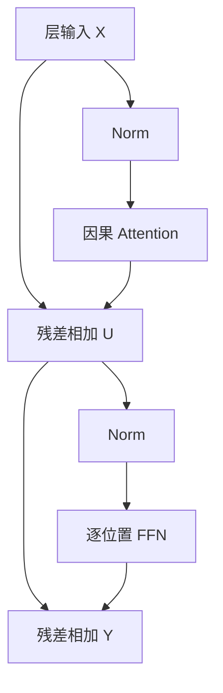

# 04 · Transformer 的完整计算路径

[返回目录](../README.md) · [下一章](05-attention-walkthrough.md)

## 从输入序列到下一 Token

本章跟踪一个 **Decoder-only、Pre-Norm、普通多头注意力**模型的前向。其他结构的变化见[架构变体](06-modern-architectures.md)。设输入有 `B` 条序列、每条 `T` 个有效位置，隐藏宽度为 `d`、层数为 `L`、词表大小为 `V`；表中的规则张量先不考虑 padding 和打包。

模型要实现的不是“查一个词的解释”，而是把每个位置更新成包含其允许上下文的表示，再用最后一个输入位置的表示预测后续 Token。一次生成先完成下表，再把选出的 Token 送回同一网络；不是一次前向就生成整篇答案。

| 阶段 | 输入与输出 | 信息发生了什么变化 |
| --- | --- | --- |
| Tokenization | 文本 → IDs `[B,T]` | 切分与映射由 Tokenizer 完成；聊天模板也是实际输入的一部分 |
| Embedding | IDs → `[B,T,d]` | 按 ID 取可学习矩阵的行，得到初始表示，不是相似度搜索 |
| 第一个 Block | `[B,T,d]` → `[B,T,d]` | Attention 混合跨位置信息，FFN 变换每个位置的特征 |
| 后续 Blocks | 重复到第 `L` 层 | 新一层读取上一层已组合的表示，通常使用各自参数 |
| 最终 Norm 与 LM Head | `[B,T,d]` → logits `[B,T,V]` | 将隐藏特征投影为各词表 Token 的未归一化分数 |
| 解码策略 | 最后有效位置的 logits → 一个 ID | 按采样或确定性规则选择后续输入 |

生成时引擎可以只对需要的末端位置运行 LM Head，不必保存所有位置的词表 logits。训练通常需要许多位置的监督，但实现也可以分块计算损失，避免物化整个 logits 张量。

## 一层内部：残差通路与两个子层



```math
U=X+\mathrm{Attention}(\mathrm{Norm}(X))
```

```math
Y=U+\mathrm{FFN}(\mathrm{Norm}(U))
```

Norm 通常沿一个位置的隐藏维归一化，不把不同请求的内容平均在一起。子层输出必须回到隐藏宽度，才能与残差相加。残差提供直接的信息和梯度路径，子层学习对已有表示的增量；它不是把 Attention 权重再加一次。

Pre-Norm 在子层前归一化，Post-Norm 在残差相加后归一化。原始 Transformer 与许多现代模型并不使用同一种布局；训练稳定性还依赖初始化、深度和参数化，不能仅凭 Norm 的名字判断。

## Attention：从隐藏状态到上下文更新

对归一化后的输入做三组可学习投影，单头记为：

```math
Q=XW_Q,\quad K=XW_K,\quad V=XW_V
```

这里的 `X` 指进入 Attention 的表示。每个位置既产生查询 Q，也产生供其他允许位置读取的 K/V。匹配特征与传递内容分开，使模型能“按某种特征找到位置，再取另一种特征”。它们不是自然语言问题或数据库主键。

普通 MHA 将投影结果拆为多个头。对某个查询位置 `t`，用它的 Q 与所有允许位置的 K 做点积，再在**键位置轴**上归一化，用这些权重加权汇总 V：

```math
A=\mathrm{softmax}\left(\frac{QK^\top}{\sqrt{d_h}}+M\right),\qquad Z=AV
```

缩放控制点积尺度，减轻维度增大时 Softmax 饱和。Mask 在归一化前屏蔽不允许的位置，概念上给它们负无穷分数。对因果模型，位置 `t` 可读自身和历史，不能读未来；padding 还需要额外屏蔽。

各头独立做信息组合，然后拼接并投影回隐藏宽度：

```math
\mathrm{MHA}(X)=\mathrm{Concat}(Z_1,\ldots,Z_h)W_O
```

`W_O` 混合不同头的结果；残差再保留原来的位置表示。因此 Attention 输出不是一个被选中 Token 的原文，而是可包含多个位置内容的向量。头的功能由训练形成，不能默认一个头对应一种固定语法规则。

## FFN：已有上下文上的特征计算

```math
\mathrm{FFN}(x)=\phi(xW_1+b_1)W_2+b_2
```

经典路径是 `d → d_ff → d`：先扩展特征，做非线性，再压回残差宽度。FFN 的参数在序列位置间共享，但它不再直接读取其他位置；输入已经包含 Attention 混入的上下文。现代门控 FFN 额外学习哪些中间特征应该通过，见[第 06 章](06-modern-architectures.md)。

Attention 负责跨位置组合，FFN 负责非线性特征变换，二者都占用计算和参数。只算注意力矩阵的成本，可能遗漏主要的线性投影和 FFN 工作。

## LM Head、采样与下一轮前向

最终 Norm 后，每个需要输出的位置与词表投影矩阵相乘，得到长度为 `V` 的 logits。模型并不是先恢复自然语言再选词；概率或排序直接发生在 Token ID 空间。部分模型让 LM Head 与 Embedding 共享权重，这是一种参数共享选择。

长度为 `T` 的提示词处理结束时，最后输入位置的 logits 用于选第一个输出 Token。**选出 ID 不会自动产生这个新 Token 的各层 K/V。**下一轮必须将这个 ID 做 Embedding，逐层执行网络，才能写入其 K/V 并得到再下一个 Token 的分数。停止前最后采样出的 Token 可能从未作为输入处理。

权重在普通推理中保持不变。随生成变化的是输入前缀和请求状态，具体增量路径见[KV Cache](09-inference-and-memory.md)，采样和流式输出的服务边界见[第 10 章](10-serving-and-distributed.md)。

## 为什么训练能并行，而单请求生成不能

训练已有完整目标序列，可以把所有输入位置同时送入网络，让因果 Mask 保证每个位置只能读其前缀。各位置预测各自的后继，并不是读到答案后复制答案。输入与标签的移位见[预训练](07-pretraining.md)。

生成时后续输入尚未确定：后一轮要等前一轮的 Token 选择。KV Cache 消除旧前缀的重复计算，但没有消除这种依赖；不同请求之间仍可批处理。

## 逻辑形状与执行代价

下表假设普通 MHA、`d = h × d_h`。实际模型的 Q/K/V 头数和宽度须按配置读取。

| 对象 | 逻辑形状 | 主要代价或边界 |
| --- | --- | --- |
| 隐藏状态 | `[B,T,d]` | 跨层传递；训练还需反向状态 |
| 拆头后的 Q/K/V | `[B,h,T,d_h]` | 新位置需重新投影；各层独立 |
| 注意力分数与权重 | `[B,h,T,T]` | 全注意力关系数随长度平方增长 |
| 每头汇总结果 | `[B,h,T,d_h]` | 拼头与输出投影回到 `[B,T,d]` |
| FFN 中间激活 | `[B,T,d_ff]` | 宽度、门控和保存策略影响峰值内存 |
| 词表 logits | `[B,T,V]` | 大词表投影和损失可成为独立开销 |

这是语义形状，不要求所有张量同时物化。[FlashAttention 与计算布局](16-transformer-implementation.md)改变数据读写和中间存储，不因此改变允许的信息关系。Encoder 的双向读取、Encoder–Decoder 的交叉注意力则改变信息边界，详见[第 05 章](05-attention-walkthrough.md)。

依据：[Attention Is All You Need](https://arxiv.org/abs/1706.03762)、[Hugging Face 缓存机制](https://huggingface.co/docs/transformers/cache_explanation)。
