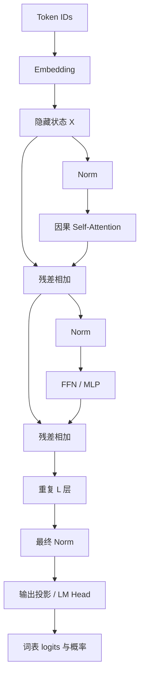

# 04 · Transformer 的完整计算路径

[返回目录](../README.md) · [下一章](05-attention-walkthrough.md)

## 一个位置如何获得上下文

可以把每个 Token 的隐藏状态看作一份不断更新的特征记录。Attention 让它从允许访问的位置吸收信息；FFN 对每个位置做特征变换。多层堆叠不断组合这些信息。

这只是理解数据流的类比：网络并没有显式的「记录对象」，隐藏向量也不是可直接读出的知识表。

## Decoder-only 主线

下面采用常见的 Pre-Norm 结构；本章采用这一常见结构，具体模型可能采用其他归一化、位置和 FFN 设计。



一层可写为：

```math
U=X+\mathrm{Attention}(\mathrm{Norm}(X))
```

```math
Y=U+\mathrm{FFN}(\mathrm{Norm}(U))
```


位置机制在注意力或输入等处应用，取决于实现。图中没有把它强行限定在某一个位置。

## Q、K、V：怎样计算关联

对单个头，先用三组可学习权重把隐藏状态映射为：

```math
Q=XW_Q,\quad K=XW_K,\quad V=XW_V
```


- Q：当前位置用于匹配信息的查询特征。
- K：各位置用于被匹配的键特征。
- V：各位置用于汇总的值特征。

Q/K/V 来自学习到的投影；不是人类写的查询语句或数据库主键。经典缩放点积注意力是：

```math
A=\mathrm{softmax}\left(\frac{QK^\top}{\sqrt{d_h}}+M\right),\qquad Z=AV
```


Softmax 沿每个查询对应的键位置进行。$`M`$ 是 Mask：允许位置取 0，不允许的位置概念上取负无穷，从而让其权重为 0。

除以 $`\sqrt{d_h}`$ 是为了控制点积分数的尺度，减轻较大维度时 Softmax 过于饱和的问题。

## 因果 Mask

位置 $`t`$ 预测下一个 Token 时，只能使用当前位置及其之前的输入，不能读取未来位置。

对于查询位置 t，允许读取自身与历史位置，屏蔽其后的未来位置。这个允许关系沿序列构成下三角结构。

训练时整个已知序列可以并行输入，依靠 Mask 保证每个位置不偷看未来。生成时未来 Token 尚未产生，因此必须逐步继续生成。

## 多头注意力

在常规多头设计中，多个头分别学习不同的投影，输出拼接后再由 $`W_O`$ 投影回隐藏维度：

```math
\mathrm{MHA}(X)=\mathrm{Concat}(Z_1,\ldots,Z_h)W_O
```


它增加了不同特征子空间中的信息组合能力，但不能假设每个头都对应固定语法或某种人类可解释功能。

## FFN / MLP

经典 FFN 为：

```math
\mathrm{FFN}(x)=\phi(xW_1+b_1)W_2+b_2
```


常见维度路径为 $`d\rightarrow d_{ff}\rightarrow d`$。FFN 对每个位置独立计算，参数在位置之间共享；跨位置的信息已由 Attention 混入。现代模型常用门控变体如 SwiGLU。

## 输出头

最后的隐藏状态乘以输出权重，得到 $`[B,T,V]`$ 的 logits。训练时通常对许多位置计算损失；生成下一个 Token 时一般读取最后一个有效输入位置的 logits。

部分模型将输出头权重与输入 Embedding 共享，称为 weight tying。这是参数共享选择，不是所有模型的要求。

## 形状核对表

假设普通 MHA，$`d=h d_h`$：

| 计算 | 形状 |
| --- | --- |
| 隐藏状态 | `[B,T,d]` |
| 拆头后的 Q/K/V | `[B,h,T,d_h]` |
| 分数与注意力权重 | `[B,h,T,T]` |
| 每头输出 | `[B,h,T,d_h]` |
| 拼接与输出投影 | `[B,T,d]` |
| FFN 中间激活 | `[B,T,d_ff]` |
| 词表 logits | `[B,T,V]` |

高效实现可能不显式存储完整 $`T\times T`$ 矩阵，数学意义仍可用此表理解。

## 从机制到实现：必须能回答的具体问题

**拆头与拼头：**Q 从 `[B,T,d]` 先变成 `[B,T,h,d_h]`，再交换到 `[B,h,T,d_h]`。输出时先交换回来再拼接。仅有相同元素数量，不能保证 reshape 的语义正确。

**Softmax 轴：**每个查询对所有允许键归一化，因此沿键位置轴计算。换到查询或头维，仍能输出同形状张量，但改变了模型定义。

**Pre-Norm 与 Post-Norm：**Pre-Norm 在子层计算前归一化，残差主路径能更直接传递；Post-Norm 在残差相加后归一化。二者的梯度传播与深层训练行为不同，需要与初始化和整体参数化一起考虑。

**缓存边界：**历史 K/V 属于每一层与每个请求，不能只缓存最后一层；增量位置编号必须接着历史继续。一次续写多个 Token 时，Mask 需要按全局位置构造。

**数值与语义验证：**除了形状，应比较完整前向与缓存前向、检查未来 Token 不影响过去位置、测试分块续写。执行布局与缓存语义见[第 16 章](16-transformer-implementation.md)。

## 残差、归一化与 FFN 如何共同工作

注意力传递跨位置的信息，FFN 对已有上下文表示进行非线性变换，残差保留直接通路，归一化控制子层输入或输出尺度。它们共同组成一层，不能把 Transformer 简化成只做注意力。

多层堆叠让后续层使用前面已组合的特征。参数在位置之间共享，层与层之间通常各有参数；是否共享层参数属于另外的结构选择。模型不会为每个句子单独创建一套网络。

Pre-Norm 有较直接的残差梯度路径，Post-Norm 有不同的尺度与优化行为。具体稳定性还与初始化、深度及训练参数化有关，不能从“用了 Norm”推断训练一定稳定。

## Encoder 与 Decoder 的信息边界

Encoder-only 通常让序列位置双向读取适用输入，适合形成整体表示；因果 Decoder 只读取前缀，用于有序生成；Encoder–Decoder 分别处理来源序列和目标序列，再由 Cross-Attention 连接。

训练目标与结构是两个维度。掩码语言建模、序列到序列恢复和下一 Token 预测组织不同信号；结构相似不保证能力相同。生成模型采用何种输出顺序，还决定缓存是否可以按因果前缀复用。

## “下一 Token”怎样承载复杂任务

回答、代码和工具调用都可表达成序列，训练数据中包含任务关系，网络可以学习条件输出的模式。简单的预测目标因此不意味着模型只能完成简单任务。

但序列表达没有消除正确性要求。合法程序可能计算错，流畅答案可能缺乏来源，工具调用可能越权。模型结构提供计算能力，训练提供行为，应用验证与执行负责实际任务边界。

更深入的信息关系见[注意力机制](05-attention-walkthrough.md)，实际内核与缓存见[计算布局](16-transformer-implementation.md)。
