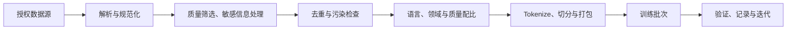

# 07 · 数据与预训练架构

[返回目录](../README.md) · [下一章](08-post-training.md)

## 预训练学什么？

主线仍然是预测下一 Token。大量文本中的语法、事实、代码模式和任务示例都影响这个目标，模型在优化过程中学习可复用的表示和生成规律。

目标简单不意味着模型只是查找原文；但它也可能记忆训练片段。泛化能力、记忆和数据泄漏需要分别评估。

## 数据管线



数据质量包含内容正确性、语言与任务覆盖、重复程度和领域平衡。数据量更多并不总能弥补劣质数据。

训练集与评估集应尽可能避免近重复和来源泄漏。仅做文件名不同的划分不够。

多个样本打包到一条序列时，要明确跨样本注意力边界和目标 Mask；简单拼接会改变训练语义。

## 输入和标签如何错开

原序列为 `[A, B, C, D]`，教学形式是：

```text
输入：A B C
目标：B C D
```

模型在 A 的输出位置学习预测 B，在 B 的位置学习预测 C。真实实现可能输入完整序列，再在损失函数内部错位。

教师强制（teacher forcing）指训练条件通常使用真实前缀；生成时使用模型此前生成的 Token，因此两个过程的输入分布可能不同。

常见损失为有效目标位置的平均负对数概率：

```math
\mathcal{L}=-\frac{1}{N_{valid}}\sum_{(b,t)\in valid}\log p_\theta(x_{b,t+1}\mid x_{b,\le t})
```


Padding 或某些任务指定的位置可从损失中排除。Attention Mask 和 Loss Mask 解决不同问题：一个控制能看什么，一个控制在哪些位置学习。

## 一个训练步骤

1. 从数据管线得到 Token、Mask 和目标。
2. 前向传播得到 logits 与损失。
3. 反向传播得到梯度。
4. 根据并行方案同步或汇聚必要梯度。
5. 用优化器更新参数，推进学习率调度。
6. 定期验证与保存检查点。

梯度累积让多个微批次的梯度合并后再更新。它改变有效批大小和更新频率，不会自动消除单次前向的激活内存。

## 为什么训练比推理占更多显存？

训练除了权重，还需要梯度、优化器状态，以及反向传播所需的激活。混合精度、激活重计算和状态分片分别改善不同部分。

恢复训练的检查点通常还需优化器、调度器、随机状态和训练进度；仅保存模型权重无法保证等价恢复。

## 规模、计算与数据

对普通稠密 Transformer，粗略训练计算估算常用 $`6ND`$，其中 $`N`$ 为参数量、$`D`$ 为训练 Token 数；这是常用近似，不是精确账单。

序列长度、注意力计算、词表、重计算、MoE 和实现都会改变成本。Scaling laws 研究资源与损失的规律，但不保证具体业务指标按同一关系改善。

## 自测

1. Attention Mask 与 Loss Mask 有什么区别？
2. 为什么从权重继续训练与从完整检查点恢复可能不同？
3. 预训练损失下降是否证明企业问答已经可靠？

[答案](misconceptions-and-answers.md) · [参考资料](references.md)
