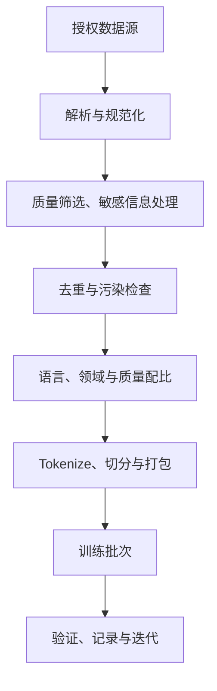

# 07 · 数据与预训练架构

[返回目录](../README.md) · [下一章](08-post-training.md)

## 预训练学什么？

主线仍然是预测下一 Token。大量文本中的语法、事实、代码模式和任务示例都影响这个目标，模型在优化过程中学习可复用的表示和生成规律。

目标简单不意味着模型只是查找原文；但它也可能记忆训练片段。泛化能力、记忆和数据泄漏需要分别评估。

## 数据管线



数据质量包含内容正确性、语言与任务覆盖、重复程度和领域平衡。数据量更多并不总能弥补劣质数据。

训练集与评估集应尽可能避免近重复和来源泄漏。仅做文件名不同的划分不够。

多个样本打包到一条序列时，要明确跨样本注意力边界和目标 Mask；简单拼接会改变训练语义。

## 输入和标签如何错开

标签移位表达相邻预测关系：

```text
输入：A B C
目标：B C D
```

模型在 A 的输出位置学习预测 B，在 B 的位置学习预测 C。真实实现可能输入完整序列，再在损失函数内部错位。

教师强制（teacher forcing）指训练条件通常使用真实前缀；生成时使用模型此前生成的 Token，因此两个过程的输入分布可能不同。

常见损失为有效目标位置的平均负对数概率：

```math
\mathcal{L}=-\frac{1}{N_{valid}}\sum_{(b,t)\in valid}\log p_\theta(x_{b,t+1}\mid x_{b,\le t})
```


Padding 或某些任务指定的位置可从损失中排除。Attention Mask 和 Loss Mask 解决不同问题：一个控制能看什么，一个控制在哪些位置学习。

## 一个训练步骤

1. 从数据管线得到 Token、Mask 和目标。
2. 前向传播得到 logits 与损失。
3. 反向传播得到梯度。
4. 根据并行方案同步或汇聚必要梯度。
5. 用优化器更新参数，推进学习率调度。
6. 定期验证与保存检查点。

梯度累积让多个微批次的梯度合并后再更新。它改变有效批大小和更新频率，不会自动消除单次前向的激活内存。

## 为什么训练比推理占更多显存？

训练除了权重，还需要梯度、优化器状态，以及反向传播所需的激活。混合精度、激活重计算和状态分片分别改善不同部分。

恢复训练的检查点通常还需优化器、调度器、随机状态和训练进度；仅保存模型权重无法保证等价恢复。

## 规模、计算与数据

对普通稠密 Transformer，粗略训练计算估算常用 $`6ND`$，其中 $`N`$ 为参数量、$`D`$ 为训练 Token 数；这是常用近似，不是精确账单。

序列长度、注意力计算、词表、重计算、MoE 和实现都会改变成本。Scaling laws 研究资源与损失的规律，但不保证具体业务指标按同一关系改善。

## 数据去重和污染检查的机制

精确哈希能去掉完全相同的文本；近重复可用规范化、片段指纹或近似匹配检测。网页模板、同文转载和代码复制可能使训练重复量远高于表面文档数。

污染检查应比较评估题、答案、近似改写和来源材料。仅删除评估文件名不够。无法证明数据完全无污染时，应明确评估结论的限制。

## 训练系统深入

优化器状态、批次语义、混合精度、状态分片与检查点恢复见[第 17 章](17-training-engineering.md)。

## 训练目标与能力之间的联系

下一 Token 预测把语法、事实表达、代码结构和问题回答都作为条件序列规律学习。要降低损失，模型可以学习局部模式，也可以学习更远的关系；哪种能力形成取决于数据、结构、规模与优化。

重复训练片段可能被记忆，组合规律也可能推广到未见输入。不能把模型全部描述成数据库，也不能把“泛化”理解成从不记忆。区分两者需要合适的留出任务与污染检查。

语言模型的目标不直接约束每个事实真实、每个动作授权。预训练建立基础能力，后训练和应用系统再对交互行为、证据与工具施加约束。

## 数据配比是一种能力取舍

自然语言、代码、数学、多语言和不同领域的数据决定模型接触到的模式。按来源均匀采样不一定按 Token 均匀，也不一定符合目标任务重要性。

稀有高质量数据可以重采样，但过度重复可能过拟合；大量低质量数据可能稀释有效信号。持续训练还要兼顾新领域与旧能力，不能只根据目标领域训练损失判断成功。

序列长度分布同样影响能力与成本。只看到短文本的训练，无法由部署时扩大窗口自动获得长文使用能力。分块与打包改变哪些信息共处一个计算序列，需要与目标一致。

## 计算预算与模型寿命

计算最优研究讨论给定训练预算下怎样在参数与数据之间分配，不是所有场景固定遵守一条比例。训练一次、推理很多次时，部署成本会使模型大小与训练长度的取舍改变。

模型总成本还包含数据处理、评估、失败训练和后续服务。模型更大但基础能力不匹配，可能需要更多后训练与更昂贵部署。Scaling law 的损失趋势也不能直接推导某个业务成功率。

原始依据：[Training Compute-Optimal Large Language Models](https://arxiv.org/abs/2203.15556)。本仓库采用其问题视角，不将实验中的经验关系写成固定配方。

## 预训练产物与检查点

推理需要权重与匹配的输入处理；恢复训练需要状态、数据顺序与优化进度。阶段检查点还为后训练、回归和问题定位提供基础版本。

训练可持续运行并不等于每个检查点都可恢复。分片写入、后台上传和提交标识要形成一致产物，失败时不能混读不同步数的状态。详见[训练系统](17-training-engineering.md)、[数据生命周期](15-data-lifecycle.md)与[模型生命周期](26-model-lifecycle.md)。
