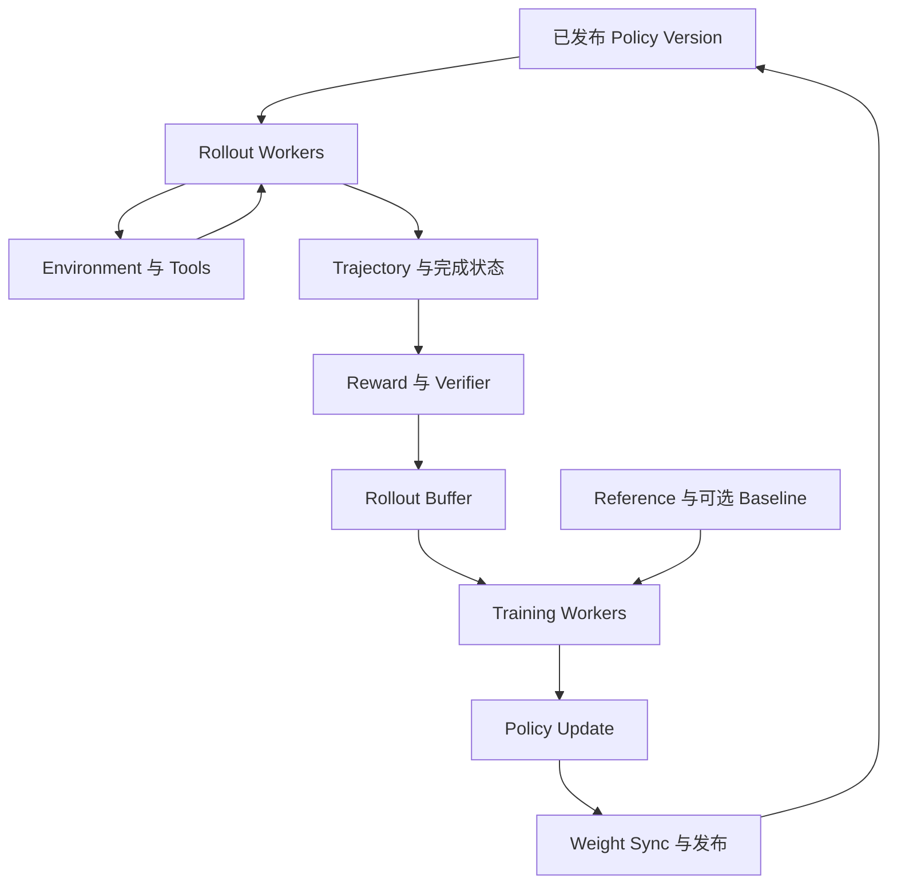

# 08 · 后训练、适配与对齐

[返回目录](../README.md) · [下一章](09-inference-and-memory.md)

## 续写能力为何还需要行为训练

预训练拟合语料中的后继，语料同时包含回答、错误、引用、角色和各种意图。给出用户请求时，模型未必知道应采用哪种行为、输出格式或拒绝边界。后训练通过示范、偏好或奖励改变输出策略，不只是给模型增加一层 Prompt。

它仍需要真实数据和评估。格式更稳、偏好得分更高不等于事实更准或所有能力都提升；新的分布可能损害原有能力。下面区分监督信号与执行数据流，不假定所有模型使用同一条流程。

## SFT 怎样把消息变成训练信号

SFT 样本通常包含指令、上下文和期望回复。先按实际聊天模板序列化角色与内容，再 Tokenize，形成与预训练类似的下一 Token 监督。

一种常见策略只计 assistant 回复的损失：用户和系统片段参与前向，为回复提供上下文，但不直接要求模型学会生成这些输入。多轮数据要明确监督哪些 assistant 段，工具调用与工具返回的角色边界也必须保留；全部 Token 都计损失则是另一种数据/目标选择。

| 环节 | 机制 | 会传到部署中的影响 |
| --- | --- | --- |
| 模板与特殊 Token | 将角色、消息结束和生成起点编码进序列 | 推理模板不同可能破坏学到的角色关系 |
| 输入/标签对齐 | 用前缀预测示范回复的后继 | 移位错误会让模型拟合错误目标 |
| Loss Mask | 选择计入损失的位置，不删除必要上下文 | 未监督输入仍可影响回复并获得间接梯度 |
| 批次与更新 | 对有效目标聚合，反向更新全参数或适配器 | 长回复权重、数据配比和重复样本改变学习分布 |

示范应展示真实可获得的信息与正确动作语义。若训练里反复写“已执行”却没有真实回执，模型可能学会自报成功；这不是运行时可靠执行的替代品。聊天格式依据：[Hugging Face Chat Templates](https://huggingface.co/docs/transformers/chat_templating)。

## 偏好对与奖励模型学到什么

偏好数据给同一输入配两个回复及优劣标签，不要求写出唯一标准答案。奖励模型可读取完整输入与回复，输出标量，训练使被选回复得分更高。标签可能来自人、模型或任务规则，各自有偏差和覆盖边界。

训练奖励模型的比较信号，不等于部署时可以直接拿它保证事实正确。模型可能利用长度、语气、格式或其他捷径取得高分；需要检查分布外行为和奖励与实际任务验收的相关性。

## DPO 怎样直接更新语言模型

标准离线 DPO 不必先训练独立奖励模型再做在线 rollout。对一个 `prompt, chosen, rejected` 三元组：

1. 训练模型分别在相同 prompt 下对两条回复做 Teacher-Forced 前向，提取回复 Token 的条件对数概率并聚合为序列分数。
2. 固定参考策略提供对应的两条序列分数；可预计算，但模型、模板、Tokenization 和计分范围要保持一致。
3. 比较两条回复“相对参考策略的对数概率变化之差”，经偏好目标形成损失，再只对训练模型反向更新。

这样优化的是相对偏好，不只是对 chosen 做一次 SFT，也不是把 rejected 当成下一 Token 的正确标签。原始 DPO 使用回复对数概率求和，直接改为长度平均会改变目标，不能当成无关实现细节。

参考策略约束漂移的方式来自目标设计，并不自动保证安全或正确。偏好数据的覆盖、噪声和超参数会决定效果；离线数据也可能逐渐偏离更新后策略的实际输出。依据：[DPO](https://arxiv.org/abs/2305.18290)。

## 在线 RL 的数据与模型怎样循环

Policy model 定义当前策略，rollout workers 用已发布的策略版本执行生成；Environment / Tools / Verifier 返回观察与评分，trajectory/reward 再进入 training workers。训练更新参数，发布新权重，后续 rollout 才使用新策略。这同时需要训练系统的更新一致性和推理系统的生成、KV 与调度能力。



图表达依赖，奖励也可在中间步骤计算，并非所有方法都等待整条轨迹结束。PPO 类流程可能有可训练 value model；其他方法可能用同一 prompt 多条 rollout 的 group baseline 或其他估计。Reference model 可提供漂移约束，但不等于生成本轨迹的 behavior policy，也不等于更新中的 trainer；上述组件并非所有方法必备。算法基础依据：[InstructGPT](https://arxiv.org/abs/2203.02155)。

Training workers 根据 reward 与所用 baseline 构造优势/目标，对选定动作位置做前向计分并反向更新策略；PPO 类目标需要对应的新旧策略概率及更新约束。Rollout 是产生训练对象的推理，不是边生成边对每个 Token 做优化器更新。概率记录还要区分原模型分布、temperature/truncation 等实际采样变换和算法所需计分口径，不能在版本或采样设置不一致时直接混用。

## 轨迹所有权、奖励与生成状态

| 对象 | 谁产生、谁消费 | 生命周期与边界 |
| --- | --- | --- |
| Rollout KV | 生成引擎产生，后续生成位置读取 | 与实际策略/adapter、历史和位置绑定；不是优化器状态，也不是训练反向激活 |
| Trajectory | rollout 协调者归集 Token、动作/观察、概率与 mask，trainer 消费 | 标识 prompt/trajectory/attempt、behavior policy version、结束原因及工具/奖励版本 |
| Reward / verifier result | 模型、程序、环境或人给信号，训练目标消费 | 保留评分依据与有效状态；验证器超时不等于回答错误或奖励为零 |
| Rollout buffer | 接收已完成/可训练轨迹，训练消费器领取 | 需明确分组完整性、去重、领取/提交、过期与容量背压 |

轨迹的逻辑所有者可以是协调者/存储服务，不必是保存所有 Token 的同一 GPU worker。失败重试要用 attempt 区分，并在进入 buffer 时避免重复计入；“收到结果”与“已被某次更新消费”是不同状态。

工具返回成为下一段生成的上下文，模型动作位置与环境提供的观察位置要有不同训练 mask。Verifier 只检查它覆盖的规则，不能由测试通过推断全部事实或安全正确。环境具有副作用时，重试需要业务幂等或对账；重新生成轨迹不会自动撤销已执行的动作，见[Agent Runtime](20-agent-runtime.md)。

Failed / truncated rollout 要区别模型终止、长度截断、环境失败与超时。是否可用于训练、截断末端如何计目标/基线，取决于算法；不能把未完成样本统一标成低奖励，更不能悄悄删除所有长失败轨迹后宣称策略改善。

## 同步与异步 rollout：陈旧程度是一份算法合同

Synchronous rollout 常在固定策略版本下收集一批，再训练并切换版本，边界清楚，但长尾轨迹、verifier 或工具会让其他资源等待。Asynchronous rollout 允许采样与训练重叠，减少部分等待，却需处理在途旧版本轨迹、积压和策略漂移。

Policy staleness 不是只看生成距今多久：要记录生成策略与当前训练策略之间的更新跨度，必要时检查分布差异和行为概率。On-policy 指数据与算法要求的采样策略相匹配，不是“刚生成的样本”同义词；新样本若来自错误权重，同样不满足。算法可能允许受控复用/校正，但不能将旧轨迹重新贴成新版本来消除偏离。

权重更新后，旧 rollout 可等待消费、在限定窗口内按支持的方法校正、弃用或重新生成；选择要由目标与实现合同确定。重算新策略概率能提供优化所需评分，却不改变轨迹原来由谁采样。持续异步还需要 buffer 上限与背压，否则高速采样只会增加过期样本和存储。

## 长 Reasoning 轨迹为什么改变系统效率

长轨迹占用更多 rollout KV、Decode 轮次、轨迹字节和训练有效位置；工具等待延长状态驻留，分组奖励可能等待同组最后一条完成。截断率、通过验证的完成量、版本可用性及奖励/训练消费能力，需要与 raw rollout tokens/s 一起看。

Rollout throughput 很高，不代表单位成本产生了更多可用学习信号：长失败回答、重复动作、奖励积压和 stale 样本弃用都可能消耗资源而不产生有效更新。最终仍以独立质量评估、达到目标所需时间/成本判断，不将更长推理或更高奖励自动等同于更强能力。

Trainer/rollout 分池、布局转换、权重发布与 checkpoint 的工程责任见[第 17 章](17-training-engineering.md)；观测关联见[第 31 章](31-ai-systems-observability-and-debugging.md)。一手系统实例：[HybridFlow](https://arxiv.org/abs/2409.19256)、[AReaL](https://arxiv.org/abs/2505.24298)；它们展示分离、同步或异步设计，不代表所有 RL 算法共享同一采样合同，也不将论文 speedup 当作普遍收益。

## LoRA 怎样减少可训练状态

对一层输入—输出方向为 `d_in → d_out` 的线性映射，一种写法是冻结原始 W，仅学习低秩增量：

```math
W'=W+\frac{\alpha}{r}AB,
\quad A\in\mathbb{R}^{d_{in}\times r},\ B\in\mathbb{R}^{r\times d_{out}}
```

前向可分别计算基础路径 `xW` 与增量路径 `(xA)B` 后相加；反向更新 A/B，不为冻结 W 维护梯度与优化器矩。冻结 W 仍参与前向，以及需要时对输入的梯度传播；不能把基础网络的计算和激活全部删掉。

训练后可将增量合并入兼容的基础权重，也可保留适配器按请求选择。量化基础权重、多个适配器并发与合并格式会产生不同执行成本；权重合并不一定是所有部署的最佳选择。基础模型版本与适配器必须匹配。

LoRA 的低秩和选定模块限制更新空间，降低参数状态成本，但不保证所有任务效果等于全参训练。QLoRA 进一步压缩冻结基础权重，仍要处理反量化、计算精度、激活与反向。依据：[LoRA](https://arxiv.org/abs/2106.09685)、[QLoRA](https://arxiv.org/abs/2305.14314)。

## Prompt、RAG、微调与工具的分工

| 缺口 | 优先考虑 | 不能替代什么 |
| --- | --- | --- |
| 任务和格式没说清 | Prompt、模板与结构验证 | 不创造缺失事实 |
| 需要最新或私有资料 | RAG、授权查询 | 检索不自动教会新行为 |
| 稳定行为、格式或特定能力需适配 | SFT / 参数适配 / 偏好优化 | 权重不应成为高频业务状态库 |
| 需要计算或真实动作 | 工具与受控运行时 | 文本声明不能替代执行回执 |

后训练改参数，RAG 组织当前证据，工具访问真实状态；可以组合，但评估应归因到具体缺口。比较适配方案时保留未适配基线，检查目标任务、通用能力回退、数据泄漏、部署成本与安全边界。

训练工程见[第 17 章](17-training-engineering.md)，应用接口见[第 11 章](11-rag-and-agents.md)，真实执行边界见[第 20 章](20-agent-runtime.md)。
