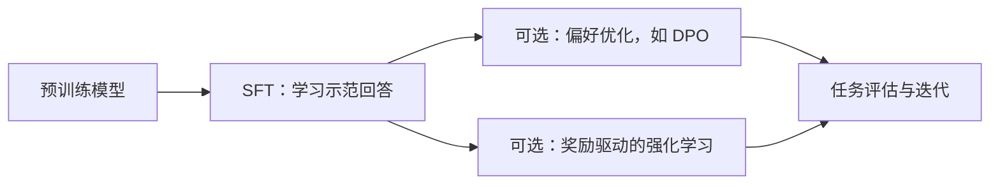

# 08 · 后训练、适配与对齐

[返回目录](../README.md) · [下一章](09-inference-and-memory.md)

## 从续写到遵循指令

预训练模型具备基础生成能力，但不一定按用户意图回答。后训练使用任务示例、偏好或奖励，让模型更适合交互和任务执行。



这是常见概念流程，实际训练可以多轮、混合或采用其他次序，不是所有模型都经过全部阶段。

## SFT：学习示范

监督微调使用「指令—回答」等样本继续训练。对话训练常在助手回答 Token 上计算损失，但具体 Mask 策略依数据与实现而定。

SFT 适合学习输出格式、任务流程、领域表达和工具调用约定。它可能带入知识，但不是一个保证事实可更新、可引用的知识库。

数据示例必须接近目标场景：只训练简单短问答，无法当然推出模型能处理长文档、多轮冲突和复杂工具结果。

## 偏好优化与 RLHF

偏好数据可以是同一问题下「更好的回答」与「较差的回答」。偏好标注需要明确定义标准，例如正确性、完整性、是否胡编和是否遵循指令。

| 方法 | 训练信号 | 关键机制 | 常见问题 |
| --- | --- | --- | --- |
| SFT | 示例目标 Token | 提高示范回答的似然 | 示例质量和覆盖不足 |
| DPO | 成对偏好 | 用策略与参考模型的相对对数概率构造直接优化目标 | 偏好偏差、参考设置、分布外表现 |
| 奖励模型 + RL | 模型生成的回答及奖励 | 采样回答、估计奖励、更新策略 | 奖励投机、训练稳定性、采样成本 |
| 可验证奖励 RL | 可检查的结果，如测试通过 | 根据结果奖励优化生成策略 | 验证器漏洞、任务覆盖有限 |

DPO 通常不需要先训练独立奖励模型，但仍是在更新模型参数，不是只修改 Prompt。

RLHF 是一类利用人类反馈的流程；PPO 是可用的强化学习算法之一。实际系统也可能用规则、AI 反馈或可验证结果，不能全部等同于「人工给每一句打分」。

## LoRA：训练少量增量参数

对权重 $`W\in\mathbb{R}^{d_{in}\times d_{out}}`$，一种行向量约定下的写法是：

```math
W'=W+\frac{\alpha}{r}AB,
\quad A\in\mathbb{R}^{d_{in}\times r},\ B\in\mathbb{R}^{r\times d_{out}}
```


冻结基础权重，只训练低秩增量。不同资料可能采用转置后的权重约定，思想相同。

LoRA 是参数高效适配方法，可以服务于 SFT 等目标；它不是与 SFT 同一维度的替代术语。部署时可合并增量，或按需加载适配器。

QLoRA 结合量化的冻结基础权重与低秩适配，改善微调资源需求。反向计算、中间激活和优化器仍需要资源；「4-bit 基础权重」不代表所有训练张量都是 4-bit。

## Prompt、RAG、微调怎么选？

| 需求 | 优先尝试 | 原因 |
| --- | --- | --- |
| 改口吻、角色、少量格式要求 | Prompt 与示例 | 改动快、容易验证 |
| 接入频繁更新的私有资料并给引用 | RAG | 从外部来源提供证据 |
| 大量稳定的领域格式或任务行为 | 高质量数据 + SFT / LoRA | 把行为模式学入参数 |
| 精确查询、运算、外部操作 | 工具调用 | 交给确定性系统完成 |
| 改善复杂推理或偏好 | 针对性后训练与评估 | 需要匹配数据、奖励和验证机制 |

这些方法可以组合。先用评估明确瓶颈：证据没检到时，优先修改检索；证据足够但行为不稳定时，再考虑 Prompt、模型或训练。

## 具体适配决策应包含哪些证据？

先建立无需训练的基线。将错误分成资料缺失、格式不稳定、领域推理不足、工具参数错误和执行约束错误，再判断是否需要训练。

若训练目标是稳定格式，数据应覆盖正常、歧义、拒绝和异常输入；只提供正面示范容易让模型在所有场景都套同一格式。若训练工具调用，目标还要匹配工具 Schema 与错误反馈。

评估同时检查目标任务改善与通用能力回退。LoRA 可训练参数变少，仍可能过拟合或遗忘；适配方法不替代数据质量与验证。

梯度聚合、分片训练与优化器状态见[第 17 章](17-training-engineering.md)。

## 行为示范、偏好与奖励的区别

SFT 指定应该生成的示范，偏好优化比较哪些回答更符合标准，强化学习根据采样结果与奖励改变策略。三者使用不同信号，对数据覆盖与错误标签有不同敏感性。

示范太窄可能只教会固定模板；偏好标注偏爱冗长可能诱导更长输出；奖励只检查最终答案可能忽略过程中的不当动作。目标设计必须覆盖真正希望改善的行为，而不是只追一个容易测量的分数。

参考策略或 KL 类约束可以限制更新偏离已有行为，但不保证不会遗忘。领域能力、通用任务、拒答和工具行为需要一起观察。后训练也不能保证删除训练记忆或完善访问控制。

## 在线采样与奖励系统

强化学习式后训练常有生成样本、评估奖励、计算更新并同步策略的循环。采样需要推理资源，奖励计算可能需要另一个模型、程序或外部环境，整个训练并不只是一次前向反向。

旧策略生成的数据与当前策略存在差异，需要由具体算法处理。采样长度、奖励稀疏程度和验证器成本都影响效率。奖励投机来自模型找到提高评分而未满足真正目标的策略，验证器因此也是必须维护的系统组件。

可验证奖励适合有明确结果标准的部分任务，不能直接覆盖所有开放式事实与交互质量。[InstructGPT](https://arxiv.org/abs/2203.02155)与 [DPO](https://arxiv.org/abs/2305.18290)展示的是不同的后训练机制。

## 参数高效并不等于总成本极低

LoRA 减少可训练增量与相应优化状态，冻结基础权重仍要参与前向，并在需要时参与梯度传播。激活内存、数据处理和基础权重加载仍然存在。

部署合并适配器可以减少额外执行，但需要与基础版本和量化路径兼容。动态加载多个适配器增加灵活性，也带来批次、缓存与版本管理问题。适配器小不能自动推断服务负担小。

蒸馏让较小模型学习教师提供的目标或行为，优势依赖教师质量与训练任务覆盖。教师输出不是天然正确标签，也可能把其偏差传给学生。最终比较仍然针对任务质量与部署成本。
