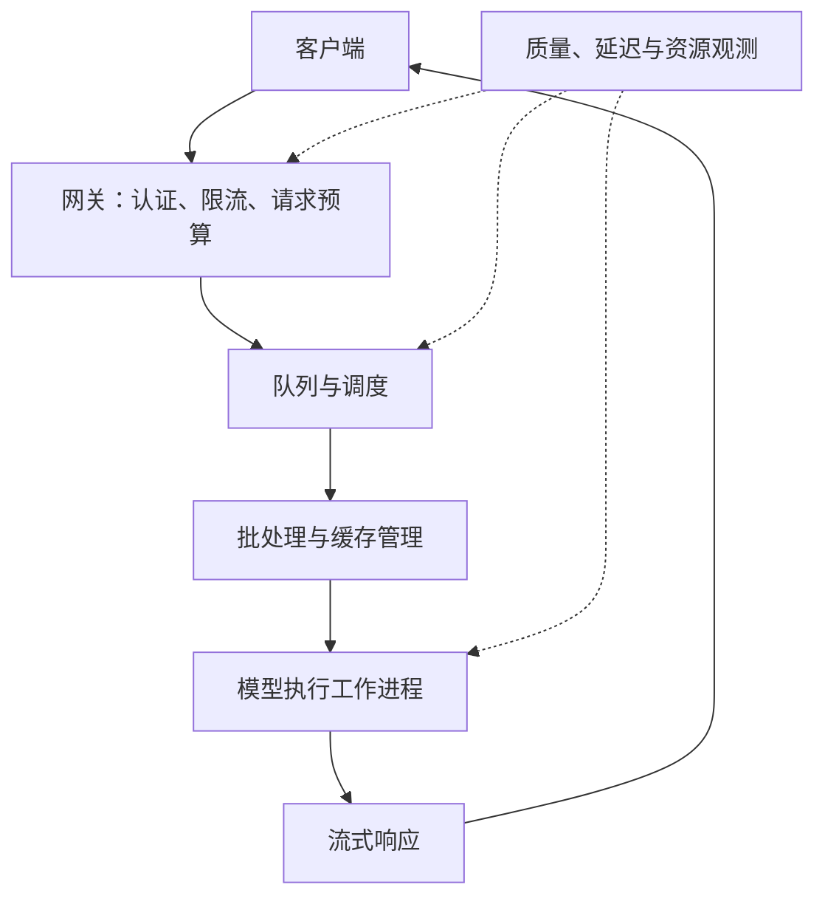

# 10 · 推理服务与分布式架构

[返回目录](../README.md) · [下一章](11-rag-and-agents.md)

## 从模型脚本到生产服务

服务要同时满足模型计算、请求隔离、资源分配、故障处理和 API 语义。实际系统可合并这些模块，也可能采用多个集群。

## 性能指标必须一起看

| 指标 | 含义 | 典型影响因素 |
| --- | --- | --- |
| TTFT | 请求发出到首 Token 的时间 | 排队、输入长度、prefill、网络 |
| ITL / TPOT | 相邻 Token 延迟 / 每输出 Token 耗时 | decode、批次和调度；统计定义需明确 |
| 端到端延迟 | 请求到完整结果的时间 | 检索、工具、生成长度和重试 |
| 吞吐 | 单位时间完成的 Token 或请求 | 硬件、批处理、长度分布 |
| P95 / P99 | 延迟分布尾部 | 大请求、拥塞、失败重试 |
| 成本 / 成功任务 | 完成一个合格任务的成本 | 模型价格、长度、重试和成功率 |

报告吞吐时，应说明输入/输出长度、并发、硬件、精度和质量约束。只比较一个 tokens/s 数字，很容易比较了不同负载。

## 连续批处理

静态批处理等待同一批请求完成；连续批处理可在生成步骤之间释放完成请求的位置并加入新请求，提高资源利用。

请求长度不同、prefill 计算重、decode 对延迟敏感，会导致调度竞争。分块 prefill 可将长输入分段调度；其收益与代价依实现和工作负载而定。

更大批次可能提高总体吞吐，也可能增加等待和尾延迟。批次大小是需要结合服务目标调整的参数。

## 缓存管理

PagedAttention 风格的方法将 KV Cache 分块管理，减少传统连续分配中的浪费，并支持更灵活的管理；它不减少模型在数学上需要的全部历史信息。

Prefix caching 复用相同前缀的已计算状态。是否命中通常取决于 Token 序列、模型与适配器版本、位置语义和运行时配置。涉及私有信息时还应按租户与权限正确隔离。

## 常见并行方式

| 方式 | 怎样拆分 | 主要用途 | 代价 |
| --- | --- | --- | --- |
| 数据并行 DP | 多个完整副本处理不同数据或请求 | 训练扩批、推理扩吞吐 | 训练同步；推理副本重复存权重 |
| 张量并行 TP | 把层内矩阵运算切到多设备 | 单卡放不下或计算太大 | 层间/层内通信频繁 |
| 流水线并行 PP | 把不同层放到不同设备 | 分摊权重与训练计算 | 流水线气泡、调度和单请求跨设备 |
| 专家并行 EP | 把不同 MoE 专家放到不同设备 | 稀疏 MoE 扩展 | Token 路由通信与负载不均 |
| 状态分片，如 ZeRO/FSDP | 分片参数、梯度或优化器状态 | 训练显存节省 | 状态获取通信、实现复杂度 |

还有序列或上下文维度的并行方法，不同框架使用的名称和实现略有区别。多种并行方式可组合，但不是设备越多越快。

## Speculative Decoding

草稿模型或其他提议机制一次提出多个 Token，目标模型批量验证。采用满足相应概率校正条件的算法时，可以保持目标采样分布；具体实现与解码设置需要核对。

速度提升取决于接受率、草稿成本和验证开销。草稿越大不一定越快，也不是所有请求都有收益。

## 一个部署决策顺序

1. 先明确任务质量要求和典型输入/输出长度。
2. 测算权重、并发缓存和工作区，保留容量余量。
3. 选择模型、精度和执行引擎，验证任务质量。
4. 测量排队、prefill、decode、检索和工具各段耗时。
5. 根据瓶颈调整调度、缓存、并行或副本数量。
6. 用真实长度分布和高峰负载复测尾延迟及稳定性。

## 准入与调度是不同决定

准入决定是否接受请求，调度决定已接受请求何时获得资源。请求数相同但上下文长度不同，KV 需求与执行时间可以相差很大，因此准入要考虑长度、输出预算和可用块。

过载时持续接受请求会扩大队列，增加尾延迟与超时。限流、优先级、退避和拒绝策略需要与服务目标匹配。更大的队列可以吸收短突发，却不能弥补长期到达率超过处理能力。

取消也属于容量管理。客户端断开或用户停止后，如果后台继续生成，缓存和计算仍被占用。应用取消信号需要传播到引擎，回收状态并给出明确终止原因。

## 副本、并行与可用性

多个完整副本扩展总吞吐并提供故障替代；TP、PP 和 EP 在一个逻辑副本内部拆分计算或参数。一个 TP 组中设备故障可能让整个副本不可用，增加设备数量并不自动增加容错。

请求路由还可以考虑当前队列、长度和前缀缓存。总是路由到最闲副本可能丢失缓存收益，总是追求命中又可能制造热点，需要权衡排队和复用。

会话在某个副本有缓存，不代表它的业务状态也应该只保存在该进程。持久任务状态与临时 KV 分离，故障后才能根据应用语义恢复或重算。

## Prefill / Decode 分离的系统代价

分离使两类负载分别采用适合的调度与设备，但增加 KV 传输、会话路由和两侧容量匹配。短请求、低复用或网络拥塞时，传输代价可能抵消执行收益。

传输开始与结束的时机、状态完整性和目标副本准备情况会影响首 Token。取消、传输失败与重试还要确保资源回收，不能仅画两台 GPU 就宣称完成了分离架构。

## 缓存层的区别

响应缓存直接复用最终结果，Prefix Cache 复用部分模型状态，文档与 Embedding 缓存复用检索产物。它们有不同的键与失效规则。

动态业务结果不应因问题文本相同就返回旧答案；Prefix Cache 则不能因为两段话意思相似就视为等价。模型、适配器、证据版本、租户和时间语义决定可复用边界。

## 服务指标反映用户和系统两个视角

吞吐描述系统处理量，延迟描述单请求体验。输入吞吐和输出吞吐的资源性质不同，按请求统计又容易忽略长短差异。

平均 TPOT 可掩盖中间一次明显卡顿；P95 / P99 更能反映长尾，但仍应按请求长度与任务类型理解。质量不达标的高速输出不是合格吞吐。公平比较需要固定质量要求和负载分布，再看资源与成本。
