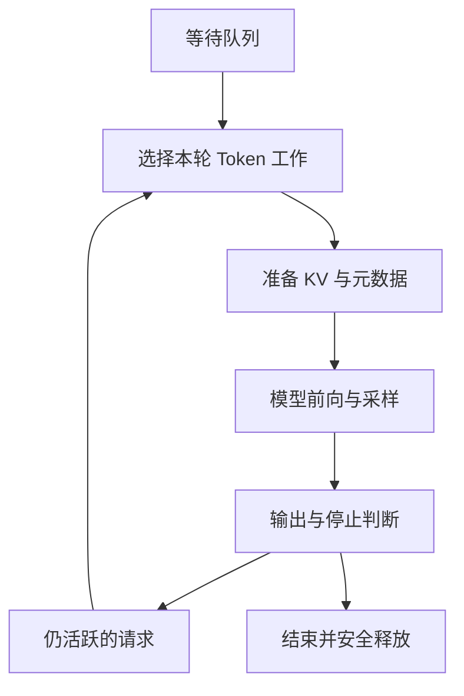

# 10 · 推理服务与分布式架构

[返回目录](../README.md) · [下一章](11-rag-and-agents.md)

## Serving 是持续管理请求与资源的系统

模型前向接收张量并产生分数，Serving 还要处理身份、输入约定、排队、显存、输出连接、取消与故障。一个 HTTP 请求的生命周期远长于一次 GPU 前向；一个 GPU 批次也可以包含多个生命周期阶段不同的请求。

本章解释控制面与分布式数据流。[第 09 章](09-inference-and-memory.md)解释缓存为什么成立，[第 18 章](18-inference-engineering.md)解释引擎的块表、调度与容量细节。下述路径采用普通自回归生成，不把实现特有的阶段名称当作统一标准。

## 一个请求从入口到结束

| 阶段 | 请求与状态怎样变化 | 必须保证什么 |
| --- | --- | --- |
| 入口处理 | 校验身份、模型/适配器、参数和配额；为请求建立 ID | 不把访问控制交给模型；记录实际模型版本 |
| 输入准备 | 应用聊天模板、Tokenize、多模态预处理；确定输入长度与输出上限 | 采用与模型匹配的输入约定，保留请求和计算输入的关联 |
| 准入与排队 | 拒绝不支持的要求，或进入待运行队列 | 等待有超时和背压，不接受无限队列 |
| 调度与 KV 准备 | 匹配可复用前缀，为本轮新位置分配块，生成位置与块表元数据 | GPU 写入有有效目标，不能边写边回收 |
| Prefill | 处理未计算的提示词位置，逐层建立 KV | 完成提示词末端计算后才具备首输出 logits |
| Sampling | 对末端 logits 应用请求的选择、约束与停止策略 | 采样状态和 Token 归属按请求隔离 |
| Streaming | 将选出的 ID 增量解码成文本或结构化事件 | 一个 Token 不一定对应一个可独立发送的字符 |
| 下一轮 Decode | 未停止的请求携带上一轮选出的 Token，再次进入调度 | 保持历史长度、位置、KV 与输出计数一致 |
| 完成或取消 | 停止新调度、提交结束原因，释放本请求引用和连接资源 | 在途 GPU 工作完成前不能复用其内存 |

输出链路也需要缓冲：Tokenizer 的字节片段可能尚未构成完整字符，停止字符串可能跨 Token，需要暂留后缀避免把应隐藏的停止内容提前发送。慢客户端需要有界输出队列和背压；不能让无限网络缓冲成为新的内存泄漏。

用户看到第一段内容时，服务可能已运行数轮。客户端断开、应用取消和模型 EOS 是不同事件；取消应传播到调度器，不能仅关闭 HTTP 连接而让生成一直占用 KV。

## 调度器为什么按迭代而不是整请求工作

静态批处理在开始时固定一组请求，短请求完成后空位可能要等最长请求。Continuous Batching 在每轮模型执行前重建运行集合：移除完成/取消项，给可继续的 Decode 分配新位置，并在预算允许时加入 Prefill 工作。

“连续”不代表可以任意时刻向已启动的 GPU 内核插入请求；改变通常发生在迭代边界。引擎用有效长度与偏移描述每条序列，避免请求互读内容。

准入决定“是否承担这个请求”，调度决定“本轮运行哪段工作”。Token 计算预算、KV 容量、最长等待与 Decode 间隔是不同约束。长 Prefill 会使已活跃请求的下一 Token 等待；分块 Prefill 能限制单轮干扰，但增加调度与历史读取的开销。

## TP 怎样切矩阵，而不只是把权重放到多卡

考虑经典两矩阵 FFN，用行向量约定：输入 `X` 宽度为 `d`，`W1[d,d_ff]` 扩展宽度，`W2[d_ff,d]` 压回。下面是一种常见的列并行—行并行组合，省略偏置，`p` 为 TP rank 数：

| 操作 | 每个 TP rank 的数据 | 通信发生在哪里 |
| --- | --- | --- |
| 第一投影按输出列切分 | 每卡有完整 X 和不同的 `W1_i[d,d_ff/p]`，得到自己的中间特征片段 | 输入已复制时无需立即汇总各片段 |
| 非线性 | 每卡对自己的特征片段执行激活 | 逐元素操作可留在本地；门控两支须对齐切分 |
| 第二投影按输入行切分 | 每卡有对应 `W2_i[d_ff/p,d]`，产生全宽但不完整的贡献 `Y_i` | 各卡贡献必须相加，不是拼接 |
| 汇总与残差 | 对各个 `Y_i` 求和得到完整输出 Y，再按布局接残差 | 常用 all-reduce；序列分片布局可采用其他通信组合 |

TP 不是每卡独立算完同一请求后投票。矩阵分片、激活布局与集合通信一起定义执行。若有输出偏置，应避免在每卡局部贡献里重复加入后又被归约多次。

Attention 常按头切 Q/K/V，各卡算本地头，再通过输出投影的部分贡献归约。GQA 的 K/V 头少时可能需要复制某些 KV 头，不能假定 KV 和权重都严格除以 TP 卡数。词表投影也可分片，此时全局 Greedy 或采样需要全局候选/归一化等协议，不能让每卡从本地词表自行选一个 Token。

层内通信处在每次生成的关键路径。增加 TP 可以降低每卡权重和计算，但小批次 Decode 中频繁小通信的时延可能超过节省，拓扑与算子大小决定收益。矩阵划分依据：[Megatron-LM](https://arxiv.org/abs/1909.08053)。

## PP、DP、EP 的真实数据路径

**PP：**不同 stage 持有不同层。微批次的隐藏状态从前段传给后段，末段才得到输出分数；每段持有其所属层的 KV。一个请求的下一轮输入仍依赖上轮末段结果，不能让各段各自产生不同后续 Token。多个请求或微批次交错填充流水线，代价是阶段间传输、负载不均与空闲气泡。

**DP：**多个副本处理不同请求，每个副本内部可以使用 TP/PP。普通推理不需要像训练一样同步梯度，但要路由、扩缩容和健康管理。迁移已有请求还需要迁移或重建 KV、采样和生成状态，不是改一个负载均衡地址即可。

**EP：**专家分布到不同设备，路由器按 Token 选择专家，将表示发送到专家拥有者，执行后再送回并按路由权重组合。一个批次可能访问许多专家；热门专家与 all-to-all 通信能成为瓶颈。权重、激活计算与路由代价须分别计算，见[第 06 章](06-modern-architectures.md)。

这些维度可组成并行分组，应匹配拓扑和模型结构。任一必须参与的 rank 故障都可能破坏当前并行副本，不能只用“设备数越多越快”指导部署。

## Prefill / Decode 分离需要交接什么

分离让两阶段分别选择硬件、批次和并行布局，减少长输入对持续生成的干扰。但 Prefill 输出不只是一个 Token：Decode worker 还需要提示词的**各层 KV**。

交接需要匹配请求 ID、模型与适配器版本、有效位置、缓存精度/布局，并将源分片传输或重排到目标布局；目标先有空间，数据到达且可读后才能继续。首 Token 在源端还是目标端采样属于协议选择，双方必须一致处理已生成与已计算的位置。

传输字节随前缀状态增长，还可能有源/目标重复持有 KV 的峰值占用。失败时要区分“源端已完成”“传输已完成”“目标已接管”，否则容易泄漏、重复输出或误释放。收益取决于互联、负载和服务目标。研究入口：[DistServe](https://arxiv.org/abs/2401.09670)。

## 指标要与边界和负载一起定义

TTFT 应明确从客户端发送、服务接收还是引擎接收计时，包含的排队、预处理、Prefill 与传输不同。Inter-token latency / TPOT 也要说明是引擎 Token 还是客户端可见事件，流式合并会改变观测。

吞吐需区分输入和输出 Token，并记录输入/输出长度分布、并发、缓存命中与质量约束。峰值 tokens/s 不等于服务容量；更有用的是满足首响应、后续间隔和错误率目标时的有效请求量。量化、推测解码与缓存策略见[推理引擎](18-inference-engineering.md)。

模型文件缓存、KV 前缀缓存和业务答案缓存复用的对象、失效条件及权限不同。容量回归与生产观测见[第 22 章](22-evaluation-and-production.md)。

调度依据：[Orca](https://www.usenix.org/conference/osdi22/presentation/yu)、[PagedAttention](https://arxiv.org/abs/2309.06180)；通信语义见[NCCL 集体操作](https://docs.nvidia.com/deeplearning/nccl/user-guide/docs/usage/collectives.html)。
