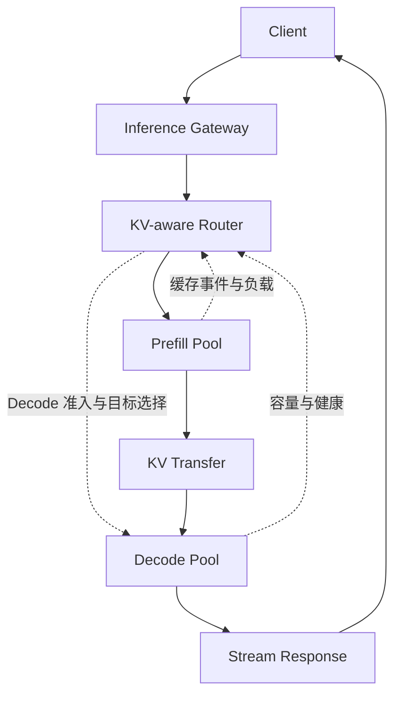

# 10 · 推理服务与分布式架构

[返回目录](../README.md) · [下一章](11-rag-and-agents.md)

## Serving 是持续管理请求与资源的系统

模型前向接收张量并产生分数，Serving 还要处理身份、输入约定、排队、显存、输出连接、取消与故障。一个 HTTP 请求的生命周期远长于一次 GPU 前向；一个 GPU 批次也可以包含多个生命周期阶段不同的请求。

本章解释控制面与分布式数据流。[第 09 章](09-inference-and-memory.md)解释缓存为什么成立，[第 18 章](18-inference-engineering.md)解释引擎的块表、调度与容量细节。下述路径采用普通自回归生成，不把实现特有的阶段名称当作统一标准。

## 一个请求从入口到结束

| 阶段 | 请求与状态怎样变化 | 必须保证什么 |
| --- | --- | --- |
| 入口处理 | 校验身份、模型/适配器、参数和配额；为请求建立 ID | 不把访问控制交给模型；记录实际模型版本 |
| 输入准备 | 应用聊天模板、Tokenize、多模态预处理；确定输入长度与输出上限 | 采用与模型匹配的输入约定，保留请求和计算输入的关联 |
| 准入与排队 | 拒绝不支持的要求，或进入待运行队列 | 等待有超时和背压，不接受无限队列 |
| 调度与 KV 准备 | 匹配可复用前缀，为本轮新位置分配块，生成位置与块表元数据 | GPU 写入有有效目标，不能边写边回收 |
| Prefill | 处理未计算的提示词位置，逐层建立 KV | 完成提示词末端计算后才具备首输出 logits |
| Sampling | 对末端 logits 应用请求的选择、约束与停止策略 | 采样状态和 Token 归属按请求隔离 |
| Streaming | 将选出的 ID 增量解码成文本或结构化事件 | 一个 Token 不一定对应一个可独立发送的字符 |
| 下一轮 Decode | 未停止的请求携带上一轮选出的 Token，再次进入调度 | 保持历史长度、位置、KV 与输出计数一致 |
| 完成或取消 | 停止新调度、提交结束原因，释放本请求引用和连接资源 | 在途 GPU 工作完成前不能复用其内存 |

输出链路也需要缓冲：Tokenizer 的字节片段可能尚未构成完整字符，停止字符串可能跨 Token，需要暂留后缀避免把应隐藏的停止内容提前发送。慢客户端需要有界输出队列和背压；不能让无限网络缓冲成为新的内存泄漏。

用户看到第一段内容时，服务可能已运行数轮。客户端断开、应用取消和模型 EOS 是不同事件；取消应传播到调度器，不能仅关闭 HTTP 连接而让生成一直占用 KV。

## 调度器为什么按迭代而不是整请求工作

准入决定是否承担请求，引擎在迭代边界决定本轮 Token 工作；两者通过容量反馈与背压连接。Continuous Batching、分块 Prefill 和局部预算的主解释见[第 18 章](18-inference-engineering.md)，本章跟踪请求跨 worker 的生命周期。

## TP 怎样切矩阵，而不只是把权重放到多卡

考虑经典两矩阵 FFN，用行向量约定：输入 `X` 宽度为 `d`，`W1[d,d_ff]` 扩展宽度，`W2[d_ff,d]` 压回。下面是一种常见的列并行—行并行组合，省略偏置，`p` 为 TP rank 数：

| 操作 | 每个 TP rank 的数据 | 通信发生在哪里 |
| --- | --- | --- |
| 第一投影按输出列切分 | 每卡有完整 X 和不同的 `W1_i[d,d_ff/p]`，得到自己的中间特征片段 | 输入已复制时无需立即汇总各片段 |
| 非线性 | 每卡对自己的特征片段执行激活 | 逐元素操作可留在本地；门控两支须对齐切分 |
| 第二投影按输入行切分 | 每卡有对应 `W2_i[d_ff/p,d]`，产生全宽但不完整的贡献 `Y_i` | 各卡贡献必须相加，不是拼接 |
| 汇总与残差 | 对各个 `Y_i` 求和得到完整输出 Y，再按布局接残差 | 常用 all-reduce；序列分片布局可采用其他通信组合 |

TP 不是每卡独立算完同一请求后投票。矩阵分片、激活布局与集合通信一起定义执行。若有输出偏置，应避免在每卡局部贡献里重复加入后又被归约多次。

Attention 常按头切 Q/K/V，各卡算本地头，再通过输出投影的部分贡献归约。GQA 的 K/V 头少时可能需要复制某些 KV 头，不能假定 KV 和权重都严格除以 TP 卡数。词表投影也可分片，此时全局 Greedy 或采样需要全局候选/归一化等协议，不能让每卡从本地词表自行选一个 Token。

层内通信处在每次生成的关键路径。增加 TP 可以降低每卡权重和计算，但小批次 Decode 中频繁小通信的时延可能超过节省，拓扑与算子大小决定收益。矩阵划分依据：[Megatron-LM](https://arxiv.org/abs/1909.08053)。

## PP、DP、EP 的真实数据路径

**PP：**不同 stage 持有不同层。微批次的隐藏状态从前段传给后段，末段才得到输出分数；每段持有其所属层的 KV。一个请求的下一轮输入仍依赖上轮末段结果，不能让各段各自产生不同后续 Token。多个请求或微批次交错填充流水线，代价是阶段间传输、负载不均与空闲气泡。

**DP：**多个副本处理不同请求，每个副本内部可以使用 TP/PP。普通推理不需要像训练一样同步梯度，但要路由、扩缩容和健康管理。迁移已有请求还需要迁移或重建 KV、采样和生成状态，不是改一个负载均衡地址即可。

**EP：**专家分布到不同设备，路由器按 Token 选择专家，将表示发送到专家拥有者，执行后再送回并按路由权重组合。一个批次可能访问许多专家；热门专家与 all-to-all 通信能成为瓶颈。权重、激活计算与路由代价须分别计算，见[第 06 章](06-modern-architectures.md)。

这些维度可组成并行分组，应匹配拓扑和模型结构。任一必须参与的 rank 故障都可能破坏当前并行副本，不能只用“设备数越多越快”指导部署。

## Prefill / Decode 分离需要交接什么

分离让两阶段分别选择硬件、批次和并行布局，减少长输入对持续生成的干扰。但 Prefill 输出不只是一个 Token：Decode worker 还需要提示词的**各层 KV**。

交接需要匹配请求 ID、模型与适配器版本、有效位置、缓存精度/布局，并将源分片传输或重排到目标布局；目标先有空间，数据到达且可读后才能继续。首 Token 在源端还是目标端采样属于协议选择，双方必须一致处理已生成与已计算的位置。

传输字节随前缀状态增长，还可能有源/目标重复持有 KV 的峰值占用。失败时要区分“源端已完成”“传输已完成”“目标已接管”，否则容易泄漏、重复输出或误释放。收益取决于互联、负载和服务目标。研究入口：[DistServe](https://arxiv.org/abs/2401.09670)。

## 从单引擎到集群级请求路径

下面是 Prefill / Decode disaggregation（P/D 解耦）的一种逻辑路径。Gateway 和 Router 可以在同一进程，也可以独立部署；流式结果可经网关或代理返回。图表示责任与状态依赖，不规定所有实现都必须有独立的七个进程。

Inference Gateway 管理模型身份、认证、配额、超时与输出连接。Router 从兼容副本中选择计算归属和交接路径；Prefill Pool 产生缺失前缀状态，Decode Pool 保留生成历史并持续推进。一个 pool 的成员可以是单 GPU worker，也可以是由多个 rank 组成的 TP/PP 副本。

控制面需要模型版本、worker 生命周期、容量、队列与缓存位置索引，数据面传请求、张量状态和输出。缓存事件可能异步到达 Router，因此位置索引是选择依据，不是保证远端块仍在的证明；目标引擎必须再次校验并保留实际引用。

实现入口：[Gateway API Inference Extension](https://gateway-api-inference-extension.sigs.k8s.io/)、[NVIDIA Dynamo KV-aware Routing](https://docs.nvidia.com/dynamo/dev/knowledge-base/concepts/system-architecture/kv-aware-routing)。这些是机制实例，路由协议、对象与默认策略可能随版本变化。

## KV ownership：可读副本与推进请求的权利

Prefill 结束时，源端拥有已计算位置的 KV；目标可能已预留空间，但尚不能消费半到达或布局不兼容的状态。协议应分别跟踪“可读取 KV 的引用”和“推进请求、采样并对外输出的执行所有权”。KV 可以被多个请求以不可变前缀共享，而一个活动请求仍需明确哪个执行者推进它。

一种可恢复交接可按以下状态组织；这是一份设计合同，不宣称所有引擎都实现相同状态机：

| 交接状态 | 谁做什么 | 正确性边界 |
| --- | --- | --- |
| Target reserved | 目标确认兼容模型/布局，预留容量；源继续持有状态 | 单选目标不等于容量已经保证 |
| Transferring | 源发送带有效位置、分片与版本标识的 KV | 接收局部块不等于整个请求就绪 |
| Target ready | 目标验证完整性与设备可读依赖，建立本地映射 | 网络传输完成与 GPU 可安全消费需按执行合同衔接 |
| Ownership committed | 协调者确认目标推进，请求代次/租约隔离旧执行者 | 防止重试造成源目标同时生成或重复输出 |
| Source released | 源确认交接，解除本请求引用 | 共享前缀其他引用与在途访问仍须保留 |

超时不等于目标没有收到。交接重试应可识别同一 transfer 与请求代次，查询接管结果或明确撤销，而不是两端都自行继续。源故障时可能从其他兼容副本取状态或重算；目标故障时也需要重新选择/重建。执行所有权的防重不自动给流式 HTTP 提供 exactly-once 交付，应用还需定义已发送输出、断流和续传策略。

普通服务可以在流开始前重试；部分输出已发送后，悄悄换 worker 重新生成可能使内容重复或改变。恢复需要 Token 历史、已计算边界、采样/约束状态和输出序号；有的实现选择终止并返回明确错误，而不是透明续流。

## 路由目标为何互相冲突

**最低队列长度、最高 KV cache 命中率、最优 GPU locality 不一定指向同一个 worker。**空闲副本可能没有前缀；有长前缀的副本可能排队严重；最近的 Decode 目标可能剩余 KV 容量不足。路由不能只用一项分数覆盖其他约束。

| 信号 | 倾向选择什么 | 会忽略的代价 |
| --- | --- | --- |
| KV-aware | 可复用兼容前缀的 worker，少做 Prefill | 热点排队、前缀可能已被淘汰 |
| Locality-aware | 状态近、P/D 传输短或副本内部拓扑合适 | 最近不一定最空闲，可能无可用容量 |
| Load-aware | 预计队列工作量小、Token/显存压力低的目标 | 需要重算、跨节点迁移或加载适配器 |
| Model replica routing | 权重版本、适配器和能力满足要求的副本 | 副本健康不等于全体 rank 和真实服务预算健康 |

应先筛选兼容性、健康、租户隔离和容量等硬约束，再比较剩余 Prefill、等待、KV 传输与 Decode 的预计成本。队列长度只数请求，会低估长输入或长输出；完整前缀命中也未必直接产生首 logits，见[第 18 章](18-inference-engineering.md)。缓存索引过期时要允许校验失败、回退重算或重新选择，避免把预期命中当成已经省下的时间。

P/D 解耦可分别安排资源，但也新增传输、双端预留与故障边界。Prefill 扩容过快可能堆积尚未获得 Decode 空间的状态；Decode 不足会让已完成 Prefill 的请求继续等待。是否拆分应由输入/输出分布、互联与 TTFT/ITL 目标共同决定，不能将论文中特定 goodput 提升当作通用收益。

## Fleet-level serving 与弹性生命周期

Fleet 是多个模型、副本和阶段池构成的服务集合。平台控制 model placement 和副本数，Router 选择请求落点，引擎进行本轮 Token 调度；三个决策时间尺度不同。跨副本不一定共享权重驻留、KV 命中或适配器集合。

服务控制面只把真实 model-ready 的副本加入可路由集合，并在缩容时先撤销准入、处理已有请求所有权。冷启动、权重加载、autoscaling 与 drain 的主解释见[第 29 章](29-ai-platform-and-cluster-scheduling.md)；本章的交接协议决定活动请求能否迁移/续流，不能由删除副本代替。

## 本库与 AI Storage 的分工

本库解释 request lifecycle、scheduler、KV ownership、routing、Prefill / Decode、SLO 与 cluster-level serving。Remote KV / offload 的定义与本地执行接口由[第 18 章](18-inference-engineering.md)主责；本章消费其位置/就绪信号并维护请求交接。

[AI Storage Notes](https://miauyle.github.io/ai-storage-notes/)深入 KV 的 GPU HBM / CPU DRAM / SSD / remote cache 层级、RDMA、GDS、object storage、GPU Data Path 与 S3 over RDMA。本库不复制这些底层实现；Serving 必须知道传输何时完成、状态是否有效、失败是否可重建，而无需在这里重复存储协议教程。

## 指标要与边界和负载一起定义

服务同时记录入口、引擎与客户端输出边界，保持请求及 attempt 关联。TTFT、TPOT/ITL、有效吞吐与 SLO 容量的统一定义见[第 30 章](30-ai-systems-performance.md)，跨组件 trace 和排障见[第 31 章](31-ai-systems-observability-and-debugging.md)，上线验收见[第 22 章](22-evaluation-and-production.md)。
