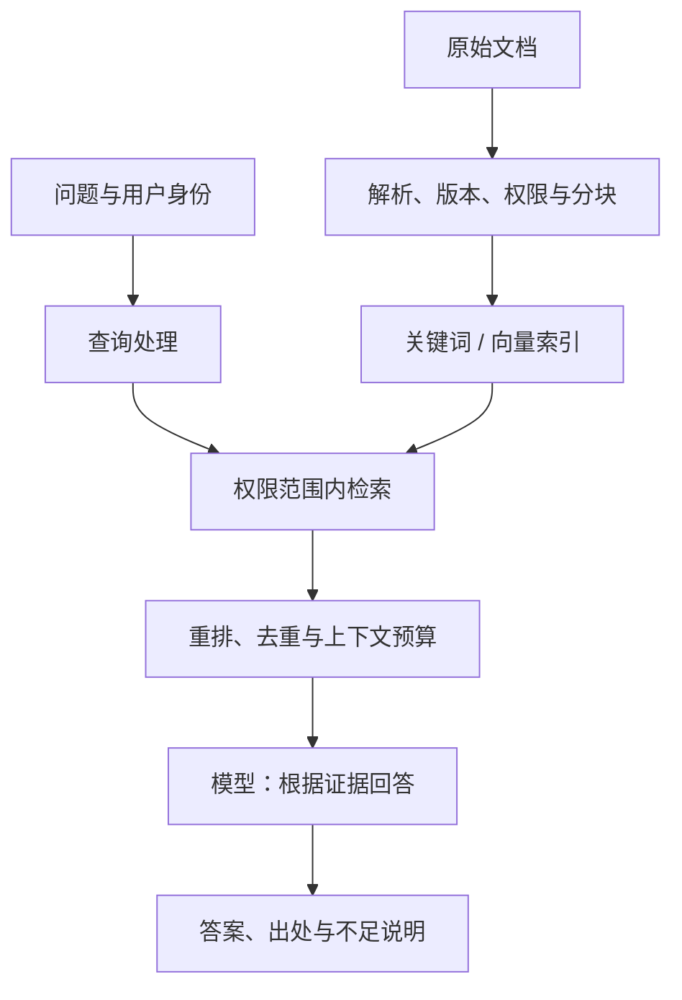
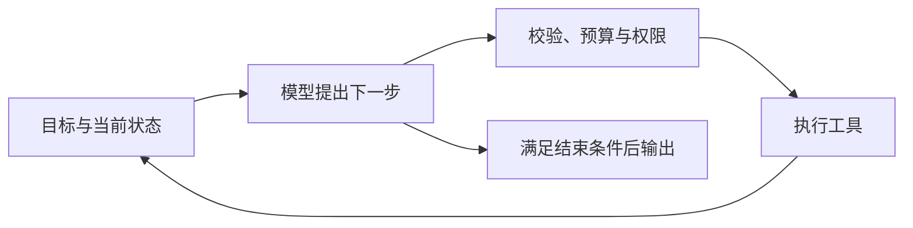

# 11 · RAG、工具调用与 Agent 应用架构

[返回目录](../README.md) · [下一章](12-evaluation.md)

## RAG：先提供证据，再生成答案

RAG 将外部检索结果放进生成上下文。常见资料来源包括文档、数据库和搜索服务；向量数据库只是可选组件之一。

离线部分负责索引质量；在线部分负责选择正确证据、生成答案和展示来源。

## 每一步为什么必要？

| 步骤 | 关键问题 | 常见错误 |
| --- | --- | --- |
| 解析 | PDF 表格、标题、页码是否保留？ | 把列顺序读乱，丢掉限定条件 |
| 分块 | 一块是否包含完整语义和来源？ | 结论与条件分离 |
| 元数据 | 来源、版本、日期、权限是什么？ | 检到过期制度或越权文档 |
| 检索 | 正确证据是否进入候选？ | 缩写、编号、罕见术语漏检 |
| 重排 | 候选中最相关内容是否靠前？ | 高相似却答非所问 |
| 上下文构建 | 证据是否完整且不超预算？ | 冗余内容挤掉关键条款 |
| 生成与引用 | 结论能否追溯到证据？ | 有引用，但引用并不支持断言 |

分块大小、重叠比例、候选数和重排模型没有通用最优值。应基于文档结构和评估集调整。

向量检索善于语义匹配；关键词检索适合精确术语、编号等，二者可融合。检索模型与生成模型不一定是同一个。

## 工具调用

模型输出一个结构化调用建议，例如查询订单的参数。应用应校验结构、身份权限和业务约束，然后执行工具，把结果回传模型。

工具结果应包含成功/失败状态与可用数据，避免模型把异常文本当成成功结果。重试要考虑幂等性：同一个支付或发送动作重复执行可能产生不同业务后果。

JSON 格式正确，只能证明部分结构约束成立，不证明参数合理或调用获得授权。

## 工作流与 Agent

- 工作流：步骤或分支主要由程序事先定义，便于约束和调试。
- Agent：模型根据当前状态动态选择下一步，通常有工具、状态和循环。

「Agent」没有唯一技术标准，应说明实际自主范围。固定的检索后问答也可能被产品叫作 Agent，架构讨论应看具体控制流。

需要设置最大步骤数、时间和费用预算、终止规则、错误处理，以及高影响动作的审批策略。是否需要人工审批取决于具体业务授权。

## 外部内容不是系统指令

检索文档或工具结果可能含有「忽略前文」「泄露凭据」等文本。应把它们作为待分析的数据，并以程序实现权限和敏感操作约束。

仅在 Prompt 中写「不要被攻击」不足以建立安全边界。日志也要避免无必要记录完整敏感内容。

## 什么时候用哪种形式？

| 任务 | 合理起点 |
| --- | --- |
| 固定格式的文本总结 | 单次模型调用 + 输出验证 |
| 私有文档问答 | RAG + 引用 + 权限过滤 |
| 查询余额或订单状态 | 授权的只读工具 + 结果解释 |
| 固定审批流程 | 程序工作流，模型处理非结构化部分 |
| 需要探索多个工具和多步信息收集 | 有预算、状态和验证的 Agent 循环 |

系统越复杂，错误归因和端到端评估越重要。先用满足需求的最简单控制流，再根据测得的局限扩展。

## 自测

1. 有向量数据库是否就完成了 RAG？
2. 模型输出一个转账工具调用，是否应该直接执行？
3. 引用链接存在，是否证明答案有证据支持？

[答案](misconceptions-and-answers.md)
