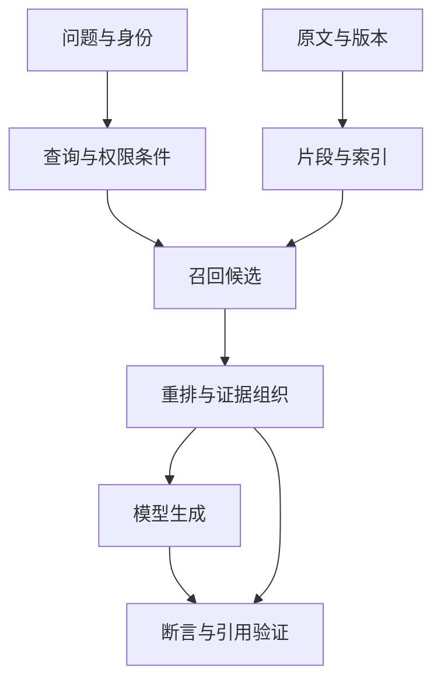

# 11 · RAG、工具调用与 Agent 应用架构

[返回目录](../README.md) · [下一章](12-evaluation.md)

## 模型能力怎样连接当前事实与真实动作

模型参数提供语言与任务能力，但不能自动知道私有资料的最新版本、当前订单状态或这个用户能执行什么。应用将当前输入、授权证据与工具观察组织为模型上下文，再用程序验证输出或执行候选动作。

Prompt 规定本轮任务与表达约束；RAG 取得外部证据；工具提供查询、计算和写操作；工作流/Agent 决定后续如何推进。它们是不同职责，可组合，不是几个互相替代的模型类型。

## RAG 的离线与在线接口

离线侧解析、分块、编码和建立索引，并保留来源、有效期与权限。在线侧在适用范围内召回候选、重排和组织证据，生成后检查结论与引用。向量数据库只是可选组件，关键词、结构化查询或精确扫描也可能合适。

这里有三个对象边界：索引记录指向什么原文，候选是否足够支持问题，生成断言是否得到这些证据支持。仅检到相似片段或生成一个存在的引用，都不能跨过全部边界。

例如问某项制度的适用条件，系统可能还缺地区与日期，需要澄清，而不是默认最新文件就适用。重排不能找回未召回的资料，长上下文也不能修复被解析掉的例外。具体候选、ANN、证据和引用流见[第 19 章](19-retrieval-engineering.md)。

## 一次工具调用包含两种计算和一个执行边界

模型读取工具 Schema 与上下文，输出工具名称和参数；应用将这个提案变成完整结构，检查字段、语义、权限和业务前置条件，才调用实际后端。工具结果再以成功/失败/未知及必要数据回传，成为下一轮观察。

调用参数的合法 JSON 只约束形式，不保证日期、资源、金额与授权正确。结构化输出或约束解码不能替代业务校验。查询实时状态和执行写操作也有不同风险，后者需要稳定操作身份、幂等与回执。

工具“受理”不等于业务完成，工具超时不证明没有执行。调用建议、实际尝试和真实副作用要分别记录；执行状态机见[第 20 章](20-agent-runtime.md)。

## 工作流和 Agent 差在谁选择下一步

工作流的步骤与分支主要由程序定义，可在某个节点让模型处理非结构化信息。Agent 在允许动作和预算中根据观察动态选择下一步，通常需要多轮模型调用、工具与持久状态。

可以在固定业务边界中使用动态检索，不必为了 Agent 名称放开全部控制。架构应明确实际自主范围：谁能改计划、谁能执行写入、什么情况下需澄清/审批、何时完成。

| 需求 | 合理起点 | 为什么 |
| --- | --- | --- |
| 固定结构总结 | 单次模型调用与输出验证 | 信息与步骤已经确定 |
| 文档问答 | RAG、引用与权限 | 需要当前可追溯证据 |
| 查询余额/状态 | 授权只读工具 | 需要真实后端状态 |
| 稳定审批流程 | 程序工作流，模型处理有限节点 | 顺序与业务约束可预定义 |
| 路径依赖观察的多步探索 | 有工具、状态和预算的 Agent | 下一步不能完全预先确定 |

更多自主性增加组合、成本和错误传播，不必然提高成功率。规划的依赖、失效与记忆机制见[第 21 章](21-agent-planning-and-memory.md)。

## 上下文是有来源与角色的输入，不是任意拼接

应用构造输入时，要区分可信用户目标/系统约束、检索证据、工具描述、真实工具结果与历史模型建议。错误地把建议写成观察，会让下一轮把“打算执行”当成“已经执行”。

摘要需保留关键条件、证据 ID、未决操作和回执指针；长历史可以外部持久化，但不能靠无来源的压缩文本替代事实。检索改写也要保留原问题与依据，避免把猜测条件写进输入。

外部文档或工具内容可能伪装成指令。它们应作为数据，权限与高影响动作限制由程序执行。Prompt 中写“不要受攻击”不能建立完整隔离，见[第 25 章](25-ai-security.md)。

## 应用控制流怎样影响模型负载

每轮模型输入都要进入[Serving](10-serving-and-distributed.md)。加入更多证据增加 Prefill、KV 和成本；连续工具循环增加调用与输出；合适的前缀复用可省部分重复前向，但不会保存真实业务状态。

选择更强模型可能减少重试，选择小模型可能降低单次成本；最终应比较合格任务率、总 Token、工具代价和端到端延迟。故障归因先判断缺信息、缺能力还是状态错误，再决定改检索、后训练或运行时。

系统整合见[第 14 章](14-end-to-end-case.md)，分层验收见[第 22 章](22-evaluation-and-production.md)。研究入口：[RAG](https://arxiv.org/abs/2005.11401)、[ReAct](https://arxiv.org/abs/2210.03629)；应用可靠性不能由论文中的单项结果推断。
