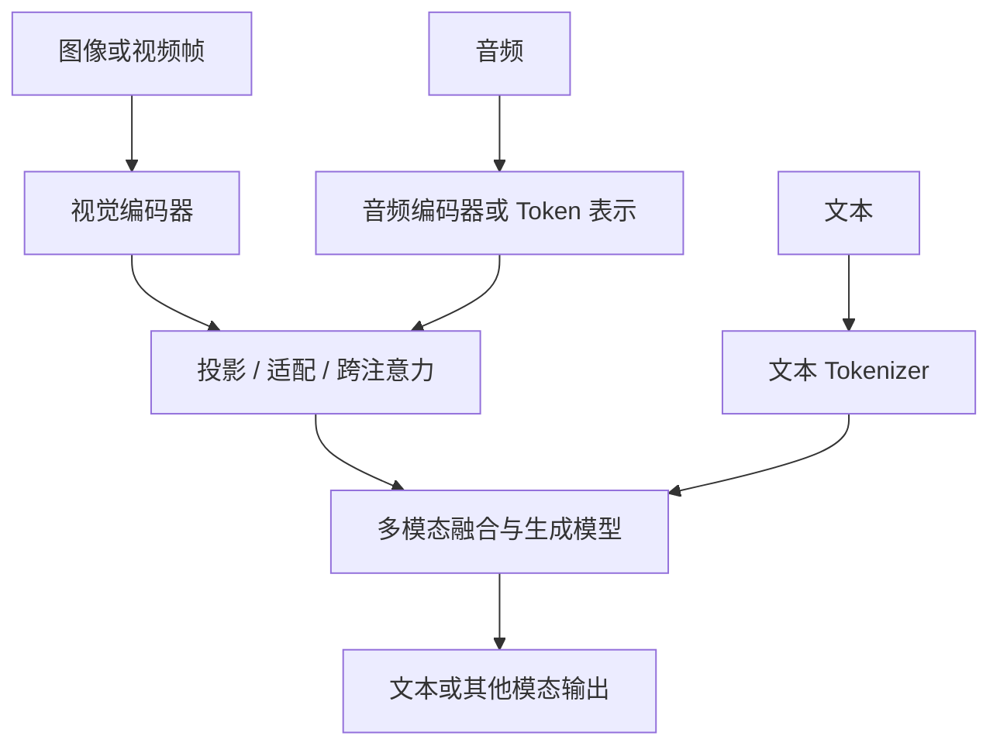

# 13 · 多模态与推理模型

[返回目录](../README.md) · [下一章](14-end-to-end-case.md)

## 多模态：让非文本信息进入表示空间

多模态模型可处理文本、图像、音频或视频。常见输入设计是用专门的编码器提取特征，再通过投影、适配器或跨注意力接入语言模型；也存在更统一的序列化方式。

该图表达常见思路，不声称所有模型采用同一融合架构。

## 图像与视频

视觉编码器常把图像划成 patch 或采用其他特征提取方式。图像分辨率、裁剪与多尺度策略影响特征数量，进而影响计算和上下文预算。

图像中的小字、复杂表格、空间关系和高精度计数仍可能出错。若任务要求提取账单金额，可以结合 OCR、结构解析与规则验证，而不只依赖自由生成。

视频还需要处理帧选择、时间信息和声音同步。稀疏抽帧可能遗漏短暂事件；更多帧也提高资源开销。

## 音频

一种系统流程是 ASR 语音转文字 → 文本模型 → TTS；另一种是直接处理音频表示并生成文本或音频。

前者便于复用文本流程，后者可能保留语调等信息，但训练与流式处理更复杂。实时交互还要考虑分块输入、端点检测、打断与输出延迟。

## 多模态训练

可能包括图文配对训练、编码器与语言模型连接层训练、多模态指令微调、以及端到端训练。不同阶段可能冻结不同部分。

「能够描述图像」不等于「能生成图像」。图像生成可以采用扩散、流匹配、自回归等机制，见[生成模型专题](24-generative-models.md)。

## 推理模型：训练策略与推理预算

推理模型通常强调复杂任务中的多步问题解决能力，可能使用推理轨迹训练、可验证奖励强化学习、更多测试时计算等策略。它不必是一个独立于 Transformer 的全新结构家族。

测试时计算可能包括更长的生成过程、采样多个候选、验证和搜索。内部实现及可见输出依产品而异，不能把用户可见解释当作完整内部计算记录。

| 方式 | 增加的资源 | 适合关注的问题 |
| --- | --- | --- |
| 更长的单次求解 | 输出或内部计算预算 | 更长过程是否真的改善正确率？ |
| 多候选采样与选择 | 多次生成与评分 | 选择器能否识别正确答案？ |
| 工具辅助验证 | 外部执行与调用延迟 | 验证器是否可靠且覆盖目标？ |
| 搜索或迭代修正 | 多轮状态与分支 | 是否能及时终止、控制成本？ |

更多计算不保证更正确。应比较任务成功率、总耗时和每成功任务成本。

## 推理增强的验证边界

采样多个候选时，关键不只在生成数量，还在选择器是否能辨别正确结果。用测试、精确计算或证据支持验证候选，可以降低只按文字流畅度选择的风险。

代码测试通过率依赖测试覆盖；数学最终答案验证可能忽略解释中的错误；外部资料核对需要版本与引用。应明确验证对象，而不把一种验证通过推广到全部可靠性。

## 视觉理解、图文对齐与图像生成

视觉编码器提取图像特征，图文对比学习使两种表示可比较，多模态语言模型将视觉信息接入生成上下文，图像生成模型则需要产生可解码图像表示。这几种能力存在联系，却不是同一条执行链。

CLIP 类方法学习匹配图文表示，可用于检索或分类，但不自动生成图像；LLaVA 类连接方法让语言模型读取视觉特征；扩散与流匹配提供另一类生成路径。原始依据：[CLIP](https://arxiv.org/abs/2103.00020)、[LLaVA](https://arxiv.org/abs/2304.08485)。

## 融合方式影响状态与成本

将视觉特征拼入序列，会让它们进入语言模型的上下文与相关状态；Cross-Attention 可以让文本查询读取另一组视觉表示；压缩或重采样减少特征数，但可能损失小字或局部细节。

输入图片数量和分辨率不能直接换成统一 Token 数，处理器、裁剪、编码器与压缩机制共同决定实际表示。把所有多模态预算按文字长度计算，会遗漏主要开销。

## 时序模态的关键是同步

视频帧的先后、音频时间与字幕内容需要对齐，静态图片的高质量识别不能自动扩展为事件顺序理解。稀疏抽帧有信息遗漏，多帧又增加计算与冗余。

实时音频既要理解内容，也要保持低延迟、处理打断和生成连续声音。ASR—语言模型—TTS 分级链便于替换组件，却有多阶段延迟与信息损失；直接音频模型有不同训练与执行要求。

## 推理增强有三个设计位置

训练可以增加推理任务与奖励；单次推理可以分配更长求解预算；应用可以组织候选搜索、工具验证与迭代。结构、训练和外部控制需要分别描述。

较长生成可能帮助复杂问题，也可能重复或偏离目标。多个候选的收益取决于差异性和选择器，不能将相似模型的多数意见当成独立事实证据。代码测试或计算器只验证其覆盖的部分。

## 质量边界要与任务匹配

图片描述流畅，不证明计数、坐标与金额准确；语音识别正确，不证明说话者身份判断可靠；可见推理清楚，不证明最终结论有证据。

多模态任务应按所需细节和模态分别评估。图像生成的自然度、识别的准确性和跨模态引用的可追溯性是不同维度。[生成模型](24-generative-models.md)展开输出生成机制，[评估](12-evaluation.md)展开结果判断。
