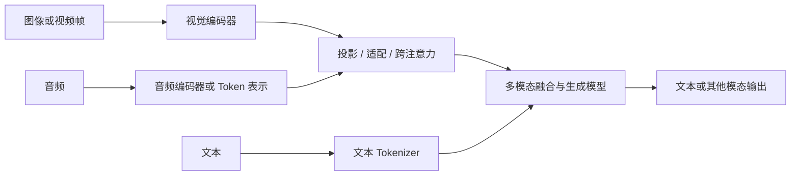

# 13 · 多模态与推理模型

[返回目录](../README.md) · [下一章](14-end-to-end-case.md)

## 多模态：让非文本信息进入表示空间

多模态模型可处理文本、图像、音频或视频。常见输入设计是用专门的编码器提取特征，再通过投影、适配器或跨注意力接入语言模型；也存在更统一的序列化方式。

该图表达常见思路，不声称所有模型采用同一融合架构。

## 图像与视频

视觉编码器常把图像划成 patch 或采用其他特征提取方式。图像分辨率、裁剪与多尺度策略影响特征数量，进而影响计算和上下文预算。

图像中的小字、复杂表格、空间关系和高精度计数仍可能出错。若任务要求提取账单金额，可以结合 OCR、结构解析与规则验证，而不只依赖自由生成。

视频还需要处理帧选择、时间信息和声音同步。稀疏抽帧可能遗漏短暂事件；更多帧也提高资源开销。

## 音频

一种系统流程是 ASR 语音转文字 → 文本模型 → TTS；另一种是直接处理音频表示并生成文本或音频。

前者便于复用文本流程，后者可能保留语调等信息，但训练与流式处理更复杂。实时交互还要考虑分块输入、端点检测、打断与输出延迟。

## 多模态训练

可能包括图文配对训练、编码器与语言模型连接层训练、多模态指令微调、以及端到端训练。不同阶段可能冻结不同部分。

「能够描述图像」不等于「能生成图像」。图像生成可以采用扩散、流匹配、自回归等其他机制；本仓库主线是语言和多模态理解/生成系统，不将所有生成模型都归为同一种 Transformer 流程。

## 推理模型：训练策略与推理预算

推理模型通常强调复杂任务中的多步问题解决能力，可能使用推理轨迹训练、可验证奖励强化学习、更多测试时计算等策略。它不必是一个独立于 Transformer 的全新结构家族。

测试时计算可能包括更长的生成过程、采样多个候选、验证和搜索。内部实现及可见输出依产品而异，不能把用户可见解释当作完整内部计算记录。

| 方式 | 增加的资源 | 适合关注的问题 |
| --- | --- | --- |
| 更长的单次求解 | 输出或内部计算预算 | 更长过程是否真的改善正确率？ |
| 多候选采样与选择 | 多次生成与评分 | 选择器能否识别正确答案？ |
| 工具辅助验证 | 外部执行与调用延迟 | 验证器是否可靠且覆盖目标？ |
| 搜索或迭代修正 | 多轮状态与分支 | 是否能及时终止、控制成本？ |

更多计算不保证更正确。应比较任务成功率、总耗时和每成功任务成本。

## 视觉 Token 与融合的具体计算

按不重叠 `14 × 14` patch 切分一张 `336 × 336` 图像，会得到 `24 × 24 = 576` 个 patch。真实编码器可能增加特殊位置、池化或压缩，因此传给语言模型的数量不能仅由这个除法确定。

直接拼接视觉特征时，语言模型需要对文本与视觉位置共同计算；跨注意力方式则可让文本 Q 读取视觉 K/V，分数矩阵为 `[文本位置数, 视觉位置数]`。连接层还要处理两个编码器的维度和训练分布差异。

若视频取 8 帧且每帧暂保留 576 个特征，已有 4,608 个视觉位置；是否使用压缩、帧间聚合与时间编码，会影响计算和事件覆盖。仅提高抽帧频率可能增加成本而仍错过关键短事件。

## 推理增强的验证边界

采样多个候选时，关键不只在生成数量，还在选择器是否能辨别正确结果。用测试、精确计算或证据支持验证候选，可以降低只按文字流畅度选择的风险。

代码测试通过率依赖测试覆盖；数学最终答案验证可能忽略解释中的错误；外部资料核对需要版本与引用。应明确验证对象，而不把一种验证通过推广到全部可靠性。

## 自测

1. 视觉编码器产生的信息怎样进入语言模型？
2. 推理能力提升一定意味着使用了全新的基础架构吗？
3. 可见的解释能否完整代表模型的内部机制？

[答案](misconceptions-and-answers.md)
