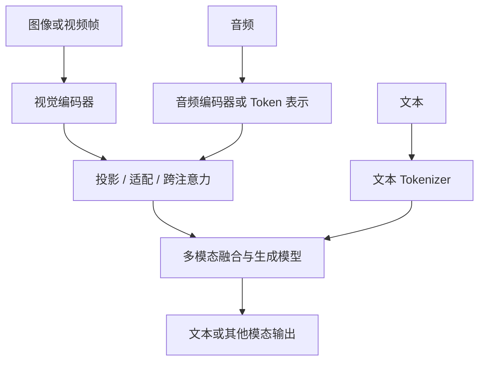
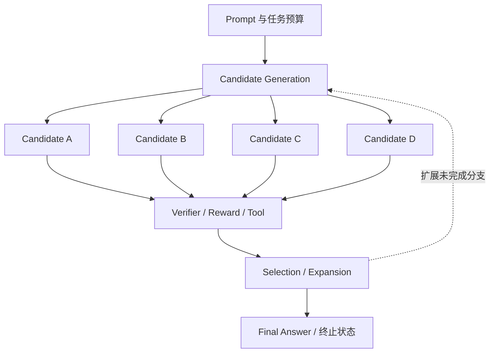

# 13 · 多模态与推理模型

[返回目录](../README.md) · [下一章](14-end-to-end-case.md)

## 多模态：让非文本信息进入表示空间

多模态模型可处理文本、图像、音频或视频。常见输入设计是用专门的编码器提取特征，再通过投影、适配器或跨注意力接入语言模型；也存在更统一的序列化方式。

该图表达常见思路，不声称所有模型采用同一融合架构。

## 图像与视频

视觉编码器常把图像划成 patch 或采用其他特征提取方式。图像分辨率、裁剪与多尺度策略影响特征数量，进而影响计算和上下文预算。

图像中的小字、复杂表格、空间关系和高精度计数仍可能出错。若任务要求提取账单金额，可以结合 OCR、结构解析与规则验证，而不只依赖自由生成。

视频还需要处理帧选择、时间信息和声音同步。稀疏抽帧可能遗漏短暂事件；更多帧也提高资源开销。

## 音频

一种系统流程是 ASR 语音转文字 → 文本模型 → TTS；另一种是直接处理音频表示并生成文本或音频。

前者便于复用文本流程，后者可能保留语调等信息，但训练与流式处理更复杂。实时交互还要考虑分块输入、端点检测、打断与输出延迟。

## 多模态训练

可能包括图文配对训练、编码器与语言模型连接层训练、多模态指令微调、以及端到端训练。不同阶段可能冻结不同部分。

「能够描述图像」不等于「能生成图像」。图像生成可以采用扩散、流匹配、自回归等机制，见[生成模型专题](24-generative-models.md)。

## 推理模型：训练策略与推理预算

推理模型通常强调复杂任务中的多步问题解决能力，可能使用推理轨迹训练、可验证奖励强化学习、更多测试时计算等策略。它不必是一个独立于 Transformer 的全新结构家族。

测试时计算可能包括更长的生成过程、采样多个候选、验证和搜索。内部实现及可见输出依产品而异，不能把用户可见解释当作完整内部计算记录。

更多计算不保证更正确。应比较任务成功率、总耗时和每成功任务成本。

## Inference-Time Scaling：候选如何成为执行工作

推理时扩展计算（inference-time / test-time scaling）是在一次任务中增加求解、验证或选择的工作。下面是外部控制器组织多候选的一种设计，不是所有 reasoning model 的内部架构；模型也可以只用一条较长轨迹，不带外部 verifier 或搜索树。

| 增加计算的方式 | 执行与状态关系 | 主要限制 |
| --- | --- | --- |
| Longer single trajectory | 一条历史持续增长，后续生成依赖前序结果 | 串行 Decode、长上下文与 deadline；更长不保证有效 |
| Parallel sampling | 同一任务产生多个候选，各自推进历史 | candidate parallelism 提出并行工作，不保证全部同时上 GPU |
| Best-of-N | 生成 N 个候选，再按规则/评分选择 | 生成成本加验证成本；候选里有正确答案不保证选择器找得到 |
| Iterative refinement | 将候选和反馈放回上下文，生成修订 | 反馈可靠性、重复输入和多轮依赖；不是相互独立的 N 次采样 |
| Verifier-guided search | 对部分状态评分，选择 frontier 继续扩展或回溯 | 分支状态、验证积压、剪枝错误与有限搜索预算 |
| Tool / environment interaction | 生成动作，获取观察再继续求解 | 外部时延、授权、会话/副作用与恢复，见[20](20-agent-runtime.md) |

生成器产生 candidate，verifier 消费候选或中间步骤并返回评分/验证证据，控制器据此选取、扩展或停止。Reward model 的分数是选择信号，测试/规则的通过是其覆盖范围内的证据，二者不能统一当作“答案已被证明正确”。候选多数一致也不是独立事实来源。

研究入口：[Test-Time Compute Scaling](https://arxiv.org/abs/2408.03314)比较验证搜索与响应修订的预算分配，[Tree of Thoughts](https://arxiv.org/abs/2305.10601)提供分支探索实例，[Self-Refine](https://arxiv.org/abs/2303.17651)提供反馈—修订实例。这些研究支持不同执行方式的存在，不构成所有任务的通用最优策略或性能保证。

## Branch State：共享 Prompt 不等于共用全部 KV

| 状态 | 谁产生、谁消费 | 生命周期 |
| --- | --- | --- |
| Task / budget | 应用建立目标、deadline、Token/候选/工具上限；控制器执行 | 跨所有候选、重试和轮次结算，不能每条分支重新获得完整预算 |
| Candidate / branch | 生成与搜索产生 ID、parent、Token 历史、评分和停止原因；选择器消费 | 保留扩展/验收必需的记录；失败、截断和未验证分别标记 |
| Prefix / suffix KV | 引擎计算、引用和追加；Attention Kernel 消费 | 兼容不可变前缀可复用，各分支自己的后续 KV 独立增长 |
| Verifier / environment state | 判分器、测试或工具产生证据/观察；控制器消费 | 关联 candidate、验证器/环境版本和范围；业务副作用另有持久合同 |

多个 candidate 共享 Prompt 时，只有在模型/adapter、实际输入与其他计算条件兼容、引擎支持且状态可用时，才可以复用 prefix KV。分叉后 A 的后续 Token 不能成为 B 的历史；共享尾块写入和引用回收由[第 18 章](18-inference-engineering.md)解释。淘汰分支只解除其引用，在途访问结束后才可复用相应空间。

候选文本、树节点与评分通常由应用控制器保存，KV 属于引擎计算状态，工具会话和已执行动作属于环境/业务状态。恢复一个搜索节点不自动恢复远端 KV，更不自动撤销工具效果。重算可以重建兼容历史的 KV，但重放有副作用的动作仍需[Agent Runtime](20-agent-runtime.md)的执行合同。

## Reasoning 也是资源调度与容量问题

Reasoning budget 可以用 candidate count、average generated tokens、verifier cost 和 search depth 的相互作用理解，但它们不能不加条件地相乘成为统一成本公式。总工作包括实际展开节点的生成、验证、工具与控制开销；搜索深度影响依赖长度，分支数量影响工作量，两者可能已经反映在实际候选/Token 计数中。

| 资源或约束 | 控制器与执行系统怎样衔接 |
| --- | --- |
| GPU batch / candidate parallelism | 控制器提交候选，引擎按局部预算组批；并行减少部分等待，也可能挤占其他任务并增加排队 |
| KV capacity / prefix reuse | 共享兼容 Prompt 可减少重复 Prefill/驻留，每条分支的长后缀仍占空间；扩分支前确认容量 |
| Verifier capacity | 独立模型、CPU 测试或外部服务有各自队列；消费不过来时暂停扩展或背压，避免积压无处验证的候选 |
| Early stop / deadline / token budget | 根据完成证据、收益估计及剩余预算停止新工作，取消无用分支；已提交计算/调用仍计实际成本 |
| Cost / successful task | 将全部候选、验证、失败、取消与重试计入账，再按独立验收的合格任务数评估 |

总体 compute 看所有工作之和，latency 看依赖关键路径及实际可用并行度。四条候选并行生成不意味着最终时延除以四：它们仍可能在引擎排队、等待最慢分支或等待 verifier；依赖上一轮结果的扩展也不能全部提前生成。

预算在调度前预留，完成后结算；达到 deadline 或总 Token 上限不等于任务成功。Early stop 可以按可信完成条件或成本策略触发，但应区分“已验证成功”“选择当前最好候选”和“预算耗尽”。总成本不能删除失败消耗，合格任务分母由独立验收确定。容量/关键路径定义见[30](30-ai-systems-performance.md)，集群路由见[10](10-serving-and-distributed.md)，预算与真实动作见[20](20-agent-runtime.md)。

## 推理增强的验证边界

采样多个候选时，关键不只在生成数量，还在选择器是否能辨别正确结果。用测试、精确计算或证据支持验证候选，可以降低只按文字流畅度选择的风险。

代码测试通过率依赖测试覆盖；数学最终答案验证可能忽略解释中的错误；外部资料核对需要版本与引用。应明确验证对象，而不把一种验证通过推广到全部可靠性。

Outcome verification 判断最终结果，process verification 判断中间步骤，两者可能用于选择或引导搜索。代表性依据：[Let's Verify Step by Step](https://arxiv.org/abs/2305.20050)。评分器偏差可能被反复搜索放大；更多分支不修复验证器盲区，仍需[独立留出与任务验收](22-evaluation-and-production.md)。

## 视觉理解、图文对齐与图像生成

视觉编码器提取图像特征，图文对比学习使两种表示可比较，多模态语言模型将视觉信息接入生成上下文，图像生成模型则需要产生可解码图像表示。这几种能力存在联系，却不是同一条执行链。

CLIP 类方法学习匹配图文表示，可用于检索或分类，但不自动生成图像；LLaVA 类连接方法让语言模型读取视觉特征；扩散与流匹配提供另一类生成路径。原始依据：[CLIP](https://arxiv.org/abs/2103.00020)、[LLaVA](https://arxiv.org/abs/2304.08485)。

## 融合方式影响状态与成本

将视觉特征拼入序列，会让它们进入语言模型的上下文与相关状态；Cross-Attention 可以让文本查询读取另一组视觉表示；压缩或重采样减少特征数，但可能损失小字或局部细节。

输入图片数量和分辨率不能直接换成统一 Token 数，处理器、裁剪、编码器与压缩机制共同决定实际表示。把所有多模态预算按文字长度计算，会遗漏主要开销。

系统连接是 modality preprocessing → modality tokens / features → context growth → Prefill cost → KV / memory。高分辨率图片、视频帧数量与音频长度会映射为预处理、编码和状态成本；序列拼接与 Cross-Attention 的缓存对象不同，不能统一假定所有特征都成为 decoder KV。执行预算见[推理引擎](18-inference-engineering.md)与[性能模型](30-ai-systems-performance.md)。

## 时序模态的关键是同步

视频帧的先后、音频时间与字幕内容需要对齐，静态图片的高质量识别不能自动扩展为事件顺序理解。稀疏抽帧有信息遗漏，多帧又增加计算与冗余。

实时音频既要理解内容，也要保持低延迟、处理打断和生成连续声音。ASR—语言模型—TTS 分级链便于替换组件，却有多阶段延迟与信息损失；直接音频模型有不同训练与执行要求。

## Training-Time 与 Inference-Time 的闭环不同

| 位置 | 数据流 | 改变什么、主要入口 |
| --- | --- | --- |
| Training-time | Rollout → Reward / Verifier → Policy Update → Weight Sync | 轨迹提供训练信号并更新参数；策略版本、陈旧样本与资源分池见[08](08-post-training.md)、[17](17-training-engineering.md) |
| Inference-time | Candidate → Search / Verification → Selection | 固定部署策略下改变本次求解与结果选择；不因评分/选择自动执行 optimizer update，本章主责 |

训练能让模型更善于单轨迹求解，推理时控制器也能给已有模型组织多候选；两者可以组合，却不是同一种循环。生产候选若进入后续训练，需先经过[数据验证与版本发布](15-data-lifecycle.md)，不能把线上验证通过直接当成可靠训练标签。端到端位置见[第 14 章](14-end-to-end-case.md)。

## 质量边界要与任务匹配

图片描述流畅，不证明计数、坐标与金额准确；语音识别正确，不证明说话者身份判断可靠；可见推理清楚，不证明最终结论有证据。

多模态任务应按所需细节和模态分别评估。图像生成的自然度、识别的准确性和跨模态引用的可追溯性是不同维度。[生成模型](24-generative-models.md)展开输出生成机制，[评估](12-evaluation.md)展开结果判断。
