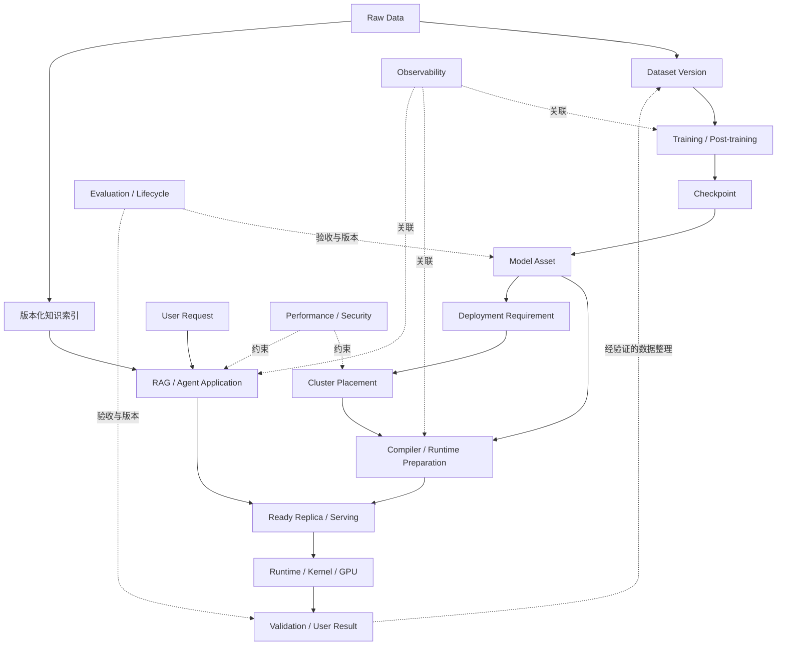
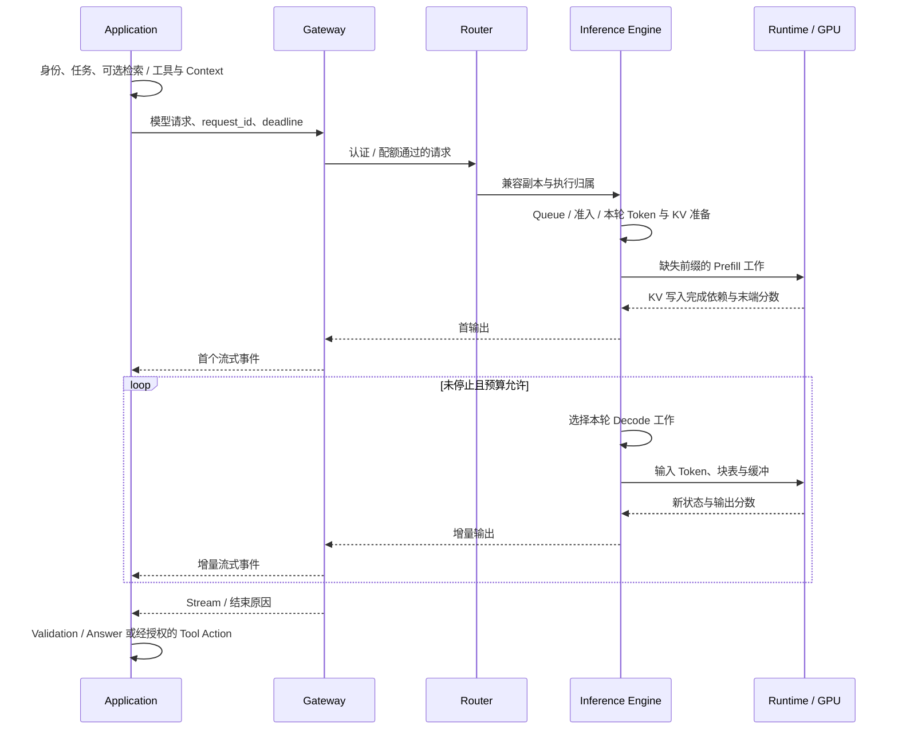

# 14 · 系统整合：从数据到生产请求的完整生命周期

[知识地图](00-learning-roadmap.md) · [系统全景](01-system-map.md) · [推理时 Reasoning](13-multimodal-and-reasoning.md)

## 把全库装成一个运行中的系统

一个 AI 系统既要构建和发布资产，也要接收请求、推进计算并完成业务任务。本章把两条路径接起来，作为读完全库后可以返回查看的“总装图”。企业知识助手仍是具体案例：它解释制度、查询申请，也可能在授权后创建申请；不假设某个真实公司的配置。

Offline / Build Path 产生可用资产和服务；Online / Request Path 消费这些版本并产生用户结果。生产反馈经过验证和数据整理，才可能进入下一数据版本。不是每个助手都要自行训练：采用已有模型资产时，可以从资产验收进入部署；更新企业资料也可以只更新索引。

实线表示主要输入或执行依赖，虚线表示反馈、关联与约束。图是逻辑关系，不规定所有准备必须离线完成：编译可能在构建期、启动期或首次遇到新输入形状时发生，设备相关准备也需要实际 placement。Kernel 与 GPU 怎样接入每轮执行，见下文。

## Offline / Build Path：每一步产生不同对象

| 阶段 | 输入 | 产物与下游消费者 | 主解释入口 |
| --- | --- | --- | --- |
| Data | 原始资料、处理规则与来源 | dataset version / manifest，供训练采样与追溯 | [15 · 数据](15-data-lifecycle.md) |
| Training | dataset / mixture、模型起点与训练配置 | 一致更新点的 checkpoint，供恢复或资产转换 | [17 · 训练](17-training-engineering.md) |
| Post-training | 偏好样本，或 rollout / reward / verifier | updated policy 及其 checkpoint；在线 RL 还向 rollout 发布权重 | [08 · 后训练](08-post-training.md)、[17](17-training-engineering.md) |
| Model lifecycle | checkpoint、配置、Tokenizer / template、adapter | 验证后的 deployable model asset，供部署加载 | [26 · 模型资产](26-model-lifecycle.md) |
| Compiler / Runtime preparation | 模型程序、shape / dtype / layout、配置与目标设备 | 图、Kernel / 库选择、compile cache 及运行准备，供兼容执行消费 | [28 · 执行栈](28-ai-compiler-and-runtime.md) |
| Platform | deployment requirement、配额与资源约束 | GPU / NIC / Storage placement、replica 身份和配置 | [29 · 平台](29-ai-platform-and-cluster-scheduling.md) |
| Serving | 已就绪副本、健康与准入配置 | 可路由的 request endpoint，供应用调用 | [10 · Serving](10-serving-and-distributed.md) |

**Dataset、checkpoint、model asset、compiled artifact、running replica 不是同一个“模型”。**Dataset 固定数据和处理版本；checkpoint 固定可恢复的训练状态；model asset 包装可部署的计算与输入约定；compiled artifact 保存执行产物及适用条件；replica 是具体设备上有运行状态的实例。

它们的失效和恢复也不同。重新部署可以重建 replica，却不会自动恢复训练 optimizer 或在途业务任务；编译缓存命中不证明请求 KV 有效；导出推理资产不等于保留完整训练恢复点。服务重启后能恢复什么，由对应对象的持久记录和恢复合同决定。

企业制度另有资料 → 解析/分块 → 文本与索引版本 → 在线授权检索的路径。索引版本决定本次证据，训练 dataset version 通过模型资产血缘解释参数来源；两者不能用一个“数据版本”含糊替代。资料删除、权限撤销与训练信息更新的边界见[第 15 章](15-data-lifecycle.md)。

## 从资源分配到真正可接请求

Workload → Cluster Scheduler → GPU / NIC / Storage Placement → Runtime。平台分配资源、建立副本组，Runtime 才能在这些设备上加载和运行；请求 Router 从已发布的副本中选择落点，不能把请求路由当作 GPU 分配。

一个 replica Ready 可能经历 resource allocation → weight load → distributed group initialization → compile / CUDA Graph preparation → warmup → health validation → serving ready。顺序及重叠依实现变化；失败时须撤销准入、清理本次实例并按平台策略重建，不能将部分 rank 初始化成功当作整组就绪。

| 就绪边界 | 已经证明什么 | 仍需确认什么 |
| --- | --- | --- |
| Pod Running | 容器进程进入运行状态 | 正确资产是否加载、rank 是否到齐、设备路径是否可用 |
| Model Ready | 必要模型执行路径和并行组通过健康验证 | 真实长度、并发、冷热和故障条件下是否达到服务目标 |
| SLO-ready 验收 | 在约定负载与质量边界下达到目标 | 放量后负载分布、容量余量与恢复期间是否仍成立 |

这里的 SLO-ready 是验收口径，不是各框架统一的状态字段。**Pod Running ≠ Model Ready ≠ SLO-ready。**初始化主责见[29](29-ai-platform-and-cluster-scheduling.md)，编译/图条件见[28](28-ai-compiler-and-runtime.md)，SLO 容量见[30](30-ai-systems-performance.md)。

## Online / Request Path：从任务到流式结果

普通生成路径是 User → Application → Gateway → Router → Queue → Prefill → KV → Decode → Stream → Application Result。KV 是跨迭代的计算状态，不是一次独立的业务处理阶段；Prefill 末端通常给出首输出分数，后续生成再逐轮推进。

图以单个逻辑引擎说明边界；P/D 分离时，Prefill 产生的 KV 还需交给 Decode 目标，目标可读并确认执行归属后才继续，交接由[第 10 章](10-serving-and-distributed.md)解释。引擎的 block/page、prefix、准入与迭代主责见[第 18 章](18-inference-engineering.md)。

RAG / Agent 的任务可能重复 Application → Retrieval / Tool → Context → Model Serving → Validation，并据结果继续或结束。模型流完成只表示一次生成结束，不表示证据正确、工具已执行或整个任务成功。用户取消应停止新的应用工作并传播到模型请求；在途计算的释放与已提交业务动作仍须各自处理。

## 三种 Scheduler 调度不同对象

| 层 | 谁调度什么 | 持有或消费的状态 | 与相邻层怎样连接 |
| --- | --- | --- | --- |
| Application Scheduler | Task / Tool / candidate 分支及依赖 | 任务、权限、观察、预算与完成条件 | 发模型/工具请求，接收结果并核验；见[20](20-agent-runtime.md)、[13](13-multimodal-and-reasoning.md) |
| Cluster Scheduler / 平台控制面 | Workload 的 GPU / Replica placement；控制器管理副本生命周期 | 配额、设备、拓扑、资产与副本就绪 | 发布可用副本与资源限制；见[29](29-ai-platform-and-cluster-scheduling.md) |
| Inference Scheduler | 本轮 Token / KV 工作与活跃请求集合 | 本地队列、已计算位置、块引用和迭代预算 | 将选定工作交给 Runtime，反馈容量/等待；见[18](18-inference-engineering.md) |

**Application Scheduler ≠ Cluster Scheduler ≠ Inference Scheduler。**Router 另负责从兼容副本中选择请求落点；它既不自动扩出 GPU，也不保证引擎立即运行全部请求。应用同时生成多个 reasoning candidate，只是提出并行工作，能否一起入 GPU batch 还受引擎与平台资源限制。

## Serving 选出工作以后，模型怎样变成 GPU 计算

执行关系是 Model → Tensor / Graph → Compiler → Runtime → Kernel → GPU。它连接模型逻辑、执行产物和设备工作；Eager 可直接分派已有 Kernel，Compiler 也可以选择现成库，不能理解为每轮都重新编译一次模型。

| 本轮边界 | 发生的工作 | 跨轮保留什么 |
| --- | --- | --- |
| Inference Scheduler → Runtime | 选出 Token 工作后，准备 tensor、位置、block table、buffer 和 stream dependency | 请求 KV / 块引用、配置及相关执行实例 |
| Runtime → Kernel | 核对图/代码适用条件，更新输入并提交 kernel launch 或受支持的图重放 | 兼容编译缓存、图实例与必要稳定缓冲 |
| Kernel → GPU / Network | 读取权重/历史状态、计算、写入新状态，必要时等待 collective | GPU 完成依赖决定何时可消费、释放或复用 |
| 执行完成 → Engine | 将分数、采样与停止结果对应回请求，准备输出和下一轮 | 已生成/已计算进度与执行所有权 |

CPU 提交返回不等于 GPU 完成，取消也不能提前复用在途 Kernel 的地址。图、Compiler 与 Kernel 的机制由[28](28-ai-compiler-and-runtime.md)主责，物理数据与 NCCL 路径由[27](27-compute-infrastructure.md)主责；本章连接调度决定与实际执行。

## 企业知识助手：把计算结果变成可信结果

假设用户问某日期、地区的制度限额，并希望创建申请。应用先从可信会话确定身份与允许动作，缺少条件时澄清；授权检索得到版本化条款与来源位置，业务工具提供实时实体状态。这些事实进入 Context，由模型解释或提出动作。

| 对象 | 由谁提供 | 验收依据 |
| --- | --- | --- |
| 制度事实 | 版本化原文、索引与授权检索 | 条件、例外、适用时间与引用完整 |
| 推理与答案候选 | 模型生成或候选搜索 | 来源支持、规则/测试覆盖，不能只看语言流畅 |
| 行动建议 | 模型或固定工作流 | 结构、语义、权限、前置业务状态均通过 |
| 实际业务结果 | 授权工具与业务后端 | 持久操作 ID、回执与必要对账 |

资料解析若丢失例外，线上模型无法从不存在的证据中恢复原意；引用字段存在也不证明结论被支持。创建申请前持久记录意图与操作 ID；超时后的结果未知应对账，不能立即换 ID 重做。“受理”“创建成功”“审批通过”是不同完成边界，机制见[19 · 检索](19-retrieval-engineering.md)、[20 · Agent Runtime](20-agent-runtime.md)、[22 · 验收](22-evaluation-and-production.md)。

任务/操作记录在应用持久层，索引在知识系统，权重和请求 KV 在模型服务。聊天摘要、KV 和业务回执互不替代。模型/Prompt/索引/工具 Schema 升级要检查兼容组合；模型回退不会撤销已发生的写入，权限撤销也不能被索引回退覆盖，见[26](26-model-lifecycle.md)、[25](25-ai-security.md)。

## 横切能力：同一权重为什么 TTFT 变差

一次生产问题要把 `request_id` / attempt 与实际 `model_version`、Tokenizer / template / adapter、`dataset/index_version`、`compiler/runtime_version`、`engine_version`、deployment、GPU topology 和 trace 关联。训练 dataset version 通常经 model asset 血缘追溯，在线 index version 直接决定本次检索；记录的是请求实际使用的组合，不是事后查询到的“当前版本”。

假设模型权重未变，但 TTFT P99 上升。先固定任务类别和计时边界，比较慢/正常样本的长度、版本与冷热分布，再用条件可比的 trace 沿依赖找变化：

| 调查链 | 应比较的对象 | 可能的系统解释 |
| --- | --- | --- |
| Prompt length changed? → Retrieval context changed? | 模板、索引版本、实际输入 ID / 长度和证据集合 | 应用增加片段或模态特征，改变 Prefill 与状态负载 |
| Router changed? → Prefix hit changed? | 路由配置、worker、实际可复用前缀 | 落到不同副本或计算条件改变，预期命中未兑现 |
| Replica cold? → Compile cache miss? | 实例代次、加载/预热记录、编译事件与等待边界 | 新副本或新 shape 触发准备；若先前已预热，该原因应被证据排除 |
| GPU topology changed? → Queue load changed? | rank / NIC placement、通信等待、队列工作量 | 同模型换路径或负载混合，关键等待改变 |

这些是待验证假设，不是逐项必然发生的固定流程。Performance 定义“慢”的边界，Observability 给出原因证据，Security 限定能记录和访问什么，Evaluation 判断改动后质量是否仍合格，Lifecycle 记录生效版本与回退条件。方法入口分别是[30](30-ai-systems-performance.md)、[31](31-ai-systems-observability-and-debugging.md)、[25](25-ai-security.md)、[22](22-evaluation-and-production.md)、[26](26-model-lifecycle.md)。

## Failure Propagation：症状可能远离根因

| 起点与传播路径 | 最终看到什么 | 怎样沿关系回查 |
| --- | --- | --- |
| 在线资料读取/模态输入延迟 → CPU preprocessing delay → GPU starvation → throughput decrease → queue growth | TTFT P99 增大 | 输入何时可用、CPU 是否准备/提交、队列是否持续增长；训练数据存储慢不自动等于在线请求慢 |
| One slow rank → collective waits → training step slows → 按 step 触发的 checkpoint 在墙钟时间上后移 | Time-to-train 增加 | 对照同一步各 rank 首次落后的位置；通信长可能在等上游，并非 NIC 自身故障 |
| KV pressure → 受支持的抢占/重算 → 计算争用与 Decode interference | ITL 增大 | 检查活跃引用、抢占与实际重算；仅淘汰空闲 prefix 不等于删除活跃请求 KV，可能先影响后续 Prefill |

同一个用户指标异常可以来自数据、应用、平台、执行或输出层。修复应针对最早被证据支持的异常依赖，并确认下游队列、质量和任务结果一起恢复。只提高 GPU utilization、只缩短一个 Kernel 或只让进程重启，都不能单独证明端到端问题已解决。

这张总装图连接对象、责任与生命周期：从数据构建可追溯资产，在资源上准备可用执行，把请求推进为计算，最后由证据和真实回执验收用户结果。具体机制保持在主解释章节。
