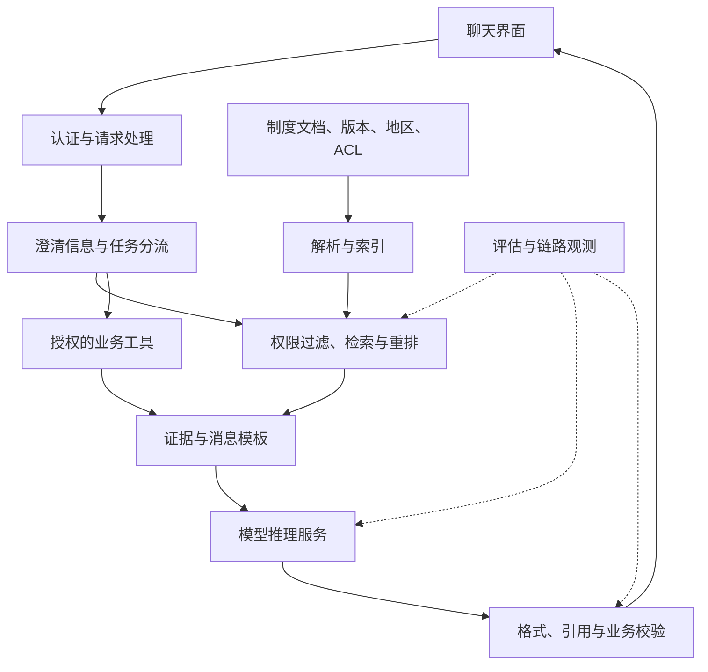

# 14 · 贯穿案例：企业制度知识助手

[返回目录](../README.md) · [下一章](15-experiments.md)

## 任务定义

假设员工要问：「我下周去外地出差，住宿报销上限是多少？」资料存在多个地区与版本，访问权限不同。

这是教学案例，不代表你的真实项目。它适合把业务、模型、数据与服务四层串起来。

成功条件是：使用员工有权限看到的最新适用条款，给出条件和出处；信息不足时澄清，而不是猜一个金额。

## 从需求反推架构

| 需求 | 架构决定 | 原因 |
| --- | --- | --- |
| 制度经常更新 | 文档索引与 RAG | 避免每次更新都依赖训练 |
| 地区、职级影响限额 | 查询澄清 + 结构化元数据 | 防止只按语义相似选错条款 |
| 员工权限不同 | 检索和工具层强制过滤 | 权限不能交给模型自由判断 |
| 回答必须能追溯 | 稳定来源 ID 与逐断言引用 | 能核对日期、条款和版本 |
| 查询申请状态 | 只读业务工具 | 实时数据来自业务系统 |
| 将来可能创建申请 | 有验证与授权的动作流程 | 状态变更需要业务约束 |

起点选择 RAG 加固定工作流。只有确实需要动态多步探索时，才扩展成 Agent 循环。

## 组件图

## 一条请求怎样完成

1. 验证身份，确定员工可访问的数据范围。
2. 检查问题是否缺少影响答案的信息。比如目的地决定住宿档位，需要先澄清。
3. 将问题和结构化条件用于检索，在授权范围内筛选有效版本。
4. 返回条款片段、来源 ID、生效日期、适用范围。
5. 将证据与回答规则传给模型：依据资料回答，条件不足时指出缺口。
6. 校验引用 ID 存在，关键结论与证据一致；验证失败则重试、澄清或回退。
7. 展示答案与可访问的来源，记录版本、耗时与失败类型。

不要让「有引用字段」代替真正的证据检查。如果模型把来源 A 的金额引用到来源 B，格式仍可能完全正确。

## 推理服务怎么选？

初期可用托管 API，先建立质量基线与成本统计。若有私有部署、资源控制等需求，再评估自托管；这取决于具体数据和组织要求。

假设选用 09 的 7B、BF16 权重、8 个 K/V 头的配置，目标 8 个活跃序列，每个最终不超过 4096 Token：

- 理想权重约 13.04 GiB。
- 理想 KV Cache 约 4 GiB。
- 二者合计约 17.04 GiB。

这只是粗算。还需要工作区、运行时、分块占用余量等，并检查实际卡的可用容量。不能由此直接承诺「一张某容量显卡必能稳定支持 8 并发」。

## 评估与迭代

准备问题覆盖不同地区、过期版本、权限、资料缺失和多轮澄清。为每个问题标注应使用的证据及可接受答案。

| 失败样例 | 应优先修改 |
| --- | --- |
| 最新条款未进入候选 | 版本元数据与检索 |
| 正确金额检到了却漏了地区条件 | 上下文组织、Prompt 与模型 |
| 无资料时编造金额 | 回答规则、缺失案例与回退机制 |
| 回答正确但太慢 | 检索耗时、排队、prefill 和生成长度 |
| 无权限用户看到了受限内容 | 数据过滤与系统权限边界 |

先量化失败，再做对应修改。微调不是所有错误的统一解决办法。

## 你的实践产物

使用[架构决策模板](../templates/architecture-decision.md)写一页设计，使用[评估模板](../templates/evaluation-record.md)记录基线与改动。即便暂时不写应用代码，也能形成可以讨论和验证的方案。
