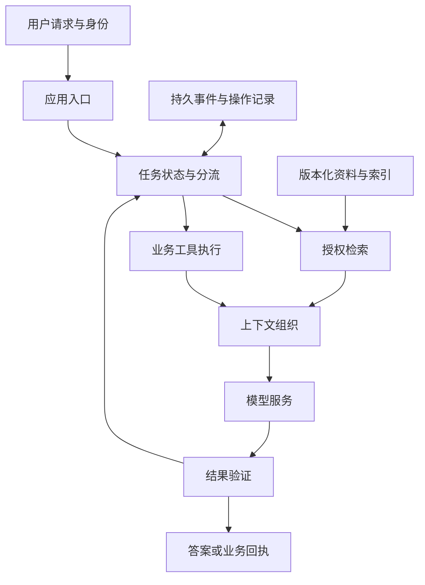

# 14 · 系统整合：知识助手怎样成为可靠应用

[知识地图](00-learning-roadmap.md) · [RAG 与工具](11-rag-and-agents.md) · [数据生命周期](15-data-lifecycle.md)

## 从一个稳定场景看清各层关系

企业知识助手需要回答制度、产品或技术问题，也可能查询工单并创建申请。它把模型、资料、权限、工具、持久状态和服务连接起来，适合说明系统架构怎样相互约束。

这里讨论架构关系，不假设某个真实公司的数据与配置。成功条件不是生成一段文字，而是在适用身份与时间下，使用完整证据给出可追溯结论；行动任务还要获得真实业务回执。

## 先分开事实、判断和行动

稳定的解释可以由模型组织，动态制度来自版本化资料，实时实体状态来自业务工具，写操作由授权的后端完成。这种职责划分避免让同一生成步骤同时充当知识库、权限系统和事务执行器。

| 用户需求 | 系统能力 | 关键约束 |
| --- | --- | --- |
| 理解制度含义 | 证据检索与语言解释 | 条件、例外与出处完整 |
| 查询适用条款 | 元数据筛选与检索 | 地区、组织、时间与权限 |
| 查询申请进度 | 只读业务接口 | 当前身份与实时状态 |
| 创建申请 | 验证后的写工具 | 意图、前置条件与幂等 |
| 跟踪复杂任务 | 计划与持久运行时 | 依赖、预算、恢复与终止 |

固定查询可以由工作流完成，动态探索才需要更灵活的 Agent 控制。两种方式都可以使用同一个语言模型。

## 组件与状态位置

权重与临时 KV 在模型服务，资料与索引在知识系统，身份来自可信会话，操作状态在持久运行时。把全部状态放在聊天摘要中，会让权限、结果未知和任务恢复失去可靠依据。

## 离线侧决定在线证据的上限

解析保留标题、表格、页码和条件，分块形成可引用单元，索引支持相关性检索，元数据标记适用范围。任一环节丢掉例外条款，线上模型都无法从不存在的证据中恢复原意。

文档更新后应发布兼容的新文本、索引与元数据，撤销旧权限还要及时影响检索和缓存。引用使用稳定来源位置与版本，才能解释用户看到的答案依据。

## 在线问答的关键分支

应用先识别缺失的适用条件，再在授权范围内找证据。证据不足应澄清或说明缺失；证据冲突应比较版本与范围；证据充分才组织回答。

上下文保留必要来源与条件，生成后的引用检查确认来源属于本次可见集合，并确认其支持关联结论。字段存在只满足结构，不能证明语义正确。

错误归因沿链路进行：原文缺失、解析失败、召回失败、重排失败、上下文遗漏、模型理解错误、引用错配各有不同修复位置。

## 动作如何接入

模型提出动作后，运行时检查参数、权限、业务状态与用户意图，执行前保存操作标识。成功回执更新任务；明确失败进入可分类处理；超时进入结果未知并对账。

调用返回“受理”不代表申请通过，返回“创建成功”也不代表后续审批完成。最终回答要与业务阶段一致。取消任务还要处理已经完成或仍未知的操作，而不只是停止生成文本。

## 模型服务与应用成本互相影响

检索过多冗余片段会增加 Prefill 和 KV，过长历史增加上下文，反复自我修正增加输出与轮数。应用设计影响模型负载，服务优化也受任务结构约束。

较强模型可能减少重试，较小模型可能降低单次成本；决定总成本的是合格任务率、调用次数、输入输出长度和工具代价。无需训练的基线有助于确定是否真的需要适配模型。

## 版本升级与回退

模型、Prompt、索引、工具 Schema 和权限规则组成实际系统版本。升级其中任一项都可能改变质量；同时改多项时，记录完整组合并保留逐项比较依据。

回退模型不能恢复已经发生的业务写入，回退索引不能随意撤销权限变更。应用状态与资产版本需要有兼容关系。质量回退与业务补偿是两种不同操作。

## 如何理解端到端可靠性

最终任务成功需要证据、推理、授权、执行和展示共同正确，一个局部高分不保证整体成功。指标应区分完整任务、事实、引用、真实副作用和服务性能。

线上链路记录阶段与版本，让每个失败对应可观察原因。离线评估提供质量比较，业务回执提供行动证据，性能观测提供容量限制。系统可靠性来自这些可追溯关系，不能由一次流畅演示推断。

关联专题：[检索工程](19-retrieval-engineering.md)、[Agent 运行时](20-agent-runtime.md)、[生产评估](22-evaluation-and-production.md)、[安全边界](25-ai-security.md)。
