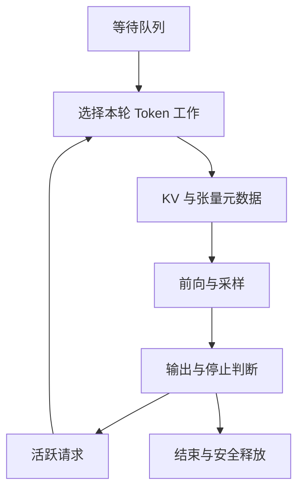

# 18 · 推理引擎内部、容量与调度

[返回目录](../README.md) · [KV 基础](09-inference-and-memory.md) · [服务架构](10-serving-and-distributed.md)

## 从请求状态到一次 GPU 执行

引擎接收模型/适配器、有效前缀、已计算长度、待处理 Token、采样与停止参数。每轮将选出的工作变成张量、位置、序列偏移和 KV 地址，执行后将结果写回各请求。

KV 的分配、读取和释放必须与实际 GPU 执行对齐。模型语义可以正确，块表或生命周期却仍可能导致串请求、读取未初始化内存或写入已回收地址。

## 逻辑 Token 如何找到物理 KV

连续内存按每请求最大长度预留，会浪费未生成的空间；序列增长和并发变化又使大块连续分配困难。分页将序列分成固定 Token 容量的块，用块表记录物理位置。

设每块容纳 `P` 个位置，逻辑位置 `t` 对应 `block_index = t // P`、`offset = t % P`。本请求的块表将逻辑块映射为物理块 ID；内核再结合层、K/V、头和块内偏移定位元素。实现可能用一组块 ID 管理多层缓存或逐层维护映射，读写双方必须采用相同布局。

| 生命周期 | 管理动作 | 内核看到什么 |
| --- | --- | --- |
| 本轮调度前 | 判断尾块有无空间，必要时分配新块，发布映射 | 可写的新位置与完整块表 |
| 逐层前向 | 新 K/V 写入槽位，Attention 读取有效历史 | 只有已计算或本轮正确产生的位置可读 |
| 输出完成 | 更新已计算长度及待处理 Token | 采样后的 Token 尚未必有 K/V |
| 请求结束 | 释放引用，等待在途访问结束 | 不再被下一轮调度使用 |
| 物理块复用 | 无有效引用/在途访问时重新分配 | 旧内容不是新请求的有效状态 |

Attention 按块表读取，不把序列语义也打乱。大块减少元数据与寻址，增加尾块浪费；小块提高分配粒度，却增加块表和访问开销。分页改善分配与共享，不消除有效 KV 字节或全历史读取。依据：[PagedAttention](https://arxiv.org/abs/2309.06180)。

## 共享前缀为什么需要引用和写时复制

同一已计算前缀可被多个请求引用。不可变的完整块可以共享，只有所有引用释放后才可回收。请求各自增长的后缀通常私有。

若两个序列共享尚未填满的尾块，追加不能直接写同一空槽并互相覆盖。实现可不共享这种尾块，或在分叉时复制已有有效内容后再写入，即写时复制。复制的是状态，不是重新采样一个分叉答案。

取消请求只解除它自己的引用，不能删除其他请求仍在用的块。GPU 已启动时还要保留在途访问保护；CPU 引用数减到零并不必然意味着地址马上可复用。

## Prefix Cache 如何判断前缀相同

缓存键代表实际前向条件，而不是只看原始字符串。聊天模板/Tokenizer 后的 ID、此前整个前缀、模型权重与适配器、位置规则，以及多模态输入内容都可能影响结果。

一种设计用“父前缀标识 + 当前块 Token + 其他计算条件”建立链式块键。父标识不可省略：同一段 Token 放在不同历史后面，其高层 K/V 不同。需要控制碰撞风险、版本失效和租户隔离；时延也可能泄漏跨租户复用信息。

命中长度为 `C` 的前缀时，后缀 Prefill 的新查询仍需读取这些历史位置，但不必重算它们的投影和 FFN。任意相同中间片段不能脱离其历史直接拼成缓存。

**全提示词 KV 命中也不等于自动有首输出 logits。**纯 KV 缓存不保存末端隐藏状态/输出分数；引擎可能保留最后一个提示词位置重新计算，或另存可复用输出。完整块命中、可跳过位置数和首输出就绪须分别定义。实现入口：[vLLM Prefix Caching 设计](https://docs.vllm.ai/en/latest/design/prefix_caching/)；此处不固定其配置参数。

## 保留缓存与回收空间的取舍

活跃引用的块通常必须保留，空闲但仍在索引里的前缀块可在压力下淘汰。它们都占物理容量，但后者可回收；将两者混为“空闲显存”会误判还能接多少请求。

长而低复用的前缀可能挤走高复用块。跨副本的命中、负载与 locality 取舍由[第 10 章](10-serving-and-distributed.md)主责；本章负责落地后的引用与可回收容量。

集群 Router 还需要判断模型副本、拓扑与预期传输。它看到的缓存位置不必等于引擎当前可用块；请求落地后，引擎负责重新校验、引用和安全分配。完整集群路径与执行所有权见[服务架构](10-serving-and-distributed.md)。

空间不足时，排队、抢占、重计算、卸载与拒绝分别改变延迟、读写量或可用性。重计算需根据原始输入和已经生成的 ID 重建状态，不必重新随机生成历史；卸载增加回传开销。频繁抢占会使吞吐下降、尾延迟放大。

## Remote KV、offload 与本地执行的接口

Remote KV 说明状态可从另一 worker 或缓存服务取得；offload 说明状态离开当前紧缺的驻留层级。远端已有可复用前缀与把本请求私有历史卸载，是不同操作；两者可以组合，也都不代表远端值能被当前 Attention Kernel 无条件直接读取。

| 对象 | 谁产生、谁消费 | 引擎必须维护的状态 |
| --- | --- | --- |
| 远端可复用前缀 | 先前计算产生，不同兼容请求复用 | 前缀键、版本、有效位置、权限、远端有效性 |
| 活动请求 offload | 本轮已有历史被迁出，后续 Decode 再消费 | 局部引用、已计算长度、恢复依赖 |
| P/D transfer | Prefill 源产生，Decode 目标接收 | 目标块、分片布局、本地映射、可读完成标识；交接代次/所有权见第 10 章 |

常见取回路径需要先分配目标块，发起传输/重排，等待数据设备可读，再发布给下一轮调度。少数执行 backend 支持其他访问方式，仍要核对同步和布局合同。物理块 ID 是局部 allocator 的地址解释，不能原样从另一 worker 拷贝一张块表就当作有效本地映射。

待取回请求应有可等待的状态；不能每轮都选中它却无法执行，也不能让其他请求看到尚未就绪的数据。传输占带宽和缓冲，等待期间可能同时占源与目标空间；这属于调度预算，不是免费的缓存命中。

取回失败时可回退重算兼容前缀或重建已知 Token 历史，但要清理不完整目标，保留仍有效的源引用，并检查请求 deadline。若模型/适配器、位置或精度布局不匹配，应失效而非复用。远端缓存可消失；除非系统明确提供持久合同，不能把它当作唯一恢复记录。

底层层级、格式、RDMA/GDS 和读写路径由[AI Storage Notes](https://miauyle.github.io/ai-storage-notes/)深入说明。本章负责引擎状态与可执行边界，集群交接由[第 10 章](10-serving-and-distributed.md)解释。具体 connector 实例见[vLLM Disaggregated Prefill](https://docs.vllm.ai/en/latest/features/disagg_prefill/)，接口和支持组合可能变化。

## Continuous Batching 在迭代边界改变运行集合

静态批处理开始时固定请求集合，短请求完成后空位可能等待最长请求；Continuous Batching 每轮移除结束项，为继续的 Decode 准备新位置，并按预算加入 Prefill。改变发生在执行边界，不是在已启动 Kernel 中任意插入新请求。

有效长度、偏移与块表保持请求隔离。Chunked Prefill 将长输入分段，限制单轮对 Decode 的干扰；代价包括额外调度和历史读取。机制依据：[Orca](https://www.usenix.org/conference/osdi22/presentation/yu)。

## 一轮调度同时受三笔预算约束

**计算预算：**本轮处理多少新 Token；长 Prefill 有大量可并行位置，Decode 通常每请求少量位置。相同 Token 数不等于相同时间，还要看历史长度和算子形态。

**容量预算：**本轮追加需要多少新块，完成后还保留多少历史；权重、工作区、通信和图缓冲不属于可分配 KV 池。容量允许并发，不保证每轮延迟合格。

**访问预算：**很多长历史 Decode 即使各只处理一个新 Token，也要读大量 KV。新 Token 数控制不了所有读流量，不能只按批次序列数估算时间。

调度器可先照顾有间隔目标的 Decode，再用余量安排分块 Prefill，具体公平性策略不同。提示词中间块结束只推进已计算长度，未到末端不能当成完整提示词开始回答。分块也要避免长输入永远饥饿。

## 集群决策到引擎迭代之间还有一道准入

Router 选择低预计成本的目标，引擎仍要承担真正的空间与迭代预算。路由信号有采样时差，多个请求可能同时选择同一副本；“路由时有空位”不保证稍后每个请求都能入场。预留、准入反馈和背压需要相互连接。

P/D 分离中，Decode pool 应为接收 KV 和继续增长保留预算，而非仅检查当前 Prefill 状态放得下。预计输出长度只是估计，可用输出上限、分段准入或压力控制定义风险边界。引擎拒绝/等待必须反馈上层，避免 Prefill 持续生产没有消费者的状态。

局部准入必须反馈真实等待/拒绝与容量，不能把路由估计当作预留成功。全局目标冲突见[第 10 章](10-serving-and-distributed.md)，比较准入方案的 SLO 口径见[第 30 章](30-ai-systems-performance.md)。

## 编译与 CUDA Graph 如何进入一轮执行

本轮序列数、Token 数、长度、块表和布局要满足编译/图产物的适用条件；引擎更新输入元数据，并保护 KV 与图所用缓冲直到设备消费者完成。变体/持久工作区压缩本地 KV 池预算。Graph capture、CUDA Graph 与地址/动态形状机制由[第 28 章](28-ai-compiler-and-runtime.md)主责；初始化就绪由[第 29 章](29-ai-platform-and-cluster-scheduling.md)主责。

## 为什么小批次 Decode 常受带宽限制

引擎不能只按本轮新 Token 数估时间，还需考虑权重复用与历史 KV 访问；统一的 Decode 带宽、算术强度与 Roofline 分析见[第 30 章](30-ai-systems-performance.md)。本章的三笔预算将这些约束落实为可运行的迭代集合。

TP 缩小每卡部分权重与计算，却增加层内归约；长上下文可能把瓶颈移到 KV，少 K/V 头的模型不一定均匀分片。矩阵切分见[第 10 章](10-serving-and-distributed.md)。

## 量化收益取决于存储和计算路径

权重量化缩小常驻与读取字节，算子通常读取压缩值及缩放信息，再在内核中解码或采用对应低精度计算。若先展开成大张量再执行，会损失部分收益。格式、分组粒度、异常值处理与硬件支持决定成本。

KV 量化是另一个选择：旧值会被多轮查询反复使用，误差也持续影响注意力。尺度粒度、元数据、转换和 Attention 内核需要共同设计，不能从“模型是低比特”推断缓存也低比特。

质量验证应覆盖长上下文、代码、数值、引用和任务输出；性能覆盖真实长度与并发。量化不会自动解除通信、排队或输出瓶颈。

## 推测解码的验证与状态提交

草稿路径先提出一串候选，目标模型把这些已知候选作为一段因果输入并行验证，得到各位置的目标分布。正确算法依据目标与草稿概率进行接受/拒绝及必要的修正采样；确定性匹配与概率采样的规则不同。

目标是降低串行目标模型调用次数，不是随意接受“看起来差不多”的草稿。若要求保持目标采样分布，概率校正与候选截断必须满足算法条件。

验证期间算出的 KV 可能覆盖尚未接受的候选。提交时只保留真实接受且已处理的位置，拒绝分支的 KV 必须失效/截断；修正采样出的 ID 也要区分是否已经经过目标前向。草稿状态同样要对齐，不能把拒绝候选留成有效历史。

加速取决于接受长度、草稿成本、验证批次和缓存/调度开销。高并发目标模型已高效批处理时，额外草稿不一定划算。依据：[Speculative Decoding](https://arxiv.org/abs/2211.17192)。

## 性能变化必须保留可比较的语义

引擎变更必须保留真实输入、停止原因与质量语义；性能比较和计时定义由[第 30 章](30-ai-systems-performance.md)主责，迭代到请求的观测关联见[第 31 章](31-ai-systems-observability-and-debugging.md)。

缓存错误还需通过完整前向与增量前向一致性、多请求隔离、分块续写、取消和分叉路径验证。系统优化的约束是“仍执行正确请求”，不仅是 GPU 更忙。

这些状态路径的生产验收见[第 22 章](22-evaluation-and-production.md)。
