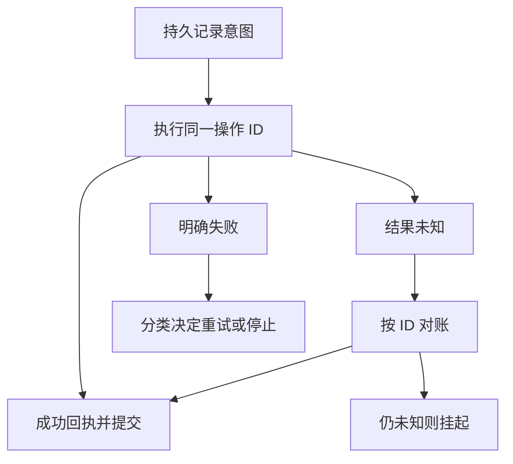

# 20 · Agent 运行时：决策、执行、状态与恢复

[返回目录](../README.md) · [应用架构](11-rag-and-agents.md) · [下一章](21-agent-planning-and-memory.md)

## 为什么模型调用之外还需要运行时

模型根据输入提出下一步，外部工具产生真实状态变化，后续模型输入再包含这些观察。这形成闭环，但“能生成调用 JSON”只完成提案，不等于权限检查、可靠执行或目标完成。

运行时持有目标、计划、证据、操作记录与预算，控制每轮能读什么、能做什么及何时停止。固定工作流也需要这些边界；Agent 增加动态选择，不使事务和故障问题消失。行动—观察范式入口：[ReAct](https://arxiv.org/abs/2210.03629)。

## 一个步骤中的对象怎样流动

| 环节 | 输入与产物 | 状态变化 |
| --- | --- | --- |
| 读取快照 | 目标、已完成事项、未决操作、当前版本 | 确定本轮依据的状态 revision |
| 构建上下文 | 可信约束、允许工具 Schema、必要证据与历史 | 记录模型/Prompt/证据版本，不把全部日志无限拼接 |
| 模型决策 | 答案、澄清请求或结构化动作候选 | 候选尚未产生业务副作用 |
| 校验与准备 | 参数、身份、前置状态、审批与预算 | 建立稳定操作身份，持久记录意图 |
| 外部执行 | 经授权的完整调用 | 获得成功、明确失败或结果未知 |
| 核验与提交 | 回执、必要后续查询、实际资源状态 | 原子更新本地任务状态与事件记录 |
| 继续或结束 | 新观察及完成条件 | 下一轮、挂起、失败或真正完成 |

流式输出里尚未完整的工具参数不能直接执行。完整结构仍需语义校验；参数单位、枚举和资源 ID 合法，不代表这个用户允许操作这个资源。

多个调用只有在依赖与副作用兼容时才能并行。按输出数组顺序执行、全部并行或等待全部结果，是不同控制语义，应由运行时明确，不让模型格式偶然决定。

## 真正状态不能只存在于聊天文本

任务记录至少包括目标 ID、用户/租户范围、授权来源、计划版本、证据引用、操作 ID、规范化参数、幂等键、前置资源版本、执行状态/回执、预算和验收结果。

对话摘要帮助模型理解，但原始执行回执和结果未知记录需持久保存。重新启动后，先恢复这些结构化状态，再构造模型上下文；不能从一句“应该已经完成”恢复业务事实。

当前状态便于读取，事件日志解释为何发生变化。提交状态与事件可以使用同一本地事务；并发 worker 用版本比较或租约避免同时推进同一任务。租约过期不意味着外部操作没执行，仍需对账。

## 校验为何要跨四个边界

结构校验检查字段/类型；语义校验检查单位、时间范围和组合是否合理；授权校验使用可信用户状态检查资源与动作；业务校验确认对象当前阶段、前置条件和审批。

模型建议使用的资源 ID 与外部文档不是授权来源。权限拒绝不应让模型换工具绕过，业务前置状态在决策后也可能变化，执行时还要再次验证。可用资源版本或后端条件写入防止基于过期观察执行。

预算也要在调用前预留，结束后结算实际消耗；并发分支都读取同一个旧余额再扣款，会突破总额。步骤数、Token、工具次数、时间与费用需分别定义，避免每次重试重新获得完整预算。

## 超时为什么进入“结果未知”

外部服务可能已成功，网络却没带回回执；进程也可能在收到结果后、提交本地状态前崩溃。直接把超时当失败并创建新操作，会重复副作用。

恢复时按故障窗口处理：尚未发起且确认无副作用时可继续；可能已发起就查询稳定操作 ID；已有回执则幂等提交本地结果。若后端不能查询且不能去重，结果未知时不可随意重试高影响写入，需要挂起或人工处理。

本地数据库事务无法自动覆盖所有外部服务，这正是意图、调用身份和回执都要保存的原因。框架提供检查点，也不自动保证外部 exactly-once。

## 幂等键必须代表同一业务意图

同一次逻辑操作的重试与恢复应使用相同键。只按参数哈希不够：两次真实独立的相同金额支付可能都应执行，模型第二次改写措辞也不应生成一个“全新支付”。

后端需原子处理键、请求一致性和结果，保证并发重复不会同时执行；相同键却参数不同应拒绝或明确处理。去重范围、保留期限和处理中状态也属于合同，过期后重复提交未必仍有保证。

Agent 内存里缓存返回结果，只覆盖当前进程，不能解决跨进程、崩溃与后端完成后的回执丢失。业务验收应依据持久回执和实际资源，不能把“最多一次发送”混同为“恰好一次完成”。

## 错误反馈怎样决定下一步

参数缺失可让模型纠正；临时故障可在预算内退避重试；授权拒绝保持边界；结果未知先对账；不可逆错误需要明确结束或走授权补偿。提供错误类别、可纠正字段与安全诊断事实，而非只给一个 Error 或完整敏感堆栈。

“受理”“运行中”“完成”是不同状态。异步工具返回任务 ID 后，运行时应保存 ID 并按协议查询/等待，而不是重新提交原动作。重复同类失败达到阈值要停止，不把反复调用称为合理探索。

## 暂停、取消与补偿不是回滚世界

等待用户、审批或外部结果时保存恢复点，恢复后重新检查权限、资源状态、证据有效期和预算。重新生成一段计划不会取消已经提交的动作；重规划应标明受影响结果，见[第 21 章](21-agent-planning-and-memory.md)。

取消停止新的调度并尽可能传播给在途工具。外部系统可能无法撤销已完成副作用，运行时仍要追踪完成或未知状态，并向用户准确说明。

补偿是新的业务动作，例如取消申请，与数据库回滚不同：它可能需要新权限、存在时间限制、部分不可逆，且自身也可能失败。必须记录局部成功，而不是统称“已恢复原状”。

## 验收是独立于模型自报的判定

完成条件可由回执、资源查询、规则、测试或证据覆盖构成。模型文本“已创建”不等于对象真的存在；创建成功也不等于审批通过。只读研究任务同样需核验来源、覆盖和结论支持。

终止状态可包括完成、需澄清、等待审批、预算耗尽、明确失败和结果未知。不能把所有结束都算成功，也不能因文本流完成就停止跟踪业务动作。

生成文本、动作提议、工具开始、工具受理、业务完成与任务完成应作为不同可观测事件。一次模型提议可能触发多次工具尝试，调用数和重试数要分开记录。

## 与模型服务、记忆和协议的接口

每轮模型请求进入[Serving](10-serving-and-distributed.md)，其 KV 属于临时计算状态；任务检查点与[长期记忆](21-agent-planning-and-memory.md)在应用持久层。暂停恢复可能重用模型前缀，也可能重建上下文，但不能依靠 KV 证明外部动作完成。

外部文档和工具结果是数据，不应覆盖可信目标、授权与工具限制。协议规范工具发现/调用，运行时仍负责业务语义和恢复。安全见[第 25 章](25-ai-security.md)，轨迹验收见[第 22 章](22-evaluation-and-production.md)。

实现参考：[LangGraph 持久化](https://docs.langchain.com/oss/python/langgraph/persistence)。本文的意图记录、幂等与对账是一般分布式应用设计，不宣称某个框架自动提供全部保证。
