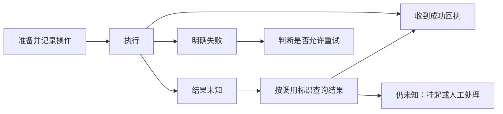

# 20 · Agent 运行时：决策、执行、状态与恢复

[返回目录](../README.md) · [Agent 入门](11-rag-and-agents.md) · [下一章](21-agent-planning-and-memory.md)

## 1. 一个 Agent 步骤包含哪些真实操作？

```text
读取目标与状态
→ 构造模型输入
→ 获取候选动作
→ 校验动作结构、权限与前置条件
→ 执行工具或输出答案
→ 验证结果并更新状态
→ 判断是否结束或继续
```

模型负责提出下一步，运行时负责决定这一步能否被执行、执行结果是什么，以及状态如何变化。把一次函数调用封装成工具，是其中很小的一部分。

## 2. 状态至少应保存什么？

| 状态字段 | 为什么需要 |
| --- | --- |
| 目标 ID 与目标定义 | 区分不同业务意图，避免混用结果 |
| 用户身份与授权范围 | 每次执行仍需校验当前权限 |
| 当前阶段与计划版本 | 知道任务在哪一步及为何重规划 |
| 证据及其来源、版本 | 生成与行动条件可追溯 |
| 工具调用参数、调用 ID、结果 | 排查、恢复、去重与验证 |
| 待确认或结果未知的操作 | 防止把超时直接当成失败 |
| 剩余步骤、时间、费用和调用预算 | 限制循环与资源使用 |
| 完成条件与验证结果 | 区分自报完成和实际完成 |

对话文本可作为状态的一部分，但不是最可靠的唯一状态存储。业务操作回执、权限、预算应使用可检查的结构化记录。

## 3. 工具协议具体包含什么？

工具需要名称、参数 Schema、输出 Schema、身份要求、风险类别、超时与重试语义。例如 `create_ticket(title)` 除了接收字符串，还应约束长度、重复请求、业务范围和成功回执。

输出至少区分：成功、明确失败、结果未知。异常文本不能混进普通结果字段，让模型自己猜执行是否成功。

工具描述应说明何时使用、参数单位、前置条件和无法保证的内容。工具名称相似但语义模糊时，模型选择错误的概率会增加。

## 4. 校验分成四层

1. **结构校验：**字段、类型、枚举与格式正确。
2. **语义校验：**日期顺序、金额范围、资源 ID 是否合理。
3. **授权校验：**当前用户能否对该资源执行该动作。
4. **业务校验：**对象当前状态是否允许转换，必要审批是否完成。

模型生成合法 JSON 只覆盖第一层的一部分。即便使用约束解码，仍要在应用中完成其余验证。

## 5. 超时为什么不等于失败？

一次写操作可能已经在服务端成功，但回执在网络中丢失。如果运行时把超时视为「没执行」，直接重试，可能生成两个工单或重复扣款。

更合理的状态机是：



结果未知时优先对账或查询。操作 ID 与幂等键应在执行前确定，并在同一个业务意图的重试或恢复中保持一致。

## 6. 幂等键怎样设计？

键可结合目标/业务操作 ID、用户范围、工具类型与规范化参数。不能只按参数生成：用户两次真正不同的相同金额支付，可能需要两次执行。

后端应原子地记录幂等键和操作结果，防止两个请求同时检查「不存在」后都执行。仅在 Agent 的内存里缓存结果，无法解决服务重启或并发重复。

「最多一次」和「至少一次」是交付或执行语义的不同侧面。跨系统的完整 exactly-once 很难，仅靠一次工具调用重试规则不能作出这种保证。

## 7. 可运行的本地执行循环

[agent_runtime.py](../examples/agent_runtime.py) 实现一个确定性决策策略、三个工具动作、步骤预算、参数/权限校验、写操作前置条件、幂等键和超时对账。

```bash
python examples/agent_runtime.py
```

策略依次读取模拟制度、创建模拟咨询单、确认完成。写入成功后故意丢失一次响应，运行时进入结果未知，再通过回执查找完成对账；同一幂等键重复提交仍只产生一次实际写入。

预期：3 个决策步骤、3 次工具调用计数、1 次实际写入，事件中包含 `operation_pending`、`outcome_unknown`、`operation_verified` 和 `completed`。

这里的决策策略是固定测试夹具，不是真实 LLM；服务和状态都只存在本地内存中。示例验证的是执行边界，生产中还需要持久化、事务、真实身份和超时机制。

## 8. 错误应该回给模型什么？

提供可分类的错误，如参数缺失、资源不存在、权限拒绝、临时服务故障或结果未知。只告诉模型「Error」难以指导下一步；把完整堆栈、内部凭据或敏感数据交给模型则可能超出必要范围。

可允许模型修正可纠正参数；权限错误应由系统边界决定，而不是让模型换一个工具试着绕开。重复同一种失败达到阈值时应停止或改变策略。

## 9. 终止条件应验证目标

「模型说完成了」不是业务验收。创建工单应有合法回执；生成代码应运行必要测试；研究任务应检查来源、覆盖范围和输出结构。

终止可以有多种结果：完成、需要澄清、预算耗尽、明确失败、等待审批或结果未知。把所有结束都统计成成功，会严重扭曲评估。

## 10. 外部内容的信任边界

检索文档、网页和工具结果都是数据，可能含有伪装指令。即使模型误把它们当成指令，运行时仍应限制工具、资源和动作范围。

不要把一个外部页面里出现的资源 ID 直接当成授权依据。用户身份、业务规则和工具访问控制应来自系统中的可信状态。

## 11. 观测与故障复盘

为每次模型决策、工具尝试和状态转换记录关联 ID、版本、耗时及验证结果。一个模型动作可能对应多次实际工具尝试，这两种数量应分开统计。

复盘时先判断是目标理解、计划、工具选择、参数、授权、执行还是结果验证出错，再决定改 Prompt、控制流、工具协议或后端。

## 练习

修改示例使对账也失败，运行时应保留「结果未知」，不能编造回执；让策略重复返回同一动作，观察预算能否终止；设计可持久化事件记录，说明进程重启后怎样恢复幂等键。
