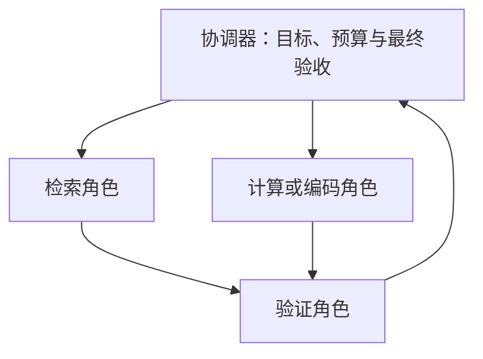

# 21 · Agent 规划、记忆、多 Agent 与协议

[返回目录](../README.md) · [运行时](20-agent-runtime.md) · [下一章](22-evaluation-and-production.md)

## 规划需要表示依赖和验收

「先查资料，再写报告」只是粗略顺序。可执行计划还要知道每一步需要哪些输入、产出什么、由什么规则判断完成，以及失败如何影响后续步骤。

```json
{
  "plan_version": 1,
  "tasks": [
    {"id": "A", "goal": "确认适用地区和日期", "depends_on": [], "done_when": "字段完整"},
    {"id": "B", "goal": "检索授权范围内的制度", "depends_on": ["A"], "done_when": "证据有效且可追溯"},
    {"id": "C", "goal": "计算报销条件", "depends_on": ["B"], "done_when": "计算与条款核对通过"},
    {"id": "D", "goal": "回答并给出处", "depends_on": ["C"], "done_when": "关键断言有支持"}
  ]
}
```

这是一张任务依赖图。B 完成之前，C 不应使用模型猜测的制度金额。计划中的任务名看似正确，也不能代替各任务的完成验证。

执行器先校验任务 ID、依赖存在且无环、工具能力和授权，再维护“前置条件已验证的就绪集合”。完成一项后提交其产物和验收结果，再释放依赖它的任务；失败不等于成功返回一个错误字符串，后继不能继续把它当有效输入。

计划版本与任务执行状态分开保存。模型修改计划不应删除已经发生的操作回执；重试也应引用原操作身份，执行语义见[运行时](20-agent-runtime.md)。计划是可检查的候选控制图，不是对真实世界的执行承诺。

## 三种控制方式怎样选择？

| 方式 | 决策时机 | 优点 | 典型问题 |
| --- | --- | --- | --- |
| 固定工作流 | 程序预定义步骤与分支 | 可预测、容易回归 | 难覆盖开放任务 |
| 逐步反应式行动 | 观察结果后再选下一步 | 能适应未知环境 | 局部决策、循环和方向漂移 |
| 先规划再执行 | 先生成结构化计划，按反馈重规划 | 显式依赖与进度 | 初始计划可能基于错误假设 |

可以组合：外层使用固定的业务边界，内层允许模型在有限工具集内探索。ReAct 类范式将行动与观察交织，但并不自动提供可靠的权限、持久化或终止机制。

## 重规划应怎样处理旧结果？

假设先按地区 A 找到了条款，用户随后补充目的地是地区 B。不能只修改最终答案的地名；依赖地区 A 的检索、计算和结论都应标记失效。

状态需要记录结果的依赖来源，例如输入字段版本、文档版本和计划版本。重规划保留仍有效的独立结果，只重做受变化影响的部分。

失效沿依赖边向后传播：上游输入改动，先标记受影响产物，再标记消费这些产物的任务。未开始项可以取消或重排，正在执行项需要判断是否可停止，已完成写入只能记录后果并走授权补偿，不能像删除草稿一样抹掉。

定期让模型「反思」不一定会提升正确性。有效重规划应由可观察信号触发：证据缺失、验证失败、用户修改目标、工具状态变化或预算不足。

## 并行步骤不是无限展开

互不依赖的资料查询可以并行；依赖查询结果的写操作不应提前执行。并行还需要处理超时、部分成功、取消和结果汇总。

一个最短路径耗时 5 秒的计划，如果必须等待一个无关但错误加入的 30 秒任务，最终延迟仍会变长。关键路径、任务必要性和并发限额应一起设计。

执行预算需要按真实工具/模型调用消耗，不按表面计划任务数量估计。每个子任务内部还可能重试或继续展开。

共享状态更新应带预期版本；两个 worker 基于同一旧版本决策时，不能无条件覆盖对方结果。针对同一资源的写入可串行化或使用后端条件更新。汇总器只接收已验收产物，保留部分失败，而不是用最后完成的文本覆盖全部任务事实。

## 工作状态与三类长期记忆

| 类型 | 例子 | 使用方式 |
| --- | --- | --- |
| 工作状态 | 当前任务缺少什么、哪些调用已完成 | 结构化任务状态，直接读取 |
| 情景记忆 | 某次任务的证据、动作和结果 | 按相似任务或目标检索 |
| 语义记忆 | 经过确认的定义、事实与约束 | 带来源、范围和有效期的知识读取 |
| 程序性记忆 | 稳定操作流程或成功策略 | 版本化工作流、规则或示例 |

这些是系统设计分类，未必对应模型内部独立区域。把聊天历史存进向量库，只实现了一种存储与检索方式，还没有完成可靠记忆系统。

## 记忆写入比读取更需要规则

建议记忆记录包含：主体范围、来源、创建时间、有效期、确认状态、允许访问者、内容版本和替代关系。

```json
{
  "memory_id": "M-DEMO-01",
  "scope": "task:demo-goal",
  "kind": "observed_fact",
  "content": "本次任务的目的地为地区 B。",
  "source": "confirmed-user-input:turn-3",
  "status": "confirmed",
  "supersedes": "M-DEMO-00",
  "expires_at": "task-end"
}
```

模型推断不能直接覆盖已确认事实。外部网页中的指令，也不应被自动写成长期规则。来源不明的记忆即使与查询很相似，也需要降低信任或重新验证。

写入链路可以依次完成候选提取、来源验证、范围/时效判定、冲突检测和版本提交。读取链路先过滤权限与有效范围，再检索相关条目、解开替代关系，最后把原始事实及来源放进上下文。不能因一个摘要与问题很相似，就跳过验证直接升级成长期规则。

## 压缩历史应保留哪些信息？

普通摘要可能删掉金额单位、否定条件、版本冲突或尚未确认的操作。这会让下一步把「可能成功」变成「已经成功」。

应优先保留目标、约束、关键证据 ID、已执行动作回执、待解决问题和结果未知操作。详细原始记录可以在外部持久化，摘要只保存足够恢复的指针与结构。

压缩前后可使用同一组状态问题验证：适用日期是什么？哪个条件尚缺失？哪个动作还未知？如果摘要无法正确回答，就不能当作等价状态。

## 记忆检索需要先过滤范围

先按用户、组织、项目、任务和时间范围过滤，再做语义相关排序。记忆相似不代表可以跨用户读取，也不代表旧规则仍有效。

「新记忆优先」也不总正确：上传更晚的资料可能描述更早时期。使用有效时间、明确替代关系和来源权威，而不是简单按创建时间选第一条。

## 多 Agent 的几种拓扑



- 协调器—工作者：中央分配任务、收集产物，容易集中控制预算。
- 流水线：每个角色负责一个阶段，接口稳定时便于检查。
- 并行候选—裁判：多个方案后选择或融合，成本与裁判质量成为关键。
- 讨论式协作：角色互相交换信息，通信和错误传播更复杂。

角色名字不赋予专业能力。同一个模型换几个角色 Prompt，也可能共享知识盲点，不能假设错误彼此独立。

## 角色之间应传产物，而不是无限聊天

检索角色应传来源 ID、片段和版本；计算角色应传输入、方法与结果；验证角色应传通过/失败及具体理由。结构化接口减少含糊信息和重复 Token。

写权限可以集中在一个执行组件，其他角色只提出建议，避免多个角色重复提交同一操作。共享状态的更新要有版本或冲突处理，不应采用谁最后说话谁覆盖全部状态。

## 多 Agent 值不值得？

比较任务成功率、人工修订、总调用成本、延迟和失败恢复。先做单 Agent 或固定工作流基线，再证明分工确实解决了某个瓶颈。

并行可能降低墙钟时间，但不一定降低总 Token 或费用。多个相似答案也不等于事实验证；应使用可检查证据、执行结果或独立规则。

## MCP 与框架怎样连接任务运行时

以 MCP 2025-06-18 为边界，host 管理应用与上下文，并通过对应 client 与 server 建立连接；初始化协商协议版本和能力，随后才能使用双方支持的交互。server 可以暴露工具、资源等能力，但不是完整 Agent。

工具发现返回描述和输入约定，host 选择将哪些能力交给当前模型；模型提出调用，host 仍须校验和授权，再由 client 向对应 server 发送调用。返回的内容/错误成为观察，不自动成为可信系统指令或业务成功。协议请求 ID 用于消息关联，不应不加判断地当作跨重试的业务幂等键。

框架可提供节点/边、工具适配、检查点和流式事件，应用仍定义计划、预算、恢复、身份与验收。协议协商和检查点保存都不能证明外部副作用只发生一次。连接层、任务层与后端事务应分别画清，相关机制见[第 20 章](20-agent-runtime.md)。

依据：[MCP 2025-06-18 架构规范](https://modelcontextprotocol.io/specification/2025-06-18/architecture)。本章不依赖某个 Agent 框架的接口版本。
