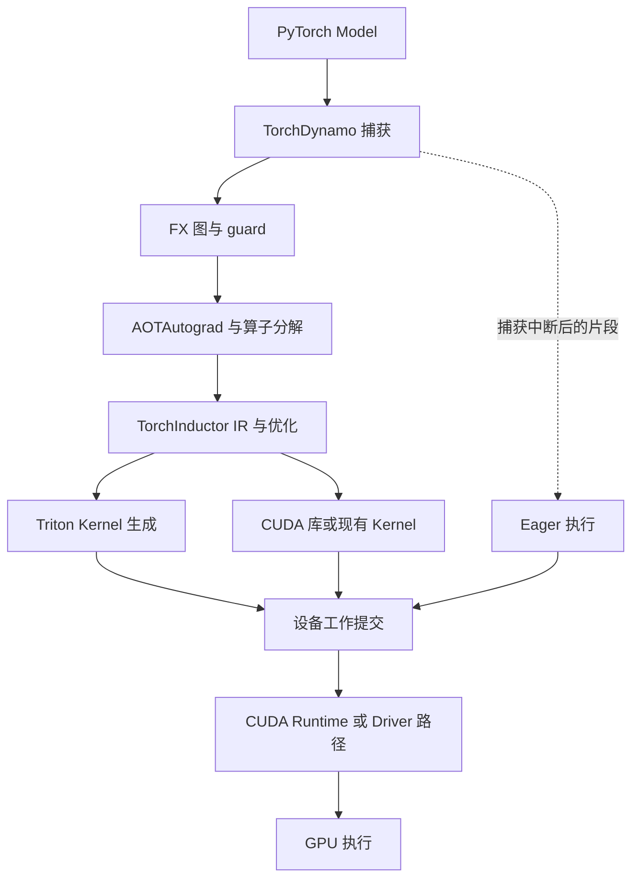

# 28 · AI Compiler、Runtime 与 Kernel 执行栈

[知识地图](00-learning-roadmap.md) · [计算布局](16-transformer-implementation.md) · [硬件与通信](27-compute-infrastructure.md)

## 模型描述计算，执行栈决定怎样完成计算

PyTorch Model 描述参数、算子和控制流。GPU 不直接执行 Python 中的 Transformer 类：框架必须把张量操作变成设备代码，准备地址、形状与依赖，再提交到设备。相同模型换执行栈，可能改变中间张量的读写、Kernel 数量、布局和启动方式，因而改变性能；模型的逻辑关系仍应成立。

这里的 Compiler 负责转换和优化程序，Runtime 负责运行期间的状态、资源与工作提交，Kernel 是在设备上执行某段计算的程序。Serving scheduler 决定哪些请求进入本轮，引擎准备输入和 KV 地址，执行栈才运行该轮计算。它们不是同一个调度器。

## Eager Mode：算子随程序运行而提交

在 Eager Mode（即时执行模式）中，Python 程序运行到张量操作时，PyTorch dispatcher 根据设备、dtype 等选择实现。一个操作可能调用预写 Kernel、cuBLAS/cuDNN 等库，也可能分解成多个操作。GPU 工作通常异步排入 stream；Python 调用返回不代表设备已经完成。

训练时，Autograd 同时记录反向所需的操作关系与保存张量。反向图不是整段 Python 程序的静态编译结果；推理关闭梯度记录后仍可以 Eager 执行。把张量读回 CPU 或根据设备值作主机判断可能触发同步，使 CPU 提交与 GPU 执行失去重叠。

Eager 保留灵活控制流，但框架逐次分派、许多小 Kernel 启动和中间张量落到 HBM 的成本可能明显。已有库 Kernel 很高效时，编译也未必再提升主要计算。

## Computational Graph 捕获的是什么

计算图用节点表示操作，用边表示数据依赖。图的输入可以包含张量与参数，元数据描述 shape、stride、dtype 和 device；副作用、别名与更新还需专门表达。图不是只有层名称的架构图，也不是一批已经算出的激活值。

Graph capture 从程序执行中提取可分析的计算片段。例如张量经过归一化、投影、激活和残差连接，Compiler 才能跨操作判断哪里能省掉中间读写。捕获产物会被编译器消费；激活仍在每次运行时由新输入产生。

对依赖 Python 分支或输入属性的程序，捕获通常附带 guard（适用条件）：只有 dtype、布局、形状或其他假设满足时，才复用对应产物。Guard 失败可能触发重新捕获与编译；不是把不兼容输入强行喂进旧 Kernel。

**Graph break 与重新编译是不同事件。**Graph break 表示捕获在某处中断，执行可能在编译片段和 Eager 片段之间切换；不支持的 Python 行为、某些数据依赖控制流或副作用会引发它。重新编译则是已有片段的假设不适合当前输入。两者都可能影响性能，但需要分别观察。要求完整图的模式可能直接报错，而非回退。

Dynamic shape（动态形状）允许部分维度采用符号约束，避免每个 batch size 或序列长度都生成一套专用图。它不意味着任意 shape、rank、分支和数据依赖都能无条件复用。更广的适用范围也可能限制优化；按长度分桶和 padding 可减少变体，却引入额外计算。依据：[PyTorch Compiler](https://docs.pytorch.org/docs/stable/torch.compiler.html)、[Dynamic Shapes](https://docs.pytorch.org/docs/main/user_guide/torch_compiler/torch.compiler_dynamic_shapes.html)。具体捕获范围、guard 和回退策略可能随版本变化。

## PyTorch 2.x 各组件怎样连接

以下以 `torch.compile` 的常见 Inductor 路径为例，不表示所有 backend 必须采用同一流水线。

| 组件 | 接收与产生的对象 | 系统职责 |
| --- | --- | --- |
| TorchDynamo | Python 执行与输入假设 → FX 图、guard | 在 Python 运行边界捕获张量计算，不负责直接生成机器指令 |
| AOTAutograd | 捕获的计算 → 可编译的前向/反向图及相关变换 | 训练中提前构造反向计算，处理保存与重计算的划分；这里 AOT 不等于整个模型必然离线部署 |
| TorchInductor | 操作图 → 调度、循环/缓冲 IR、生成代码与库调用 | 决定布局、融合、缓冲使用和 Kernel 实现 |
| Triton | 描述分块计算的程序 → 设备代码 | GPU Kernel 的语言与编译器；可由 Inductor 生成，也可由开发者编写 |
| CUDA 执行环境 | Kernel、参数、地址、stream 与事件 → 设备工作 | 管理提交与依赖，设备再执行线程和内存操作 |

推理没有训练梯度的完整反向生命周期，但仍可使用相关前向变换。Inductor 也可能生成 CPU 代码或面向其他设备 backend；不是所有 GPU 算子都变成 Triton。关系依据：[PyTorch Compiler FAQ](https://docs.pytorch.org/docs/stable/user_guide/torch_compiler/torch.compiler_faq.html)、[PyTorch 2 论文](https://pytorch.org/assets/pytorch2-2.pdf)。

## IR 让优化从模型名字转向数据依赖

Compiler IR（Intermediate Representation，中间表示）在不同阶段保留不同信息：高层 IR 保留操作与张量关系，较低层 IR 表达循环、索引、内存布局和设备执行。没有一份 IR 能同时以最佳形式表达全部层次。

Graph optimization 可以消除无用计算、传播已知信息、分解复杂算子或改变等价操作组合；必须尊重别名、原地更新、随机状态和数值约定。某些变换依赖静态形状，某些依赖硬件或精度。浮点运算顺序变化可能产生容差内差异，不能自动宣称逐位一致。

**Operator fusion 与 Kernel fusion 关注的边界不同。**操作图上把若干操作组织为一个融合区域，不保证最终只启动一个 Kernel；底层实现可能需要多个阶段。Kernel fusion 将多段设备计算放在一个 Kernel 内，主要收益可能是少启动、少中间 HBM 读写，而不是减少模型数学运算。

例如逐元素 bias、激活与残差可在一段设备程序中衔接；矩阵乘可能调用库 Kernel，再接另一个融合区域。强行把所有操作融合会增加寄存器、共享内存和代码体积，降低并发或发生 spill，也可能错过更好的库算法。融合范围需要由依赖和资源约束共同决定。

## Memory planning 管的是同时存活的缓冲

中间张量的生命周期由产生点到最后消费者决定。若两个缓冲不会同时被使用，Compiler 可安排复用内存；若有别名、异步通信、保存给反向或跨轮保留，则不能只按顺序认定前者已死。

Memory planning 产出运行所需的缓冲安排，Runtime/allocator 再提供实际地址。训练保存激活、通信预取与 CUDA Graph 地址约束都可能延长存活时间。[第 17 章](17-training-engineering.md)中的重计算与参数 gather 会改变峰值，[第 18 章](18-inference-engineering.md)中的 KV 则跨迭代存活，不能作为一次前向的普通临时张量随意回收。

图计划降低部分分配和峰值，不等于掌握进程中全部显存。库 workspace、KV 池、通信缓冲和 allocator 保留仍需单独统计。

## Compile cache 与 autotuning 保存的状态

编译可能产生图、Kernel 二进制、调度选择和 autotuning 结果。进程内缓存及可持久缓存减少重复工作，但不同缓存的键和兼容边界不同：图/代码、guard、设备架构、编译配置、软件版本与相关布局都可能影响复用。

普通参数内容在兼容条件下更新，不必每次重编译；若冻结或常量化已把某些值嵌入产物，则必须检查失效条件。缓存错误、版本不兼容或 guard 不满足时应重新生成或采用受控回退，不能仅凭“已有一个缓存文件”判断可用。依据：[Compile Time Caching](https://docs.pytorch.org/tutorials/recipes/torch_compile_caching_configuration_tutorial.html)。

Autotuning 在候选实现、tile、并发配置等之间测量并选择。选择依赖 shape、dtype、硬件与测量条件，不保证一套配置覆盖全部输入。首次编译和调优占启动时间，扩大搜索可能改善稳态却拉长就绪。多副本同时调优还可能争用资源。因此冷启动、缓存命中启动和稳定运行需要分别记录。

编译缓存不保存请求 KV，也不提供业务答案；进程退出后哪些产物仍在，取决于持久缓存配置和实际支持版本。

## CUDA kernel launch 与 CUDA Graph 的边界

Kernel launch 提交设备程序及其参数、执行配置和 stream。它有主机提交成本，也受 stream 顺序与事件约束；launch 返回只说明提交，不说明结果可读取。大量很短的 Kernel 可能让启动成本或主机供给成为瓶颈。

CUDA Graph 保存的是 Kernel、传输等**设备工作及依赖**，经过准备/实例化后重复 launch。它与 Dynamo 的张量计算图不是同一个对象：前者优化工作提交，后者支持程序分析与代码生成。CUDA Graph 可以重放已有库 Kernel，不必先由 Inductor 生成新 Kernel；Compiler 也可与它组合。

重放必须维护有效地址、输入更新与依赖。常见推理引擎为不同 batch 桶准备图和稳定缓冲，用有效长度屏蔽 padding；捕获条件、图更新与动态节点能力随 CUDA/框架版本变化，不应笼统说所有 CUDA Graph 永远不支持变化。捕获/实例化成本、多个桶的持久缓冲与图私有内存会占空间；不兼容工作需要新图或其他执行路径。

CUDA Graph 不自动融合节点中的 Kernel，也不减少必须读取的权重与 KV。若主要等待 HBM 或跨机通信，减少 launch 未必改变关键瓶颈。依据：[CUDA Graphs](https://docs.nvidia.com/cuda/cuda-programming-guide/04-special-topics/cuda-graphs.html)。

## Triton、CUDA 与 FlashAttention 各在什么位置

CUDA 是编程与执行平台，CUDA C++ 是编写设备程序的一条路径。Triton 提供另一种描述分块 GPU 计算的语言与编译栈；在 NVIDIA backend 上，生成的代码通过相应 CUDA Driver/运行集成路径提交。它不要求把每个 Triton 程序先翻译成 CUDA C++ 源码，也不替代设备驱动、CUDA 生态的所有库或多 GPU 通信。

FlashAttention 是 IO-aware 的精确 Attention 算法与其高效 Kernel 实现家族。它通过分块、在线归一化和局部复用，避免将完整注意力分数矩阵反复写回 HBM；保留 Attention 数学关系，但浮点顺序可能不同。它可以有 CUDA 或 Triton 实现，可以被框架算子或 Compiler 选用，不等于一种模型架构，也不等于通用编译器自动完成的一切融合。[第 16 章](16-transformer-implementation.md)展开其信息流；依据：[FlashAttention](https://arxiv.org/abs/2205.14135)、[Triton 官方文档](https://triton-lang.org/main/index.html)。

## 相同模型为何有不同系统性能

本章产生的图、guard、代码/库选择与缓冲计划会改变相同模型的执行。应记录 graph break、guard 失配/重新编译、编译缓存命中及产物版本；如何把这些事件关联到 CPU/GPU timeline、识别碎 Kernel 和提交等待，由[第 31 章](31-ai-systems-observability-and-debugging.md)主责。

同一执行栈在大 Prefill、小批 Decode 和变长训练上可能有不同瓶颈。性能机制应连接[第 30 章](30-ai-systems-performance.md)中的关键路径与 Roofline；上线时还要通过[生产评估](22-evaluation-and-production.md)核对数值、状态隔离与真实负载。编译失败可回退执行，GPU/rank 故障则需要请求或训练状态恢复，编译缓存本身不能完成恢复。
