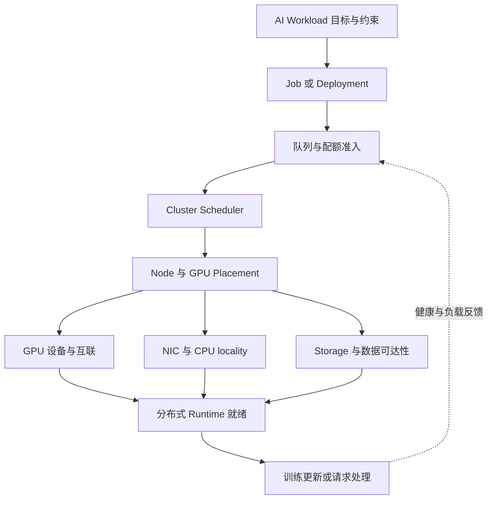

# 29 · AI Platform、GPU Cluster 与资源调度

[知识地图](00-learning-roadmap.md) · [训练系统](17-training-engineering.md) · [集群 Serving](10-serving-and-distributed.md)

## 调度的是可运行的系统，不只是 GPU 数量

训练、在线推理、离线批推理与数据准备有不同的完成目标。训练需要一组 rank 协调推进更新；在线推理要保持首响应和输出间隔；批推理关注完成期限与成本。平台把这些目标转成队列、配额、设备约束和生命周期管理，然后安排物理资源。

“分到几张 GPU”只回答资源数量。能否加载模型、能否建立通信组、能否及时读入数据、能否在 deadline 内处理请求，还依赖 GPU 型号/HBM、拓扑、NIC、CPU、主机内存与存储。一个 Pod 已运行，不等于这套 AI workload 已可用。

## Workload 怎样映射到 Job / Deployment

Job 表达有结束条件的执行，Deployment 类控制器保持服务副本存活；多节点训练或多 rank 推理往往还需 workload controller/operator 组织角色、rank、启动与健康。这里讲责任，不提供 Kubernetes 命令或配置教程。

| 层 | 谁产生状态、谁消费 | 生命周期边界 |
| --- | --- | --- |
| Workload controller | 接收模型/任务规范，创建成员与恢复策略 | 一次训练尝试、服务版本与副本组 |
| 队列/准入层 | 接收需求、租户配额与优先级，放行可承担的工作 | 等待、准入、暂停或撤回 |
| Cluster scheduler | 读取节点设备/约束，选择 placement | Pending 到资源绑定；不编排每个 Token |
| 设备管理层 | 准备设备访问、健康与运行所需配置 | 分配、准备、使用、释放 |
| 分布式 Runtime | 建立 rank 组、加载状态与通信 | 全组就绪、执行、失败与重建 |

平台资源声明应与运行实际一致。漏报主机内存或 CPU，可能让 GPU 等预处理；漏算 workspace 或加载峰值，可能在调度成功后 OOM。调度器看到的设备容量也不必包含模型运行时的活跃 KV 信息，需由平台指标和准入补上。

## GPU resource allocation 的粒度与边界

分配一张整 GPU、一份硬件分区或软件共享份额，是不同隔离合同。时间共享不自动隔离显存、带宽或故障；硬件分区也不能被笼统视作任意模型都适用的完整 GPU。分配单位必须记录能力、可用 HBM、共享规则和支持的通信路径。

Kubernetes device plugin 向 kubelet 报告设备与健康，资源经节点信息进入调度；传统扩展资源请求多以设备数量表达。设备插件负责厂商准备和容器访问，不意味着通用 scheduler 已知道每张 GPU 的完整 NVLink/NIC 拓扑，也不意味着请求 `GPU=1` 就能选择任意显存容量。

DRA（Dynamic Resource Allocation）以 DeviceClass、ResourceClaim 和驱动发布的 ResourceSlice 等对象表达设备需求与可用属性，让设备选择和 Pod placement 更紧密协同。资源匹配、准备和释放各有状态；claim 已分配不等于设备准备已完成。它不替代厂商驱动，也不自动提供所有共享或 gang 能力。DRA 的可用字段、共享特性和 feature gate 随 Kubernetes/驱动版本变化，需核对所用组合。

官方依据：[GPU Scheduling](https://kubernetes.io/docs/tasks/manage-gpus/scheduling-gpus/)、[Device Plugins](https://kubernetes.io/docs/concepts/extend-kubernetes/compute-storage-net/device-plugins/)、[DRA](https://kubernetes.io/docs/concepts/resource-management/dynamic-resource-allocation/)。

## Topology-aware placement 连接逻辑组与物理设备

TP 的层内短消息、CP 的 K/V 交换、EP 的 all-to-all 和 FSDP 的参数 gather 有不同通信模式。同样的 GPU 数量，跨高速互联域或跨机部署会改变带宽、时延和拥塞。Device Mesh 定义逻辑参与者，placement 决定这些参与者实际走哪条链路。

| 拓扑关系 | 影响什么 | 决策时应核对 |
| --- | --- | --- |
| GPU—GPU，NVLink / NVSwitch | TP、CP、EP 等设备间数据交换 | 是否同互联域、实际路径、共享负载与可用带宽 |
| GPU—NIC | 跨节点 collective、P/D transfer | PCIe/NUMA 路径、NIC 可达性与驱动支持 |
| CPU—GPU / NIC | 输入准备、主机缓冲与控制提交 | CPU/内存亲和性、跨 NUMA 搬运与线程资源 |
| Node—Storage | 权重加载、训练输入、checkpoint | 数据副本/缓存、共享带宽、权限与存储可达性 |

NVSwitch 连接的设备仍可能共享资源，不能假设无限无竞争带宽；节点标签表达能力，不必等于精确链路图。GPU + NIC affinity 要同时落实设备选择、CPU/内存 placement 与实际通信接口。CPU/设备 locality 协同机制可参考[Kubernetes Topology Manager](https://kubernetes.io/docs/tasks/administer-cluster/topology-manager/)，其策略不等同于全集群网络优化。

“最靠近数据”与“最适合通信组”也可能冲突。让 rank 靠近已有权重缓存可缩短启动，却可能使 TP 组跨慢链路；让所有任务挤在一个互联域可保持通信，却导致排队与热点。应按运行时关键路径比较启动收益和长期通信代价，而非只优化一个 locality 标签。

## Gang scheduling 与 coordinated scheduling

许多分布式训练只有在足够成员同时得到资源、版本匹配并建立通信组后才能前进。零散启动的 rank 等待未到齐成员，已占 GPU 却没有有效更新；多个作业各占一部分资源还可能互相堵住。

Gang scheduling 在调度/准入层以一组成员为单位考虑足够资源，避免只放行无法启动的碎片。Coordinated scheduling 范围更广：还包括 rank 身份、rendezvous、启动顺序、就绪、失败与重试。Gang 保证不了每个进程必然初始化成功，必须有启动超时和组级清理。

弹性训练可以允许成员数改变，但需要运行时支持新的通信组、数据划分与状态恢复，不能把“少启动几个 rank”自动当作可用弹性。TP/PP 推理副本也常需要整组就绪，独立副本之间则可分别放行。

Gang 能由具体调度器或 Kubernetes 相关机制实现，支持状态、启用条件与语义需按版本核对，不能假设普通 Pod 默认拥有组调度。官方机制入口：[Kubernetes Gang Scheduling](https://kubernetes.io/docs/concepts/scheduling-eviction/gang-scheduling/)。

## Heterogeneous GPU：能放下与能高效协作不同

异构设备可能具有不同 HBM、算力、低精度支持、互联和 Kernel 能力。模型 placement 首先筛除不支持精度/算子或容量不足的设备，再考虑性能。以“卡数相同”换算容量会忽略这些差异。

同步训练常被最慢 rank 限制，TP 的某个分片或 PP 的最慢 stage 会拉长整组时间。可以按能力分配工作或把不同设备放进不同 pool，但需要模型/Runtime 支持；不能任意分配不等矩阵片段后仍沿用等分通信协议。

P/D 分池可分别选硬件与并行度，但模型语义、KV 精度/布局和 transfer 必须兼容。新旧硬件的编译缓存、图和 Kernel 支持也可能不同，见[第 28 章](28-ai-compiler-and-runtime.md)。

## Quota、priority 与 preemption 管理共享集群

Quota 约束租户可承担的资源，priority 决定竞争时的相对顺序，preemption 通过收回较低优先级资源给其他工作让路。它们不自动保证公平、无饥饿或更好的业务吞吐，还需队列、借用和回收策略。

GPU 配额只管数量会遗漏 NIC、存储和主机资源竞争。多个租户同时写 checkpoint 或加载模型，可以在 GPU 配额未满时阻塞彼此。Multi-tenancy 还需要设备访问、数据权限、模型资产、日志和缓存键隔离；Prefix Cache 命中不得越过安全边界。

抢占训练应明确最近可恢复点与未保存进度。资源即时回收不保证来得及 checkpoint；保存前置、优雅终止与硬终止的合同不同。推理应停止准入并 drain，或按协议迁移/重建状态；正在流式输出的请求不一定能透明恢复。高优先级提升可能使低优先级不断冷启动，损失大量有效工作。

排队期限、公平性与回收成本应进入平台指标。机制入口：[Resource Quotas](https://kubernetes.io/docs/concepts/policy/resource-quotas/)、[Priority and Preemption](https://kubernetes.io/docs/concepts/scheduling-eviction/pod-priority-preemption/)。

## Failure / restart 是组与状态的恢复

设备故障、节点丢失、网络阻塞、进程退出与模型加载失败是不同事件。Scheduler 可以重新分配资源，controller 可以重建进程，但训练状态、KV 和已输出内容不会由 Pod 重建自动恢复。

训练中一个 rank 丢失可能使原组 collective 无法完成。协调者要终止或隔离旧尝试，释放资源，建立新组，从一致 checkpoint 恢复；新拓扑 reshard 见[第 17 章](17-training-engineering.md)。持续等待失联 rank 既占资源，也不能提供有效训练吞吐。

Serving 要撤销故障副本路由，清理失效缓存索引，并按请求状态重试或返回错误。版本/代次区分旧 worker 与新 worker，避免同名 Pod 让旧 KV 位置被误认为仍有效。健康检查应包含模型、通信组和必要依赖；某个 HTTP 端口能响应不等于整个并行副本可完成前向。

## Model placement、replica routing 与 autoscaling

Model placement 决定模型或阶段驻留在哪些设备，replica routing 决定一个请求选哪个已就绪副本，引擎调度决定下一轮运行哪些 Token。Gateway API 的 InferencePool / Endpoint Picker 提供模型服务池与端点选择的机制入口，不负责把 GPU 分配给 Pod，也不自动完成 P/D 交接。

新增 replica 需等待权重加载、通信、编译和预热；新副本的 Prefix Cache 常为空。Autoscaling 根据队列、长度分布、TTFT/ITL、容量和启动时间预判所需资源。GPU 忙若是通信/重算，扩卡可能继续加压网络；负载下降后也要有稳定窗口，避免频繁启动与清空热缓存。

服务缩容先从可接请求集合摘除，等待 drain，再释放设备；已有请求若要迁移，需要[第 10 章](10-serving-and-distributed.md)的所有权协议。P/D pool 分别扩容却必须平衡生产与消费，避免 Prefill 产出的 KV 堆积。机制入口：[InferencePool](https://gateway-api-inference-extension.sigs.k8s.io/api-types/inferencepool/)。

## Storage、network 与 GPU 的联合预算

训练输入不足会使 GPU 饿死，checkpoint 持久提交会争用 I/O；模型冷启动争用权重存储，P/D transfer 争用网络；TP/CP/EP 又可能同时使用 NIC。GPU 容量够用，不代表这些数据路径满足时限。

平台需要把数据读取、加载、通信、保存与请求 trace 关联到同一资源时间线。调度可以错开大规模加载/保存，保留存储和网络余量，或在 placement 中权衡 locality；不能把共享 I/O 压力全部误归因于模型 Kernel。

[第 27 章](27-compute-infrastructure.md)解释数据与通信基础，[第 30 章](30-ai-systems-performance.md)统一关键路径、SLO 与成本。具体存储层级、RDMA/GDS 和对象协议由[AI Storage Notes](https://miauyle.github.io/ai-storage-notes/)深入，本章维持平台资源与生命周期的边界。
