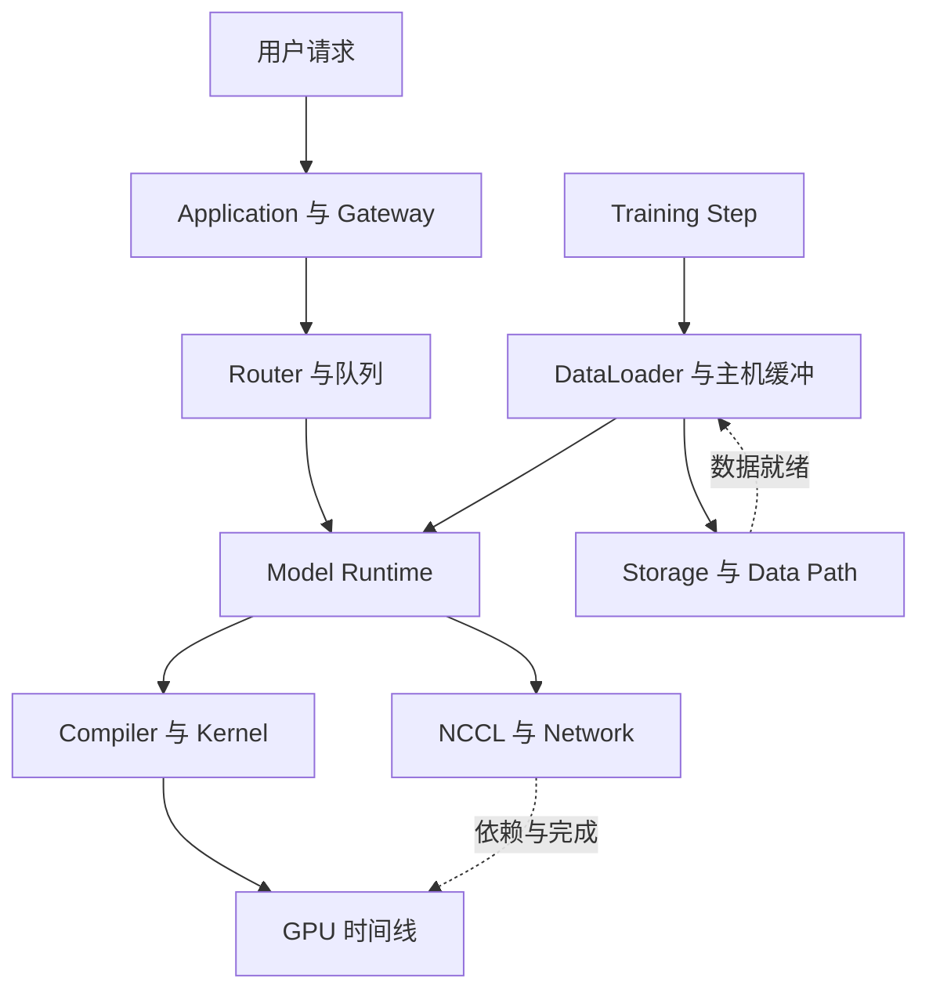

# 31 · AI Systems Observability、Profiling 与系统排障

[知识地图](00-learning-roadmap.md) · [性能口径](30-ai-systems-performance.md) · [生产验收](22-evaluation-and-production.md)

## 可观测性是解释状态与等待的能力

系统慢了、输出错了或训练挂住了，首先要找出哪个对象没有按预期推进，以及它等待谁。指标数量多不等于可观测性：如果无法把请求、批次、rank、通信和资产版本连起来，仍只能猜测原因。

观测链从 User Request / Training Step 穿过 Application / Gateway、Scheduler / Queue、Model Runtime、Compiler / Kernel、GPU，再关联 NCCL / Network 与 Storage / Data Path。它是责任和依赖关系，不表示所有阶段串行，也不表示每个请求都经过全部组件。

性能定义由[第 30 章](30-ai-systems-performance.md)统一；本章负责怎样取得证据、关联因果和缩小故障范围，不重新定义所有性能指标。

## Metrics、Logs、Traces、Profiles 各自回答什么

| 证据 | 主要回答 | 无法单独证明什么 |
| --- | --- | --- |
| Metric | 某时间窗口的计数、速率、分布和容量怎样变化 | 某个慢请求的完整原因；聚合会丢掉身份与顺序 |
| Log | 哪个对象在什么条件下发生了什么事件 | 没有发生的事件、跨服务依赖和准确 GPU 完成时间 |
| Distributed trace | 一次操作经过哪些组件、等待及重试，父子 span 如何相连 | 未插桩的内核细节；span 时长不是全部有效计算 |
| Event timeline | 提交、开始、完成与依赖在时间上怎样排列 | 顺序相近就有因果关系；不同机器时钟必须校准 |
| Profiler | CPU 调用、算子、Kernel、复制和内存在哪消耗时间/资源 | 任务答案正确；被采样执行代表所有负载 |
| Hardware counter | 所选 Kernel/设备的访存、指令、占用与停顿特征 | 端到端 P99 原因；counter 的定义和采集边界因硬件而异 |

Metric 用来发现异常范围，trace 找具体样本，log 补充状态转换，timeline 查依赖，profile/counter 深入已定位的阶段。先圈定时间、版本和负载，再选择更细证据；不要从一个全局均值直接跳到改 Kernel。

Trace context 通常包含 trace ID、span ID 和传播关系；`request_id` 是业务关联键，不必等于 trace ID。异步队列、批处理和重试需要保留上下文或 span links，不能只靠线程局部变量。传播机制见[OpenTelemetry](https://opentelemetry.io/docs/concepts/context-propagation/)。

## 请求级 Trace：把流式结果连回真实执行

Gateway 生成或接收请求身份，记录模型选择、准入和路由；worker 记录入队、被选中、Prefill、KV transfer、Decode 与 stream output。重试另记 attempt，迁移另记 worker/交接代次；同一业务请求不能让两次执行被误合成一条顺利路径。

| 请求边界 | 要关联的状态/证据 | 区分的问题 |
| --- | --- | --- |
| Gateway → Queue | 接收、Tokenize、准入、路由、入队/出队时间 | 外部等待、CPU 预处理还是 worker 排队 |
| Queue → Prefill | 已计算前缀、新位置、实际命中、批次 ID、图/编译冷热 | 重算、输入长度、局部调度还是初始化 |
| Prefill → KV transfer | 源/目标、布局、字节、目标预留、数据可读与交接确认 | 网络搬运、目标容量等待还是所有权推进停住 |
| Decode 迭代 | 请求到迭代映射、KV 压力、抢占、TP/CP 通信组 | Kernel、通信、容量或混入工作导致间隔变长；CP 仅在使用时记录 |
| Stream output | Token 就绪、入输出缓冲、flush、客户端接收 | 引擎已生成但输出 stall、网络或客户端消费变慢 |

TTFT、queue time、Prefill 和 transfer 必须使用一致边界；通信已经包含在某 span 内时不能重复相加。Cache 广告命中与落地后有效命中分别记录，命中也可能等待取回。机制主责见[集群 Serving](10-serving-and-distributed.md)、[本地引擎](18-inference-engineering.md)。

一轮 Kernel 可服务多个请求，一个请求也跨很多轮。保留 request → batch/iteration → runtime correlation → GPU work 的映射，但不要将整轮时长分别全算给每个请求后再求和。请求关键路径与设备总 busy time 是不同对象。

同一个 P99 异常可能来自入口队列、长 Prefill、KV 目标未就绪、TP 慢 rank 或输出缓冲。分位数指出慢样本位置，不包含故障解释；从这些样本的完整依赖寻找第一个异常等待。

## Training Step Trace：找到最先落后的参与者

训练用 job / attempt、global step、microbatch、rank/通信组、collective 序号及数据版本关联事件。逻辑顺序是 Data Load → H2D → Forward → Backward → Collective → Optimizer → Checkpoint，但预取、反向通信和异步保存可重叠，checkpoint 也不必每步执行。

| 阶段异常 | 需要对照的事件 | 不能草率下的结论 |
| --- | --- | --- |
| Input starvation | 下一批准备时间、主机队列水位、读取/解析时间、H2D 开始 | GPU 空闲不必是存储慢，也可能 CPU/worker 分片或主机内存压力 |
| Compute 变长 | 有效 Token、packing/padding、重计算、算子/Kernel 时间 | step 变长不必是硬件算力下降 |
| Exposed communication | 各 rank 数据就绪、collective 提交/完成、重叠区间 | 通信持续长不必是网络差，可能在等迟到 rank |
| Load imbalance / straggler | 同一步各 rank 的长度、专家负载、最早分歧位置 | 最后报 timeout 的 rank 不一定最先故障 |
| Checkpoint stall | 快照、staging、后台写入、提交、CPU/I/O 争用 | 上传完成不等于一致可恢复点，后台工作也可能拖慢前台 |

先比较同一步各 rank 何时到达同一依赖，再查迟到者上游。如果多数 rank 已等 collective，而一个 rank 在数据解析或某专家计算，长 NCCL span 是后果。检查点一致性由[第 17 章](17-training-engineering.md)解释，数据消费与恢复进度由[第 15 章](15-data-lifecycle.md)解释。

RL 后训练还要把轨迹 ID、behavior policy version、verifier 版本和训练消费更新连接起来；rollout 空转、奖励积压或 stale 样本丢弃不会由普通 step time 完整体现，见[后训练](08-post-training.md)。

## CPU / GPU Timeline：提交不等于执行完毕

CPU submission 可能很快返回，设备工作尚未开始；同一 CUDA stream 的顺序和跨 stream 的事件依赖才决定执行边界。Timeline 应区分 CPU API、kernel launch、GPU Kernel、memcpy、NCCL 工作及 synchronization。CUDA 异步机制见[官方指南](https://docs.nvidia.com/cuda/cuda-programming-guide/02-basics/asynchronous-execution.html)，执行栈见[第 28 章](28-ai-compiler-and-runtime.md)。

GPU 空洞前若 CPU 迟迟没有提交，先查 Tokenize、数据加载、Python/线程调度、小算子提交和隐式同步；若已提交但在等依赖，再查复制或其他 stream。看到两条 stream 并不证明 overlap，必须看到设备区间实际重叠，且重叠可能争用 HBM/SM 而降低单项效率。

GPU utilization 高不代表有效计算多：padding、重计算、拒绝的 speculative tokens、通信 Kernel 或低效访存都可能让设备很忙。低也不必是 GPU 问题：上游供给、CPU 提交、同步或失联 rank 能使它等待。设备 busy、SM 活跃、Tensor Core 使用、带宽利用与 occupancy 的定义不同，不能互相替代。

CPU 算子 self time、所有 Kernel 时间之和与请求延迟不是同一量。跨机时间线还受时钟偏差影响；无法保证对齐时，先用同机持续时间、消息关联及序号判依赖，不从微小时间差推断先后。

## 工具应在什么层级介入

| 已经缩小的问题 | 合适证据/工具 | 使用边界 |
| --- | --- | --- |
| 哪类请求/版本退化、哪个服务等待 | Metrics、结构化 logs、OpenTelemetry trace；vLLM 指标作为引擎实例 | 需自行连接 Gateway、引擎和输出边界；不假设开箱即全链路 |
| 哪个训练算子或框架阶段变慢 | [PyTorch Profiler](https://docs.pytorch.org/docs/stable/profiler.html) | 关联算子与设备事件；shape/stack/memory 采集会增加开销 |
| 业务阶段如何标到系统时间线 | NVTX range / marker | 标注用途，不是测量器；CPU range 结束不表示 GPU 工作结束 |
| CPU、CUDA、memcpy、stream 与通信如何等待/重叠 | [Nsight Systems](https://docs.nvidia.com/nsight-systems/UserGuide/index.html) | 看全系统时间线，先找关键区间再深入 Kernel |
| 某个 Kernel 为什么效率低 | [Nsight Compute](https://docs.nvidia.com/nsight-compute/ProfilingGuide/index.html) | 查硬件 counter、访存与指令；replay/序列化可能改变原执行与缓存状态 |
| 哪个通信组/序号不推进 | NCCL debug、框架 watchdog / flight recorder、rank logs | 功能和开销依版本；timeout 是检测信号，不等于网络根因 |
| OOM 对象与分配历史 | allocator statistics / memory snapshot、设备全局占用 | 框架 allocator 看不到全部外部分配，例如部分 NCCL/driver 内存 |

具体功能、权限、GPU 支持和采集模式可能变化。遵守部署采集权限，不能以排障为由绕过计数器访问控制。工具采集本身会影响时间、内存和并发；短区间抽样、未采集基线及明确采样条件比长期全量 profile 更可靠。

## 从症状到可证伪的定位路径

| 入口 | 下一步查什么 | 怎样缩小或排除 |
| --- | --- | --- |
| TTFT 高 | queue → Tokenize → Prefill → KV transfer → cold start | 同样长度/版本的慢与正常 trace 对照；分别核对开始、就绪、执行和首输出，勿只看 Prefill 总时间 |
| ITL / output stall | Decode 迭代 → 通信/抢占 → 输出缓冲 | Token 已就绪而客户端迟收，转查交付；未就绪再查迭代关键路径 |
| GPU utilization 低 | input starvation → CPU submission → synchronization → communication → small kernels | 看空洞前后的提交和依赖；有工作排队与根本没供给需要不同修复 |
| GPU 高但 throughput 低 | padding → recompute → rejected speculative tokens → communication → inefficient kernel | 对比有效交付/训练 Token 与实际执行量，再对关键 Kernel 查 counter |
| Distributed training hang | collective ordering/shape → dead rank → uneven control flow → network | 找各 rank 最后完成/提交的同组序号和最早异常；未到齐先查 rank 上游，到齐仍不完成再查链路/运行时 |
| OOM | weights → activation → KV → communication buffer → CUDA Graph → allocator reservation/fragmentation | 按生命周期定位峰值、活跃与保留及外部分配；allocator 保留和其中活跃字节不能重复相加 |

这些箭头是调查候选，不是固定根因顺序。先保存故障现场和版本，再提出可验证假设；改变一个有因果依据的环节，保持长度、质量、硬件与冷热条件可比，确认改善与新瓶颈。不要凭 utilization 直接扩卡，也不要在原组已损坏后无限重试 collective。通信定义见[第 27 章](27-compute-infrastructure.md)，组级恢复见[第 29 章](29-ai-platform-and-cluster-scheduling.md)。

输出错时还要区分模型质量与执行错误：沿输入 ID、模板/mask/位置、模型/adapter、KV 命中键、块表和已提交输出寻找首次偏离。对兼容执行路径可比较完整与增量前向、多请求隔离和取消/复用状态；浮点与采样非确定性不要求所有路径逐位一致。Profile 能解释资源消耗，不能验证事实或工具副作用，业务验收仍由[第 22 章](22-evaluation-and-production.md)负责。

## Version / Lineage：同模型也可能不同表现

| 关联资产/环境 | 为什么影响结果或性能 |
| --- | --- |
| Model、Tokenizer、prompt/template、adapter | 改变输入、前向条件、缓存兼容与生成行为 |
| Compiler / Runtime、engine、Kernel / driver | 改变捕获、分桶、布局、缓冲、数值路径与调度 |
| Dataset / mixture、data/index、verifier | 改变训练信号、证据、输入长度和奖励判断 |
| Deployment / attempt、配置与 GPU topology | 改变副本组、负载、并行、设备能力、NIC 路径和冷热状态 |

每次 attempt 绑定实际生效的版本/配置，而不是事后读取已升级的“当前版本”。同一模型权重不变，模板、索引、Compiler、KV 策略、拓扑或流量混合改变，都可能改变表现。血缘应连接发布记录、数据版本和可恢复点，见[模型生命周期](26-model-lifecycle.md)。

Request ID、轨迹 ID 等高基数字段适合受控 trace/log，不宜直接变成无界 metric label。Prompt、工具返回和训练样本可能包含隐私与秘密；只保留排障必需的脱敏字段，明确采样、访问权限和保留期。Trace 缺失也要记录采样/丢弃原因，否则“没有事件”不能当作“没有执行”。

官方资料与原始依据集中在[References](references.md)。本章建立通用关联方法，不承诺所有引擎、GPU 或版本提供相同 trace、counter 与恢复能力。
